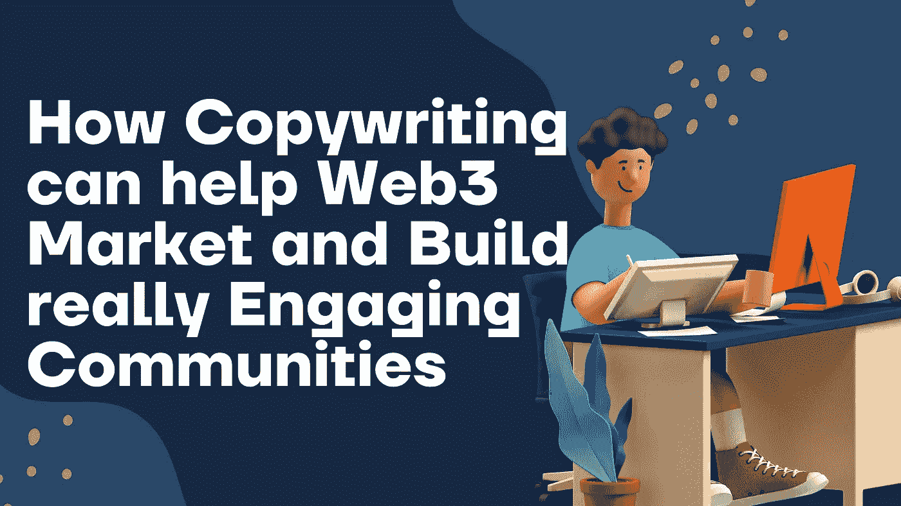

# 文案如何帮助 Web3 品牌营销和建立真正吸引人的社区

> 原文：<https://medium.com/coinmonks/how-copywriting-can-help-web3-market-and-build-really-engaging-communities-4fe4f70e6f79?source=collection_archive---------1----------------------->

Web3 中的营销可能有点困难，因为它与 Web2 中的营销策略有很大不同。

在 Web2 中，像脸书、谷歌和 Data 这样的平台是营销和销售产品的良好开端。但是在 Web3 中，社区、信任和影响力是你最大的资产。

> Web 3 营销是一个通过观察趋势和新技术来探索网络的概念。不仅仅是进化；它彻底改变了我们对互联网的看法。Web 3.0 营销不仅仅是网站和搜索引擎优化

正确理解皮里尔的声明。在 Web3 中，社区就是 CEO。不是平台。

将你的产品和你的目标受众联系起来是你在营销你的 web3 品牌时首先要做的事情之一。

你的目标受众不是机器人，他们是人类。这些人后来成为了了不起的社区成员。他们会向你购买。

联系你的目标受众，让他们相信你的项目是很困难的。这就是为什么许多好的项目往往经历糟糕的造币厂。

你如何说服你的目标受众？这个秘密回放了市场营销的基本原理；人类的说服力。

这是一些 web3 项目几乎没有关注的一件事。相反，他们会把资源花在影响者和阿尔法小组的合作上，以分发白名单。

不幸的是，这并不总是奏效。即使它真的有效，也不是一种可持续的社区建设方式。我们倾向于看到严重依赖炒作的项目在造币后表现不佳。

正如我们最近看到的，像 Goblins 和 Wagdie 等项目，没有路线图和期望，通过与人联系来建立一个可靠的社区——他们比许多公用事业项目做得更好。

这说明了社区对你的项目有多重要。

既然我们已经明白了社区是网络 3 营销的核心。文案如何帮助 Web3 品牌增加转化？

虽然有不同的组成部分需要讨论(我们将在随后讨论)…但重要的是首先关注**客户之旅或社区之旅。**

在他们到达薄荷按钮之前，他们对你的项目有什么样的体验？

他们是否感到被重视和重要，他们是否与社区内的价值观和准则产生共鸣，他们是否为构建项目路线图、艺术、游戏、活动和社区决策做出了贡献？

他们对项目目标有什么看法？他们对项目的发展方向有主人翁意识吗？

这种体验不是在造币日建立的。很多会有这种体验的人，会自动成为超级粉丝。

当你有意建立一个合适的社区时，拥有一个超级粉丝社区就开始了。在这段旅程中，你试图联系，建立信任，获得影响力，共同成长。

你可以看看这篇关于建立一个吸引人的社区的最好方法的文章。

换句话说就是建立一个超级粉丝的社区。你必须交流。大多数情况下，你使用文本与你的社区成员交流，这就是文案的用武之地。

简单来说，文案就是印刷的**推销术。**这意味着，你必须在你所在社区的所有营销材料、网站、活动、公告、活动和协作中贯彻文案原则。

> 为什么这很重要？嗯，感知比现实强大。这就是为什么人劝才是王道。

文案具有说服力，这影响了你的社区对价值观、准则、语言、目标和社区氛围的看法。

这不诡异。求[苹果](https://bettermarketing.pub/how-to-write-like-apple-cd3876beb41b#:~:text=According%20to%20a%20study%2C%20people,short%20sentences%2C%20and%20simple%20words.)，[微软](https://www.microsoft.com/en-au/microsoft-365/business-insights-ideas/resources/the-benefits-of-copywriting-for-business)，[三星](https://www.weareluminescence.com/world-2018-android-samsung-copywriting/)，[优步](https://neilpatel.com/blog/how-uber-uses-data/)，[网飞](https://www.verygoodcopy.com/very-good-copy-blogs-5/netflix-and-copywriting)等。

这些顶级品牌都了解感知的力量，他们通过在文案上投入时间来利用人类说服力。

他们为什么这样做？这样他们就能联系到你和我。我们可以有把握地说他们是成功的，对吗？我们使用他们的一种或多种产品。

这意味着，如果你正在开发一个 Web3 产品，你的社区对你的项目的看法是一个需要控制的关键营销位置！

这为他们建立了坚实的体验，并帮助你锁定对你的产品感兴趣的人。你即将拥有一个超级粉丝社区。

现在你有了营销控制权。对于任何与 Web3 相关的项目，这是一个简单的销售漏斗:

> 社区建设——协作和营销——入职 web2 受众——发布——发布后——履行和品牌推广。

让我们从协作开始，在每个阶段快速运行文案，好吗？

## 合作

这是 web3 的顶级营销策略，但文案仍然是关键。你应该对每一次合作都深思熟虑。

当你与这个项目合作时，你得到了什么好处？这个项目有适合你的目标受众的社区吗，等等？

宣布与您的社区的合作，陈述对他们和其他项目社区的好处。

使用情感触发器和视觉吸引力:图像、视频、ama 和访谈。

与在社区中拥有目标受众的顶级 Web3 品牌、Alpha 团体和 Dao 合作。

让它看起来像是一家俱乐部刚刚签下了一名球员！

你不需要一天 10 次。质量重于数量。记得让你的社区参与进来！

其他营销策略包括影响者合作、在顶级 web3 播客和 Youtube 频道上的采访、对你的 Twitter 页面/帖子的认真关注以及可能的 Twitter 营销。

## 入职 Web2 受众

最好的方法之一就是利用内容写作。因为受众在 Web2 中，所以围绕他们所在的位置创建一个营销漏斗。

像这样建立一个简单的内容营销漏斗:

使用 CTA 创建 SEO 帖子到您的服务器中的欢迎频道(或您的项目网站)+在频道中，他们阅读欢迎消息，以及关于项目的更多信息+他们通过单击验证按钮登上自己，获得对社区的访问。

因为这个欢迎频道是为 Web2 观众定制的，所以您可以在 Discord 上创建一个特殊的标签。

一旦他们验证，他们得到这些标签，这使他们能够访问服务器和其他定制渠道，在那里你可以创建教育信息，如如何造币等。

在这里雇佣 Mods 来帮助他们回答问题，让入职更容易。对他们来说，这是非常私人的，他们可以正常登机。

## 启动:

如果你勾选了其他阶段，没有压力。凭借你们强大的社区和疯狂的影响力。发起为期 14 天的发布活动！

跨越社会。你的服务器。以及每一个你合作过的社区。这是一个后续活动，随着你越来越接近造币日期，高潮越来越强烈！

为期 14 天的活动，视觉可以是图像，电影视频，数字事件，IRL 事件，采访字面上的任何东西。

先睹为快也有用，但它被过度利用了。**发挥创意！**

不要随便在你的造币页上写些字。把一个推销员放在造币页上:文案。

包括社区证明。可信度。保证。等等

> 在这里等一下
> 
> 这些过去的阶段需要几周甚至几个月来实施。这不是在公园散步。它甚至可以比我在这里分享的更详细。实际上，如果你坚持到底，发射应该会成功。一切都是为了社区。这都是关于他们的

## 发布后

已经过了制造日期了。你卖不卖。不要像其他项目那样去睡觉。这里还有更多工作要做。

根据造币过程中发生的事情，你可以期待一吨的反应。别紧张，发生这些很正常。

这是你的社区管理者和 mod 更多参与社区的时候了。这是因为了解首席执行官们的想法、感受和需求非常重要。

**社区就是 CEO。别忘了那部分。**

根据反应(好的或坏的)，主持一个 AMA 来解决这个问题。并与社区分享路线图的下一阶段。

请求他们的意见，并与他们一起构建。

## 履行和品牌

完成路线图是团队的主要责任之一。根据这个过程的技术水平，你的工作是雇佣一些最优秀的人来提高团队的实力。

当你这么做的时候。记住你有投资者——你的社区成员——他们已经投资了 *x 金额*的钱来建造这个产品。每一步都让他们参与进来。

一个惊人的策略是从社区中雇佣一些顶尖人才。他们的贡献对路线图的实现至关重要。

这需要时间和努力。投资最优秀的团队成员来实现您在路线图中的承诺。

在这一阶段，有必要举办一些活动，让社区参与进来。通过 Merch、空投、Irl 活动以及与 web2 和 web3 项目的新合作关系给社区带来惊喜。

那些 50%的产品都是自己生产的，并且不需要依赖造币费的项目相对来说也做得很好。

建立一个项目和一个吸引超级粉丝的社区可能会非常困难，尤其是当你开始的时候。

利用你的文案进入一个坚实的社区之旅和营销将使你的项目脱颖而出——这正是我帮助 web3 品牌实现的，如果你已经有了一个 web3 品牌并需要扩大规模，请点击这里[联系我。](https://optimusprime.crd.co/)

> 交易新手？尝试[加密交易机器人](/coinmonks/crypto-trading-bot-c2ffce8acb2a)或[复制交易](/coinmonks/top-10-crypto-copy-trading-platforms-for-beginners-d0c37c7d698c)