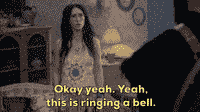

# 文案如何纠正 NFT 创始人犯的最大错误

> 原文：<https://medium.com/coinmonks/how-copywriting-fixes-the-biggest-mistake-nft-founders-make-f38e28b47d91?source=collection_archive---------22----------------------->

根据研究，80%的 NFT 项目会因为他们犯的常见错误而失败。你愿意避免掉进沟里吗？

这让我想起了我工作过的一个 NFT 项目。他们犯了“错误”，当造币日即将到来时，很明显他们不会卖光

猜猜他们做了什么

是啊，任何创始人都会这么做。
他们推迟了造币

他们有相当多的收藏，这也使得在熊市中很难卖出去。

隧道尽头没有光明，他们不得不把它变成免费的造币厂来出售。

然而，你应该注意到“卖出”一个 Nft 收藏并不等同于成功。真正的成功是后来发生的事情，以及它在市场上的表现。

我曾经遇到一位女士，她卖出了 10 套 NFT 时装。我查买家的时候，是她的一个同事全部带过来的，并且以一个可笑的价格挂牌

你不想让这成为你的故事，对吗？

想要与众不同，你必须意识到文案是所有这些问题的答案。

我听到你问如何

嗯，也许不是“所有”的问题，但这个文案原则是多米诺骨牌效应，击倒所有其他的问题

你看，每个 NFT 项目都要经历我称之为项目生命周期的过程。

“项目的生命周期就是一个漏斗，涵盖了从孵化阶段到后薄荷(路线图的实现)阶段的旅程。”

这个漏斗阶段的每一步都是为了构建项目，并让社区认为它是有价值的

*如果没有，他们还会如何投资？*

许多 NFT 创始人错过的是，他们开始试图在 mint 或 premint 或 genesis collection 的漏斗中间关闭他们的社区。

虽然这很公平，但不是最好的。

为什么不加入我，让我们来看看这个文案原则是如何运作的

该原则指出

> 不要在报价时(活动/造币日)就构建报价的价值(项目的效用),而是从客户的旅程一开始就构建

也许我应该大声点

**不要在报价(营销活动)时就构建报价的价值(项目的效用),而是从客户之旅的最开始**

这是成功发布、售前和造币所需的全部内容

还在迷茫？

好吧，让我进一步解释。

你应该从一个人成为你社区的一部分的第一天起，就开始建立他对你的项目和你的提议的看法。

我所看到的一些项目的做法是，他们开始用一个 TBA(即将公布)路线图和 TBA 白皮书来建立他们的社区，而没有任何暗示

虽然这听起来不错，但它会逐渐扼杀一个项目

> 每个项目都有一个焦点(他们希望实现和提供什么),应该在社区的每个成员进入时让他们知道。

一旦社区的每个成员都意识到项目希望交付什么，那么让他们认为它是有价值的东西就变得容易了。

现在，我并不是说在准备路线图和白皮书的同时开始构建社区是不好的。你肯定能做到。

我只是说，你应该确保项目的目的和可交付成果对社区的每个成员都是清楚的。

一旦勾掉了，我们就可以进行清单上的下一项了。

## 对买方进行资格预审

让我解释一下我们这个时代最伟大的营销者之一拉塞尔·布伦森的话。他曾经说过*如果你能让他们说三个是，那么第四个是也没什么大不了的*

你不应该等到铸币日才让你的社区参与购买行动。

按照布伦森的说法，如果你让他们在薄荷之前对你的推销至少说三次是，那么他们就会在薄荷期间对你说是。

从那些回答“是”的人的统计数据中，你可以知道有多少人最有可能购买你的 NFT

然而，你应该注意到，你的“推销”并不一定是你推出一个迷你系列来看看谁会买

销售并不总是涉及金钱的交换。

如果我给你一个建议，你同意了，我就成功地把我的意见卖给了你，你也接受了。

确保为你所有的“推销”举办一次活动。它有助于建立感知。

读到这里，让我悄悄告诉你一些想法

> 服务器升级活动
> 一个免费的造币厂，免费为您的主造币厂提供实用工具

remember, you need 3 yes(es)

现在我们来看最后一个

## 让他们自我封闭

是什么影响了 NFT 收藏的铸币价格？

不同的创始人基于不同的事情设定他们的铸币价格

我认为更大的问题是

**人们会以设定的价格铸造 NFT 吗？**

我遇到过拥有非常有价值的公用事业的了不起的创始人，但他们最终降低了自己收藏的价格，只是为了让人们愿意购买

如果你提供的东西值设定的价格，那就不要贸然降价

让他们关闭自己

大多数人所做的是吹嘘他们所提供的东西有多棒，以及为什么人们应该购买

让我们试着与众不同

一个文案说了一句话，让我拿记事本一字不漏的乱写。他说

> 当你告诉客户你的产品的价值，这是一回事，但当你让他们告诉你，这是一切。

你应该这样做:

通过给他们一次难忘的客户之旅，并很好地解释你的优惠的好处，帮助他们将你的优惠视为一笔交易，一种不可抗拒的价值

在 mint 点，简单地提醒他们你的项目给他们带来的价值和好处。

如果你很好地完成了建立认知的工作，他们会很容易地联系起来，并且能够把所有的片段放在一起

要了解如何用文案建立认知，请阅读此文。

提醒他们之后，通过民意调查询问他们认为你的薄荷价格应该是多少

***提示:提供 2× — 5×您实际铸币价格的数字***

当他们点击那些大数字接受我热情的握手，因为他们已经成功地封闭了自己。

你现在设定的最低价格看起来很低，对他们来说更像是一笔交易。

他们只是在你面前尖叫**闭嘴，拿走我的钱**

我的朋友会让他们成为你项目的忠实粉丝

到目前为止，我们已经看到了通过文案建立一个稳固的社区的重要性

## 我们确实强调了这一点

1.  每个社区成员都应该清楚地了解你在建设什么
2.  你应该通过让买家从你这里至少购买三次来预先确定他们的资格
3.  展示你的产品价值的客户之旅会让他们主动接近你

> 我希望这些揭示的原则证明对你和对无数其他人一样有效，如果你想谈谈，就[联系我](http://www.semi-lore.carrd.co)
> 
> 哦，一定要点击关注按钮，这样你就不会错过我以后的文章了。他们会值得你花时间。

> 交易新手？尝试[加密交易机器人](/coinmonks/crypto-trading-bot-c2ffce8acb2a)或[复制交易](/coinmonks/top-10-crypto-copy-trading-platforms-for-beginners-d0c37c7d698c)