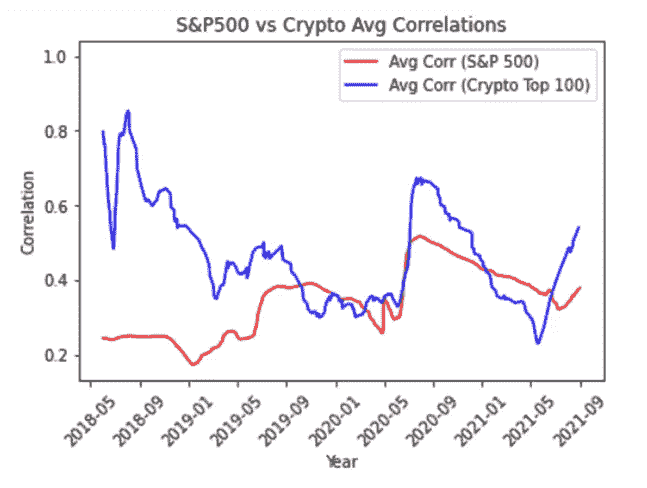
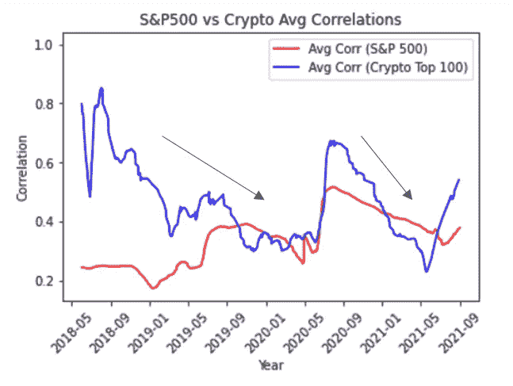
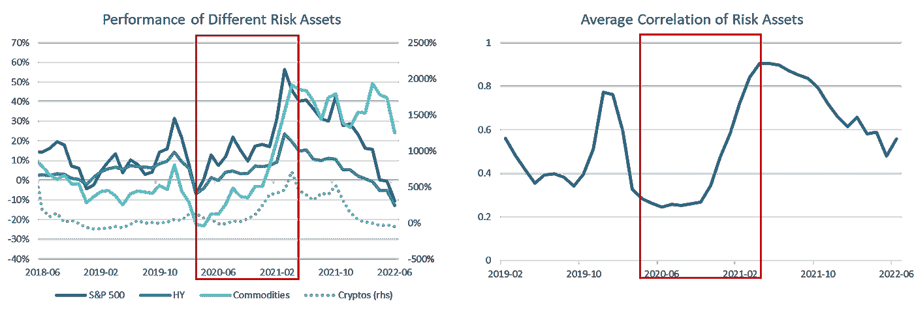
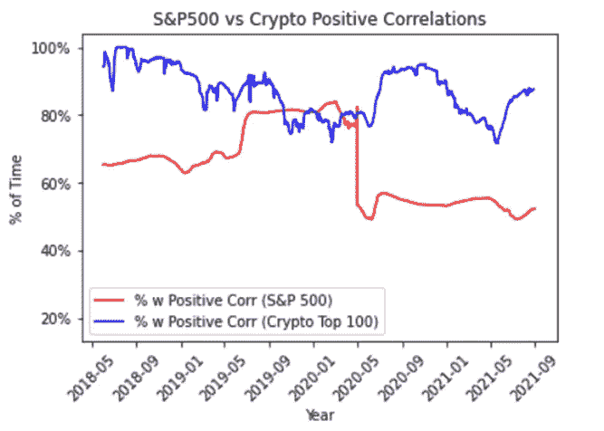
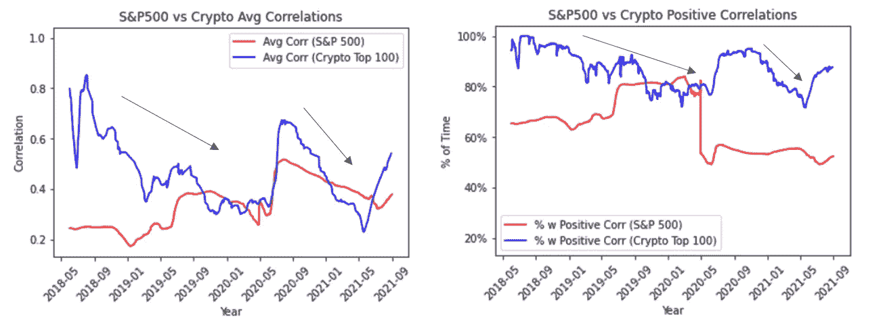

# 加密市场真的有多相关？

> 原文：<https://medium.com/coinmonks/how-correlated-are-crypto-markets-really-f7ebe6170ea8?source=collection_archive---------4----------------------->

我们在之前的一篇文章中讨论过，在管理风险时，相关性不一定是正确的衡量标准，在构建加密投资组合时，beta(相关性和波动性的函数)是更好的风险衡量标准。然而，行业中的许多人仍然将相关性视为首选指标，鉴于行业认为密码高度相关，我们希望自己运行这些数字，以更好地了解加密资产的相关性。没有人怀疑构建多元化股票投资组合的能力，我们想在这里迈出第一步来解决这个问题，“有可能构建多元化的加密投资组合吗？”

在超级波动时期，tldr-crypto 与股票之间的相关性更强，但与正常市场环境下的股票具有相似的相关性。

为了进行这一分析，我们提取了标准普尔 500 每家公司和 100 强名单中每家加密公司自 2018 年以来的历史年同比回报率(从上一次加密熊市开始)。标准普尔 500 通常被视为美国股票的基准，前 100 名的 crypto 占整个 crypto 市值的 95%以上。考虑到这种动态，我们觉得使用这两个世界的资产可能是有意义的。

接下来，我们将标准普尔 500 的每只股票与标准普尔 500 的每只股票相关联，使用一年滚动相关性，并消除任何重复计算的情况。我们在这里使用了皮尔逊相关，因为这是大多数人心目中的基本相关形式。然后，我们继续这一步，取所有相关对(基本上是 125，000 对)的平均值，以了解标准普尔 500 指数的“平均相关性”是什么。

我们以排名前 100 的密码(当然不包括 stablecoin)结束了这项工作…结果让我们非常惊讶:

Source: S&P 500, coingecko.com. Data as of 30/06/2022\. *Special shout-out to Timo on our team for assembling the analysis.

密码的平均相关性波动相当大，从高达 0.9 到低于 0.3 不等。股票的平均相关性也经历了波动，尽管没有 cryptos 的波动幅度大。股票达到了近 0.6 的高点和低于 0.2 的低点。

然而，这里非常有趣的是，在 2018 年至 2020 年的熊市期间，加密数据的平均相关性实际上呈下降趋势，并在 2020 年的最初飙升后再次下降(反映了 COVID 疫情的开始，请记住这些是逐年的数字)。

这表明，在风险开启和风险关闭事件期间，加密市场的相关性将达到峰值并趋向于 1。然而，几乎所有的风险资产都是如此。在波动风险时期，市场相关性，如加密货币，往往会达到 1。我们刚刚使用了美国股票，高收益，商品和密码作为一个说明性的例子。可以构建类似的风险篮子，包括新兴市场债券、新兴市场股票、科技股等。不管怎样，结论是一样的。

Source: Bloomberg, Bitwise Indices. Data as of 30/06/2022.

因此，与股票市场相比，我们到目前为止所看到的是，加密市场往往在风险或风险关闭事件方面更相关，但实际上在波动性非常高的时期之外表现出类似的资产类别内相关性，在这些时期，更广泛的风险资产无论如何都会趋向于 1 的相关性。

然而，我们还应该考虑另一件事，那就是加密空间中的相关对实际上有多长时间是正的？换句话说，一种加密货币趋势为正而另一种趋势为负的频率有多高？

Source: S&P 500, coingecko.com. Data as of 30/06/2022.

在这里，你可以清楚地看到，大多数密码在大多数时候都会表现出正相关性(即，当一个上涨时，另一个上涨，当一个下跌时，另一个下跌)。事实上，这很可能是人们说密码市场高度相关的原因。那就是不管定向波动的**幅度**或者相关性实际上有多**高/低**，好日子通常意味着绿色的海洋，坏日子通常意味着红色的海洋。非常有趣的是，这里还指出，正相关对的百分比也遵循平均相关，这意味着正相关在市场波动较大时达到峰值，在正常市场环境下下降。事实上，在某些点上，正相关性的百分比与标准普尔&500 指数相当。

从我们在这里看到的数据(当然，考虑到加密货币的新生性质，我们必须注意时间段偏差，并且以前的表现模式可能会在未来发生变化)，我们可以确定，虽然加密市场确实可能高度相关，但情况并不总是如此**。在严重的风险开/关事件期间，加密市场高度相关。然而，在过去的周期中，它们的相关性实际上反映了正常市场条件下美国股市的相关性。如果一个人有一个加密资产和现金的投资组合，这意味着仅从相关性指标来看，创建一个像正常市场条件下的股票投资组合一样多样化的加密投资组合是可行的。然而，在风险规避事件中，寻求构建加密投资组合的投资者无疑将不得不比他们的股票投资者对手更多地依赖现金来抑制投资组合的波动。**

> **交易新手？试试[密码交易机器人](/coinmonks/crypto-trading-bot-c2ffce8acb2a)或者[复制交易](/coinmonks/top-10-crypto-copy-trading-platforms-for-beginners-d0c37c7d698c)**