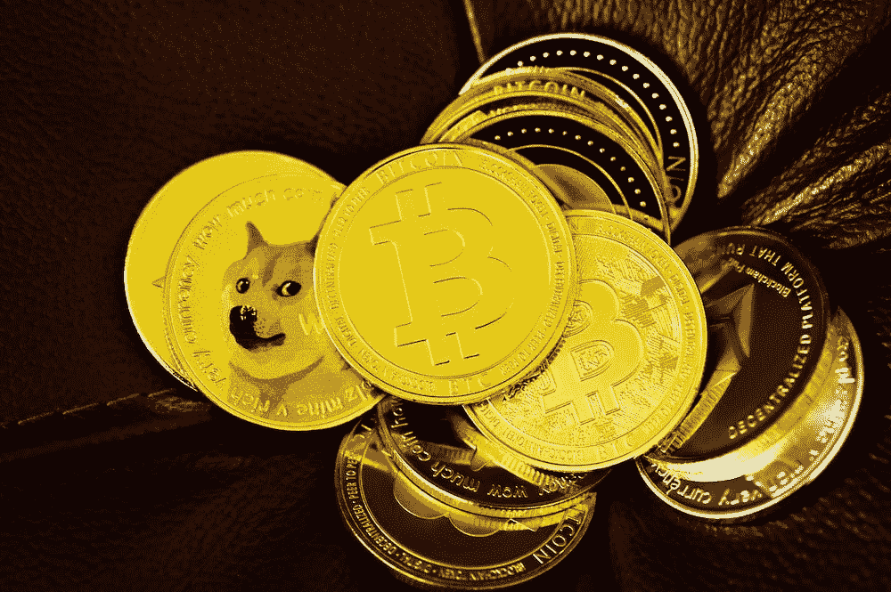

# 密码是如何改变世界的

> 原文：<https://medium.com/coinmonks/how-crypto-already-changed-the-world-201cde666f3c?source=collection_archive---------29----------------------->

加密货币仍处于起步阶段，但它们已经对世界产生了巨大影响。短短几年间，crypto 改变了我们对金钱、投资甚至互联网的看法。这里只是 crypto 已经改变世界的几个方面。

# Crypto 为创业公司和企业创造了一种新的融资方式