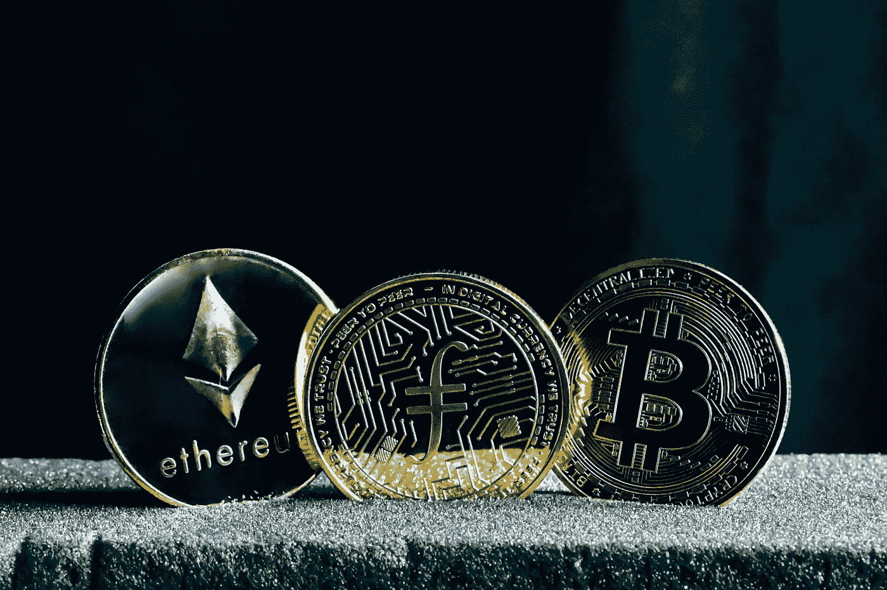

# 加密货币如何改变经济的未来

> 原文：<https://medium.com/coinmonks/how-cryptocurrency-can-change-the-future-of-the-economy-ef6d47f0fa15?source=collection_archive---------12----------------------->

加密货币是一种新形式的数字货币，近年来广受欢迎。加密货币是通过一个称为挖掘的过程创建的，用户通过解决复杂的数学问题来赚取硬币。

加密货币可以用于在线购买商品和服务，作为一种投资工具，它们也越来越受欢迎。在这篇博文中，我们将讨论加密货币对未来经济的潜在影响。

## 加密货币是无国界的

加密货币有可能彻底改变我们与全球经济互动的方式。首先，加密货币是无国界的，这意味着它们可以被世界上任何地方的任何人使用。由于区块链技术，使用加密货币进行的交易也快速安全。加密货币有可能使传统银行业务过时，因为它们可以用来发送和接收支付，而不需要银行账户。

## 加密货币抑制通货膨胀

如果通货膨胀是货币的主要形式，它也会对通货膨胀产生重大影响。因为大多数加密货币的供应量有限，所以它们的价格不会像传统货币那样波动。从长期来看，这可能会导致更稳定的价格和更小的通胀压力。

## 告别银行费用

加密货币也有助于降低汇款成本，因为它们可以快速、廉价地跨境转移。这可能对发展中国家产生重大影响，因为汇款是发展中国家的重要收入来源。

## 加密货币可能会改变全球经济

加密货币仍处于起步阶段，它们对经济的长期影响还有待观察。然而，毫无疑问，加密货币有可能扰乱我们与全球经济互动的方式。随着每天越来越多的人采用加密货币，它们成为经济中的主流力量只是时间问题。

如果你正在寻找一位能帮助你理解这个快速变化的世界的作家，[点击这里](https://www.fiverr.com/share/Q0Noq2)了解我的服务。

> 交易新手？试试[密码交易机器人](/coinmonks/crypto-trading-bot-c2ffce8acb2a)或者[复制交易](/coinmonks/top-10-crypto-copy-trading-platforms-for-beginners-d0c37c7d698c)