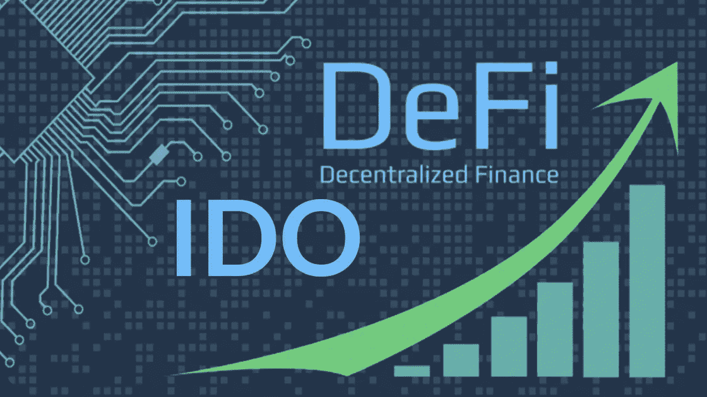

# 加密货币如何筹款/众筹

> 原文：<https://medium.com/coinmonks/how-cryptocurrency-do-fundraising-crowdfunding-75c3f365582d?source=collection_archive---------38----------------------->

加密货币肯定需要资金来运营。这种融资活动被称为 ICO。初始硬币发行是通过发行新型硬币或新的加密货币服务来筹集资金的一种方式。

*   **IDO** (首次 Dex 发售)
*   **IEO** (首发上市)

> 从顶级交易者那里复制交易机器人。免费试用。

## **什么是 IDO？**

**首次公开募股(IDO)是一种众筹 Dex 平台，是密码行业一种新的融资方式**。当一个项目通过分散流动性交易所发行硬币或代币时，通常会进行 IDO。

## **什么是 IEO？**

**交易所首次公开募股(IEO)是由第三方，即交易所(CEX)** 实施的秘密项目中的筹资策略。
ieo 一般要求更多的费用，因为他们将交易所作为众筹的场所，但大多数时候他们获得的资金额也更高。

crypto 还有一个众筹，就是 IGO。**游戏首发(IGO)本身就是以加密货币为游戏项目筹集资金的一种方式**。通常一个游戏项目也会使用它的令牌在游戏中进行 NFT 交易。

## IEO 和伊多的区别

1.  在 IEO(首次交易所发售)，做众筹更难，因为币安、bybit、MEXC 等交易所的条款比 IDO(首次 Dex 发售)更严格。
2.  IEO(首次公开募股)的费用也更贵，因为众筹是在大型交易所而不是 IDO(首次公开募股)上进行的。
3.  对于新项目来说，IDO(首次公开募股)更容易做到，因为其要求比 IEO(首次交易所公开募股)更容易。
4.  IDO(首次 Dex 发行)的安全/风险水平高于 IEO(首次交易所发行)，后者受到更严格的监管。

## IEO(首次公开交易)平台示例

币安发射台
Bybit 发射台
MEXC 发射台
Gate.io 发射台

## IDO(首次公开发行股票)平台示例

刀匠
波尔卡启动者
GameFi

> *加入 Coinmonks* [*电报频道*](https://t.me/coincodecap) *和* [*Youtube 频道*](https://www.youtube.com/c/coinmonks/videos) *了解加密交易和投资*

# 另外，阅读

*   [3 商业评论](/coinmonks/3commas-review-an-excellent-crypto-trading-bot-2020-1313a58bec92) | [Pionex 评论](https://coincodecap.com/pionex-review-exchange-with-crypto-trading-bot) | [Coinrule 评论](/coinmonks/coinrule-review-2021-a-beginner-friendly-crypto-trading-bot-daf0504848ba)
*   [莱杰 vs n rave](/coinmonks/ledger-vs-ngrave-zero-7e40f0c1d694)|[莱杰 nano s vs x](/coinmonks/ledger-nano-s-vs-x-battery-hardware-price-storage-59a6663fe3b0) | [币安评论](/coinmonks/binance-review-ee10d3bf3b6e)
*   [加密交易机器人](/coinmonks/crypto-trading-bot-c2ffce8acb2a) | [Bingbon 评论](https://coincodecap.com/bingbon-review)
*   [Bybit Exchange 审查](/coinmonks/bybit-exchange-review-dbd570019b71) | [Bityard 审查](https://coincodecap.com/bityard-reivew) | [Jet-Bot 审查](https://coincodecap.com/jet-bot-review)