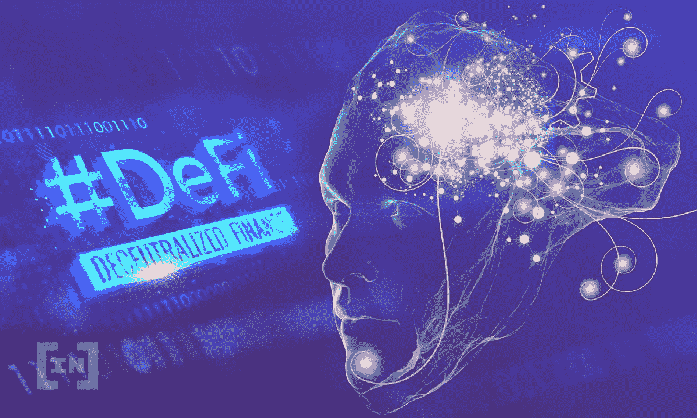

# 分散融资(DeFi)的工作原理

> 原文：<https://medium.com/coinmonks/how-decentralized-finance-defi-works-1143282cbd4c?source=collection_archive---------30----------------------->

一种新的和创新的为分散项目融资的方法被称为分散融资或 DeFi。与传统金融不同，DeFi 基于以太坊和其他未经许可且不可信的区块链技术。这表明 DeFi 不需要一个集中的权威，每个人都可以参与其中。

DeFi 仍处于早期阶段，但它已经在提供新颖和前沿的方法来交易数字资产、借钱和赚取比特币的利息。如果你想参与的话，这里有一个 DeFi 操作的简要说明。

分散金融是什么？

分散金融，或“DeFi”，是比特币市场中一个快速扩张的领域，使用分散协议创建金融应用。任何能上网的人都可以利用这种新的金融技术，它有能力彻底改变现在管理金钱的方式。

DeFi 允许您在不需要中央交易所的情况下进行交易，从您的加密货币中赚取利息，并从银行获得免费贷款。他们也更加抵制审查和关闭，因为这些程序是基于分散的协议。

**金融:分散与集中(DeFi)**

我们今天使用的传统金融结构被称为集中金融(CEX)。这一系统下的交易是由中央中介机构如银行促成的。这些组织对中央系统中的金融系统及其资产拥有完全的权力。

另一方面，分散金融(DeFi)是一种基于区块链的全新金融结构。这个系统中的交易是点对点的；没有中央中间人。这表明，任何人都可以直接参与 DeFi 生态系统，而无需使用中介。

最终哪个更好？财务:集中还是分散？您的需求和选择将决定回应。如果稳定性和安全性对你来说很重要，集中财务可能是你的首选。然而，如果你重视更多的透明度和财务控制，分散融资是一个可行的选择。

**DeFi 的使用案例**

DeFi 可以有多种用途，而且新的用途总是不断出现。在本帖中，我们将分析 3 个 DeFi 用例，展示这项新技术的多种应用。

DeFi 可以用来获得对你的密码的兴趣。

DeFi 可以用来获得贷款。

DeFi 可以用来交易加密货币。

这些使用实例中的每一个都有独特的优势，所以选择最适合您需要的一个。DeFi 是一种适应性很强的技术，可以以无数种不同的方式使用，所以不要犹豫尝试。

DeFi 的前景

没有办法预测去中心化金融(DeFi)世界的下一步走向，因为它变化如此之快。然而，DeFi 无疑会继续存在，并且只会变得更好、更大。

在过去几年中，DeFi 协议和应用得到了快速发展。随着消费者和投资者越来越意识到 DeFi 彻底改变金融体系的潜力，我们也看到这两个群体的兴趣都在上升。

我们只能推测 DeFi 将提供的潜在可能性。可能会有新的程序使借贷和交易更加安全和有效。我们可能会看到新的分散式交易所的出现，挑战现有的集中现状。我们甚至可能会看到传统金融机构开始采用 DeFi 技术。

诺亚亚历山大

你可以在这里获得更多信息
https://crypto tactic . io

> 交易新手？尝试[加密交易机器人](/coinmonks/crypto-trading-bot-c2ffce8acb2a)或[复制交易](/coinmonks/top-10-crypto-copy-trading-platforms-for-beginners-d0c37c7d698c)