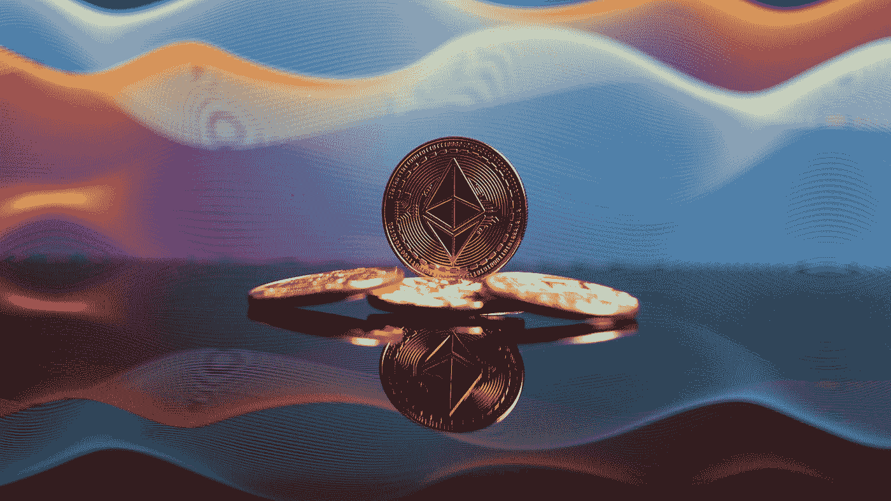
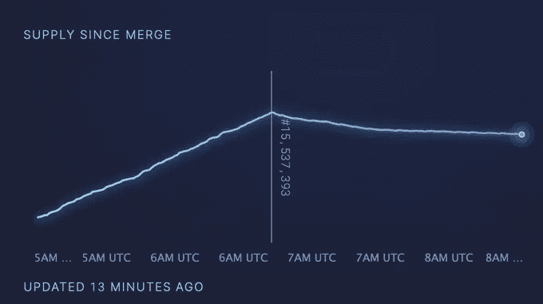
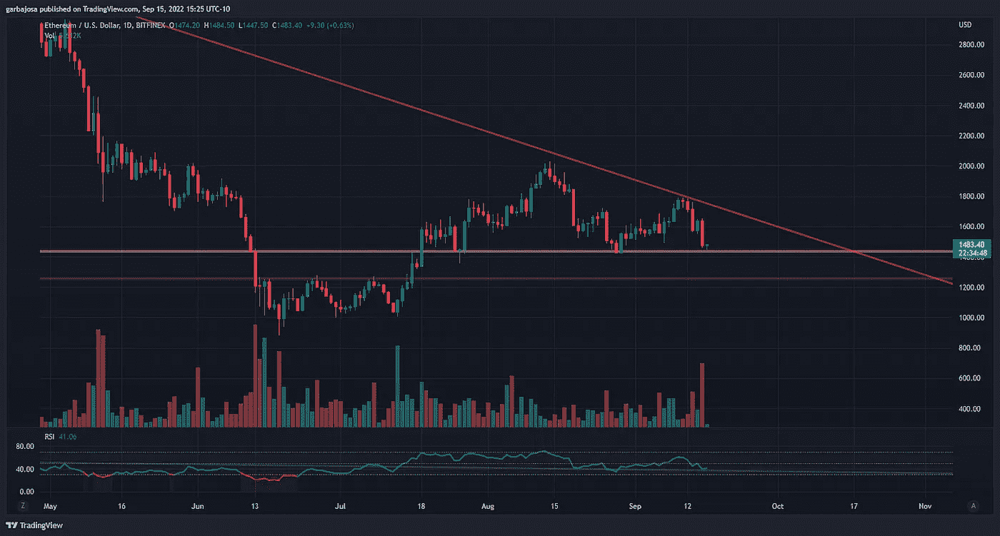
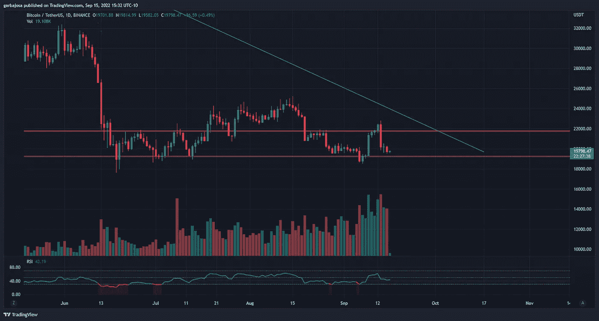
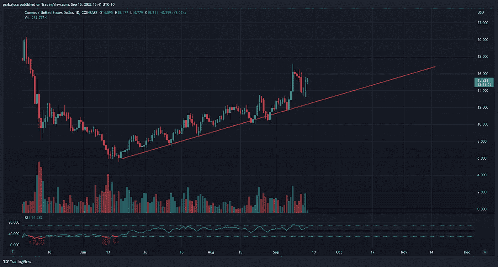
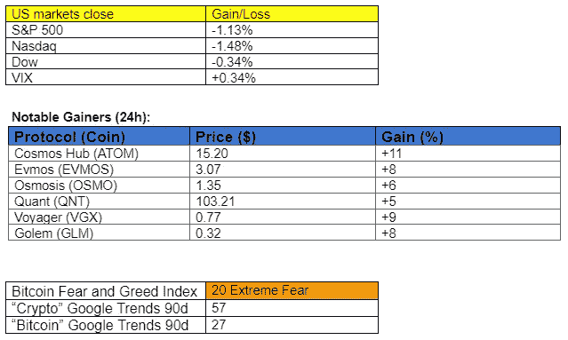
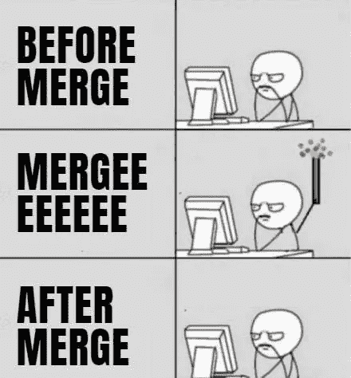

# 以太坊现在有多通缩？

> 原文：<https://medium.com/coinmonks/how-deflationary-is-ethereum-now-58ed8b6cf1e7?source=collection_archive---------15----------------------->

## 每日征服#084

## 每日透视密码。

Photo by [Bastian Riccardi](https://unsplash.com/@shutter_speed_?utm_source=medium&utm_medium=referral) on [Unsplash](https://unsplash.com?utm_source=medium&utm_medium=referral)

密码市场是一个狂野、奇妙而令人生畏的地方；不要一个人跋涉！订阅加密征服者，让我们成为您的向导。

S [*订阅*](https://tradergabi.substack.com/subscribe?) *本刊每日快讯，永不错过一期。*

**概述**

*   市场下跌，而原子攀升。
*   比特币基地打算如何影响政治？
*   以太坊变得更中央化了吗？

早上好，家人，

以太坊合并已经发生，对矿工的高排放早已过去。那么以太坊现在的通缩程度如何？它作为超声钱的案例是怎样的？我们来探索一下。

首先，我不是唯一一个对 ETH 的通缩机制感到兴奋的人。亚瑟·海斯是这么说的:

@korpi87 更深入地探讨了这个话题，在推特上发表了以太坊令牌组学最史诗般的帖子之一。如果你想了解以太坊的发行模式，这个帖子绝对是必读的。

你猜怎么着？以太坊在合并后立即陷入通货紧缩。愿它永不回头！

# 市场更新🌍

**1D ETH/USD**

也许合并是一个“购买谣言，出售新闻事件。”也可能，只是宿醉。不管是哪种情况，乙醚(ETH)的股价大幅下跌，尽管它成功地升级到了股权证明(PoS)。ETH 价格在下跌至 1474 美元后，以良好的势头接近 1430 美元的支撑位，昨天下跌了 10.00%。

**BTC/USDT 1D**

比特币(BTC)价格继续走低，而交易量继续增加。前往 19.2 万美元的支持似乎是一个很大的可能性。根据他的分析，比特币交易商 Willy Woo [在推特上发布](https://twitter.com/woonomic/status/1569973732206321664?s=20&t=9lGXnUJiu8qtMcOD2UGG2Q)消息称，BTC 有可能跌至 9100 美元的低点。BTC 收盘下跌 2.59%，至 19，700 美元。

*高清* [***图表***](https://www.tradingview.com/x/Dwl9QaPW/)

**原子/美元 1D**

在越来越多的用户、利益相关者和 TVL 背后，宇宙中心(ATOM)继续向上攀升。ATOM token 近 90 天来一直处于明显的上升趋势，几乎没有放缓的迹象。因此，ATOM 的日蜡烛线上涨了 6.71%，至 14.91 美元。Cosmos 上一些著名的本地链项目有鲸声优(KUJI)、埃夫莫斯(Evmos)、朱诺(Juno)和渗透(OSMO)。

*高分辨率* [***图表***](https://www.tradingview.com/x/r3y8UPxa/)

如果你喜欢这份报告，并且认为它值 20 分(0.01 美分)，请点击下面的鼓掌按钮来支持我的写作。(最多 50 次！)谢谢！

# 新闻观察📰

**比特币基地在交易应用上增加了追踪政客“政策努力”的功能。**周四凌晨，在[的一条推文中](https://twitter.com/brian_armstrong/status/1570133078022160384?s=20&t=xRrqINkkPo0oCPaZ00lDOw)，首席执行官 Brian Armstrong 在比特币基地应用上推出了一项新功能，追踪每位美国政客的加密友好度。此外，Armstrong 希望帮助支持加密的候选人为比特币基地社区募集捐款。Armstrong 表示:“加密宣传对于我们增加世界经济自由的使命非常重要，比特币基地将尽自己的一份力量提供帮助。”

**[**引领**](https://twitter.com/tier10k/status/1562878878015954947?s=20&t=dNNvQVSDOyU5ihEHXEv-RA) **竞购航海家号的数字资产。**今年早些时候，加密贷款和交易所 Voyager 在加密市场萎缩导致其许多头寸清算后申请破产。一个月后，该公司拒绝了 FTX 收购航海家资产的提议。之前的破产诉讼导致了一场拍卖，FTX 目前处于领先地位。报价金额未知。**

****以太坊呈现出集中化的迹象。** [根据](https://twitter.com/koeppelmann/status/1570436882483523585?s=20&t=dNNvQVSDOyU5ihEHXEv-RA)Gnosis 的联合创始人马丁·科佩尔曼(Martin Koppelmann)的说法，在合并事件发生几个小时后，两个验证实体创造了 40%的以太坊 PoS 区块:比特币基地和利多以太验证桩服务。大比例的块创建给以太网带来了中心化的问题。此外，该推文的特色是 75%的选民同意“这需要改变”。**

****新闻花絮:****

*   **在合并后的瑞士联邦储备银行激增后，瑞士联邦储备银行正在恢复与 T21 联邦储备银行的挂钩。**
*   **CFTC 准备成为 crypto 的监管机构。**
*   **币安实验室增加对 Aptos 实验室的投资。**

# **NFT 和元宇宙最新消息🐵**

*   **合并 17 秒后，第一枚 NFT、[、](https://opensea.io/collection/thetransition)在区块链以太坊 PoS 上铸造，交易费为 36.8 ETH。**
*   **堡垒之夜的创造者 Epic 游戏商店发布了它的第一款基于 NFT 的游戏:“布兰科斯街区派对”**
*   **一份泄露的宇迦实验室文件[指出](https://protos.com/yuga-labs-hopes-to-make-50m-with-new-mecha-apes-collection/)该公司打算在年底推出一个新的 NFT 系列，名为机甲猿。宇迦实验室希望从该项目中筹集 5000 万美元，但目前否认其存在。**

****戏谑的戏谑****

****

**就这样，以太坊合并没有出现疯狂的价格波动、事故或重大争议。但是，尽管这一事件很重要，但似乎对大众来说并不重要。我甚至不确定它是否会被美国消费者新闻与商业频道的头条新闻报道。老实说，我怀疑这是孙子们渴望听到的故事。想象一下:**

**2065 年的我:**

***“孩子们，以太坊确认其第一个 PoS 模块时，我在场……”***

***Kiddos:***

***“Zzzzzzzz。”***

**并不是所有的重要事件都会引人注目地展开。因此，这是一个安静的夜晚，4 万名极客(包括我自己)观看了一些编码熊猫的直播，以揭开最终的序幕。然后，我铸造了一些纪念 NFT，并呼吁这一夜。**

**最重要的是合并进行得很顺利，突出了以太坊开发者的熟练程度。当我们其他人眯着眼睛看着满是蜡烛的交易屏幕，在 Twitter 上互相叫喊的时候，愿他们继续在幕后悄悄地建设未来。**

**很荣幸。🙏**

*****加布里埃尔·莫雷诺*****

***关注我的* [*推特*](https://twitter.com/web3_gabri) *获取每日更新！***

> **交易新手？尝试[加密交易机器人](/coinmonks/crypto-trading-bot-c2ffce8acb2a)或[复制交易](/coinmonks/top-10-crypto-copy-trading-platforms-for-beginners-d0c37c7d698c)**