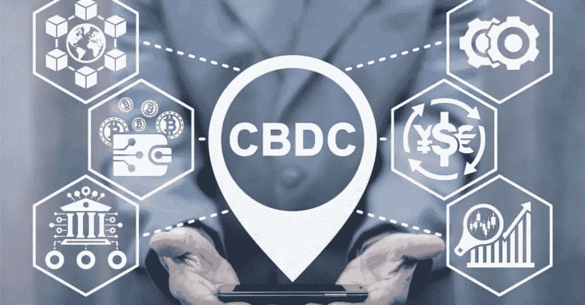

# 中央银行发行的数字货币会如何影响数字货币行业

> 原文：<https://medium.com/coinmonks/how-digital-currencies-issued-by-central-banks-might-affect-the-digital-currency-industry-b49c23344c69?source=collection_archive---------20----------------------->

# 数字货币

 [## 数字货币|数字银行|加密货币- KOOP360

### 了解中央银行发行的数字货币可能会如何影响数字货币行业。

koop360.com](https://koop360.com/blog/digital-currency-industry/) 

> *中央银行数字货币、政府支持的数字资产和其他数字资产以及私人加密企业的可扩展性和有效性将很快刺激加密货币领域。*

加密货币或[数字代币](https://www.investopedia.com/terms/c/crypto-token.asp)正试图被称为全球资产。它们可以追溯到 2009 年，当时中本聪创造了比特币区块链，并为世界提供了一种无需中央机构即可在人与人之间转移资金的新方式。这些代币由于其安全性、透明度和通胀保护，已经成为一种流行的投资选择，尤其是在新冠肺炎疫情之后。但由于比特币(BTC)等区块链公共货币的兴起让政府运营经济变得更具挑战性，许多央行正在测试基于区块链的央行数字货币(CBDCs)，以创建政府支持的虚拟货币。CBDCs 和社区以及像比特币(BTC)和以太坊(ETH)这样的无许可加密资产唯一普遍存在的是，它们都基于区块链技术。然而，将 CBDCs 加入加密生态系统可以加速传统银行业向高科技未来的转变，这有许多重要的原因。

# 区块链技术推动数字货币:

这两种数字货币都基于区块链技术，但 CBDCs 不同于其他密码，因为它们将由中央机构发行和存储。他们还将使用区块链的时间评分块来验证交易活动，并让网络参与者持续验证交易活动。这一特点使得对支付代币和法定货币等 CBDCs 的信任更加合理。它旨在使交易安全，比商业银行发行的数字货币更安全。此外，由于 CBDC 直接与国家法定货币挂钩，其价值只受外汇市场变化的影响。这降低了它的波动性，减少了投机力量的影响。由于这些差异，CBD 不太可能受到市场波动的影响，而市场波动是大多数加密货币的典型特征。它们还受益于发行它们的央行的直接支持，就像法定货币一样。另一方面，CBDCs 存在用户隐私、与其他虚拟资产的兼容性、区块链可扩展性和集中危险等问题，这些问题最终将随着它们的发展而得到解决。

另一方面，不需要许可的数字代币，如比特币和以太坊，保存在分散的公共账本中，没有边界，也没有完全监管。由于世界范围的公开市场活动，二级市场代币价值更不稳定，因为这一资产类别仅在十年前才成为投资者的选择。由于其复杂性和巨大的回报潜力，投资者容易受到欺诈、黑客攻击、骗局和市场操纵的影响。由于任何人都可以制作代币，一些坏演员制作了没有什么用处的[密码](https://koop360.com/blog/who-controls-crypto-market/)或 NFT 倡议。其结果是，投资者在抽水和倾倒计划中损失了金钱。加密提供了广泛的应用，从根本上改变了人们在现代世界开展业务的方式。最大的交易密码之一以太坊(ETH)正在推动一个快速增长的去中心化应用(dapps)和加密协议生态系统，帮助像[NFT 这样的加密资产蓬勃发展](https://koop360.com/blog/how-fashion-and-nfts-became-beneficial-partners/)。NFT 更多用于游戏、门票、艺术品拍卖等。由于不断推出具有创新用例的新加密货币，2021 年全球加密产业的价值将达到创纪录的 3 万亿美元。该行业在几年内大幅扩张，2021 年达到 3 万亿美元的新高。

# CBD 如何有效地与虚拟资产互动？

当它们出现时，CBDCs 将是对生态系统的一个非常出色的贡献，它们与虚拟资产的合作程度将决定人们在那之后如何生活在一起。在缺乏这种兼容性的情况下，CBDCs 不仅需要开发一个具有弹性和可伸缩性的[区块链基础设施](https://koop360.com/blog/what-is-blockchain/)，还需要开发激励系统和用例，使其能够被广泛采用。CBDCs 将是下一个大事件，它们将导致当前数字货币生态系统和全球银行体系的结构性转变，尽管我们知道这一点。随着越来越多的中央银行开始它们的中央银行业务，它们将成为所有相关金融交易的唯一中间人。这可能意味着主要焦点将转移到批发应用领域，为支持当前支付系统的后端基础设施带来明显的好处。然后，商业银行可以从 CBDCs 大量借款，为其贷款活动提供资金。它们之间的竞争将基于它们如何弥合短期和长期利率之间的差距。

这将引导他们致力于增加价值的项目，并通过新的易于使用的方法增加交付数字钱包的竞争。因此，CBDCs 将更容易监管或实施金融政策，因为它们将鼓励引入不依赖于传统银行系统或其纸币网点的新金融科技业务。CBDCs 还受益于 crypto 的可追溯性，这使得犯罪活动很容易被发现，因为清算机构可以看到数字账簿。一旦 CBD 的全球通信网络建立起来，世界各地的机构可以合作打击主要从事实物货币交易的国家的黑市。

cbdc 和私人加密货币的赚钱方式非常不同，所以随着未来更多 cbdc 的问世，使用加密货币的人数将会上升。由于更低的运营成本、更好的风险管理以及对更多金融包容性的推动，CBDCs 将很快增长。假设隐私、互操作性等基本问题。，都处理了。在这种情况下，CBDCs 将帮助世界各国政府创造更容易追踪、运行更高效、交易更快捷的超级数字货币。

**结论**

随着对货币政策如何通过的更多控制，CBDCs 可以帮助央行更有效地完成 crypto 的目标，同时仍然保护最终消费者的利益。

> 交易新手？试试[密码交易机器人](/coinmonks/crypto-trading-bot-c2ffce8acb2a)或者[复制交易](/coinmonks/top-10-crypto-copy-trading-platforms-for-beginners-d0c37c7d698c)