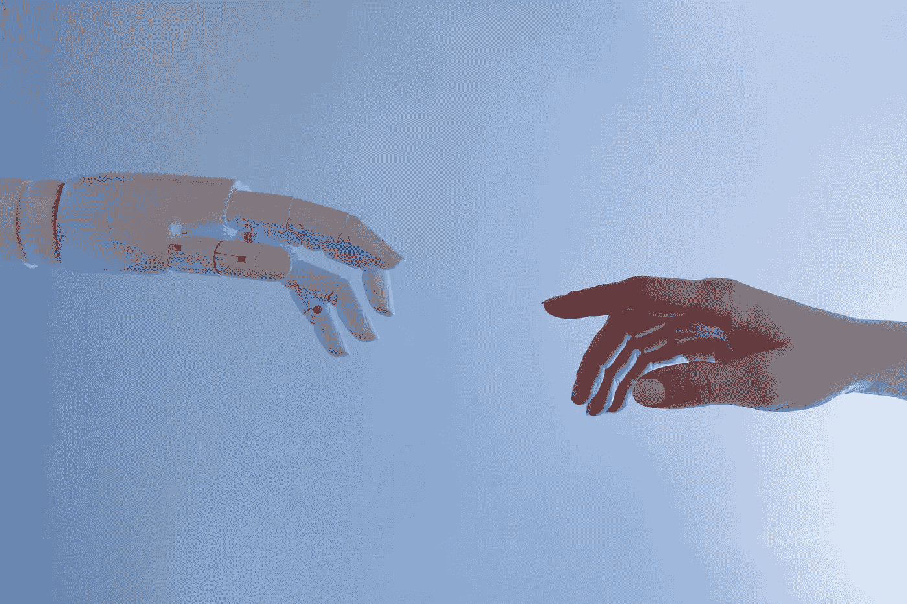

# AI、VR、AR、区块链技术如何融合？

> 原文：<https://medium.com/coinmonks/how-do-ai-vr-ar-and-blockchain-technology-converge-b5cc9de3c5f7?source=collection_archive---------45----------------------->

尽管区块链技术主要用于金融交易和服务，但随着该技术越来越受欢迎，它已经找到了各种新的应用。区块链已被证明在与 VR 和 AR 结合时非常有用，正如我们在之前的一篇文章中已经讨论过的那样，允许 AR NFTs 和虚拟财产、环境等的所有权。这些技术混合在一起，为现实世界的娱乐、投资和艺术提升提供了独一无二的机会。

# 但是 AI 是什么，它在这个故事中处于什么位置？

几十年来，人工智能一直是一个被广泛讨论的概念，是当今世界上积极取得进展的最先进的技术之一。现在，区块链行业已经受到欢迎，人工智能等技术正在进入加密货币和区块链的世界。

当元宇宙被设计成适合每个人的需求时，它可能是一个混乱的地方，但当被组织成针对更窄的受众时，每个人都可以找到适合自己的地方。这就是人工智能可以证明非常有用的地方，[根据每个用户的偏好和之前的互动，为他们创造个性化的客户体验](https://isotopic.io/)。在人工智能的帮助下，可以通过分析每个用户的行为来动态修改数字内容，但保持完全匿名。通过正确的训练，[人工智能可以通过处理大量数据并预测各种情况的结果，将自动化引入区块链技术](https://isotopic.io/)。它可以为区块链创建新的用例场景，并为行业发展提供新的安全级别和机会。

人工智能不仅可以让区块链科技的客户服务和金融方面受益，还可以成为快速发展的区块链和 NFT 博彩业娱乐课程的一部分。人工智能可以为创作者提供各种新鲜的选项，模拟问题、独特的对话框、项目和事件，并影响整体游戏体验。在 Web 3.0 中至关重要的[人工智能技术的另一个可能的应用](https://isotopic.io/)是产生完全独特的非凡物品，确保它们独一无二的行为和外观，可以作为 NFT 出售和交换。这将丰富可供用户购买的资产库，并使区块链奥运会更具吸引力。

通过结合本文中讨论的创新技术，有可能为世界经济创造一个新的进程，提供新的投资机会，并开创一个用户娱乐的新时代。即使所有这些技术仍然存在许多限制，例如虚拟现实中的运动病或人工智能中的培训成本，但这些技术的结合将在不久的将来带来全新水平的娱乐和体验。

文章由 Jenny Lis 撰写，来自[同位素](https://isotopic.io/)

[**同位素**](https://isotopic.io) **是一个支持区块链的软件分发服务，托管整合了 NFTs 和加密货币的游戏和应用。**

> 交易新手？在[最佳加密交易](/coinmonks/crypto-exchange-dd2f9d6f3769)上尝试[加密交易机器人](/coinmonks/crypto-trading-bot-c2ffce8acb2a)或[复制交易](/coinmonks/top-10-crypto-copy-trading-platforms-for-beginners-d0c37c7d698c)