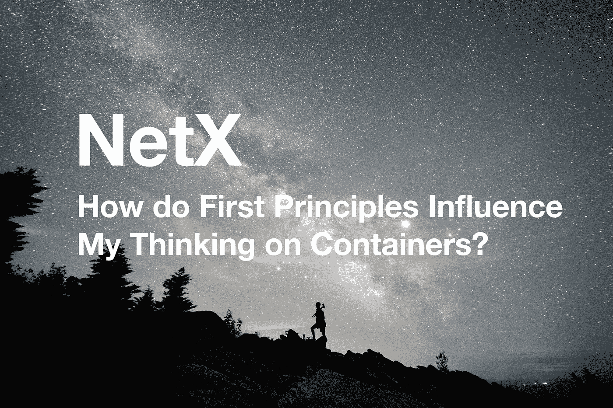

# 基本原则如何影响我对容器的思考？

> 原文：<https://medium.com/coinmonks/how-do-first-principles-influence-my-thinking-on-containers-3d2edf05763e?source=collection_archive---------10----------------------->

第四部分第三章**IT 领域的容器结构**

***TL；博士***

*虚拟化引领云计算时代。传统技术使用虚拟机管理程序虚拟化物理硬件；容器虚拟化操作系统，而不是底层硬件。回顾它的轨迹，深究它的底部，直面挑战。只有这样做，我们才能找到一个最佳的解决方案。*

**

*T 他硅谷钢铁侠**特斯拉和 SpaceX 的 CEO 埃隆马斯克**在接受采访时指出，成功在于 ***第一原理思维*** 。这意味着**把事情归结为“最基本的真理”,然后从那里推理。他鼓励人们把情况分解成基本面，从下往上走。***

*Elon Musk explained the First Principles Thinking in an interview*

*前几章打算剥去 IT 的“皮”,深入细节。**微服务**，解决方案的核心概念，改变人们的思维方式。本文更多地涉及**容器**，阐明技术方法和手段。DevOps 强调文化哲学和研发程序。*

## *虚拟化技术*

*虚拟机揭开了一个新的篇章，云时代。虚拟机建立了虚拟化的计算环境。它们已经出现了很长时间，被认为是第一代云计算的基础。一个或多个虚拟“来宾”机器/操作系统运行在物理“主机”机器上。虚拟机通过轻量级软件 hypervisor 与物理机进行交互，hypervisor 有时也称为虚拟机监视器(VMM)。VMM 将虚拟机相互隔离，并分配 CPU、内存和存储。两个明星虚拟机是 VMware 和 OpenStack。*

*虚拟机可能会占用主机的大量系统资源，并且启动需要几分钟时间，其大小有数 GB。单机一般支持几十个。迁移为特定操作系统开发的基于虚拟机的应用程序可能会非常耗时。因此，迁移应用程序和操作系统必须齐头并进。此外，虚拟机管理程序在设置时分配专用于虚拟机的硬件资源。*

*然而，容器却不受这些缺点的困扰。由 *Docker* 表示的虚拟机和容器都依赖于虚拟化，后者是轻量级的。由于移除了虚拟机管理程序，用户可以享受更快的资源分配和容器上新应用程序的更快可用性。*

***容器的强度***

*   *更有效地利用系统资源*
*   *启动更快*
*   *确保环境一致性*
*   *持续交付和部署*
*   *易于迁移*
*   *提高可重用性，松散耦合，易于维护和扩展*
*   *运行沙盒机制，增强安全性*

*传统上，VMM 虚拟化物理硬件。每个虚拟机都有一个单独的客户操作系统、特定于该操作系统的硬件的虚拟副本、应用程序以及相关的库和依赖关系。具有不同操作系统的虚拟机可以在同一台物理服务器上运行。比如 VMware VM 可以运行在 Linux VM 旁边，Linux VM 可以运行在 Microsoft VM 旁边等等。*

*容器是虚拟化的操作系统(通常是 Linux 或 Windows)，而不是底层硬件。一个容器只包含应用程序、库和依赖项。与虚拟机不同，它们体积小、速度快、可移植。这样，容器依赖于主机操作系统的特性和资源，省去了为每个实例构建客户系统的麻烦。*

## ***最优化的架构载体***

*使用容器，开发人员可以像使用虚拟机一样优化物理机的 CPU 和内存利用率。作为微服务的优化载体，容器遥遥领先。微服务和容器几乎是绝配。当整体架构分解成微服务时，一个全能的存在传送到几个专门的存在。每个不同的服务都存在于一个隔离的容器中，享有最大的灵活性。*

*服务器以其低成本、高利用率、强灵活性、动态调度等优势，最终将走上虚拟化的道路。一台服务器可以安装几个容器，每个容器运行不同的服务程序。容器可以自由地创建或销毁。它们的大小和强度可以在不停机的情况下扩大或缩小，在性能和功耗之间达到动态平衡。**因此，容器化成为云计算的终极形式。***

*集装箱不可能在一台机器上充分发挥作用。只有集群才能最好地利用它们的隔离机制、资源分配和安排管理。在趋势 IT 领域，整体应用早已成为过去。如今，应用程序由独立的容器化组件组成，即微服务。应用程序的功能与协调组件的预设功能相同。老派的 IT 架构让人想起老式的工厂；集装箱化就像现代工厂一样。我们致力于建立智能无人工厂，在这里，容器和应用程序以高效、自动和有序的方式得到控制和管理。我们设想自动化促进资源调度、部署和操作、服务发现、扩展/缩减等。对于集装箱化的应用。话虽如此，这些伟大的愿景仍然对该行业的未来构成了新的挑战。*

```
***The Writer says...**NetX aims at building the Web3 organism. We try to figure out solutions confronted by the present IT industry. To do that, we will look into every module of it to find out setbacks. Then we’ll focus on finding solutions through experiments. It’s a dynamic evolving process. To get the best solution, we have to be clear about the problems and this will be the main idea of Chapter Three. It makes me feel excited when thinking about sharing my thoughts and I do invite you to join me in this exploration and contribute to the evolvement of NetX.*
```

# *📚必读*

*[NetX 系列 1.1](/triaslab/rethinking-the-it-industry-d101384e801) | [NetX 系列 1.2](/coinmonks/a-letter-from-satoshi-nakamoto-345a45d012bb) | [NetX 系列 1.3](/coinmonks/out-of-control-the-post-it-evolution-dd64e05ff5bc) | [NetX 系列 2.1](/coinmonks/life-emerges-9ebf26304cd4) | [NetX 系列 2.2](/coinmonks/life-is-out-of-control-9f8e5b7b4b99) | [NetX 系列 2.3](/coinmonks/the-kite-flies-up-and-i-become-the-kite-40678b9dabda) | [NetX 系列 3.1](/coinmonks/the-container-in-the-it-field-21250e3e8b5) | [NetX 系列 3.2](/coinmonks/microservice-architecture-for-new-technologies-d0e37cfccdfa) | [NetX 系列 3.3](/coinmonks/from-service-mesh-to-serverless-570ebd69c884)*

****NetX，面向数字生活的可信可靠的智能自治系统链原生互联网(***[***Trias***](https://www.trias.one/)***)****

*[***铁人三项***](https://www.triathon.space/#/)***|***[***Ethanim***](https://www.ethanim.network/)***|***[***Tusima***](https://www.tusima.network/#/)***| behemo tum | Octavius | leviam | Divina****

> *交易新手？尝试[加密交易机器人](/coinmonks/crypto-trading-bot-c2ffce8acb2a)或[复制交易](/coinmonks/top-10-crypto-copy-trading-platforms-for-beginners-d0c37c7d698c)*

> **加入 Coinmonks* [*电报频道*](https://t.me/coincodecap) *和* [*Youtube 频道*](https://www.youtube.com/c/coinmonks/videos) *了解加密交易和投资**

# *另外，阅读*

*   *[有哪些交易信号？](https://coincodecap.com/trading-signal) | [Bitstamp vs 比特币基地](https://coincodecap.com/bitstamp-coinbase) | [买索拉纳](https://coincodecap.com/buy-solana)*
*   *[加密交易机器人](/coinmonks/crypto-trading-bot-c2ffce8acb2a) | [维护审查](https://coincodecap.com/uphold-review)*
*   *[如何给 MetaMask 钱包添加 Arbitrum？](https://coincodecap.com/how-to-add-arbitrum-to-metamask-wallet)*
*   *[KuCoin vs 北海巨妖 vs BitYard](https://coincodecap.com/kucoin-vs-kraken-vs-bityard)*
*   *[加密交易的最佳 VPN](https://coincodecap.com/best-vpns-for-crypto-trading)*