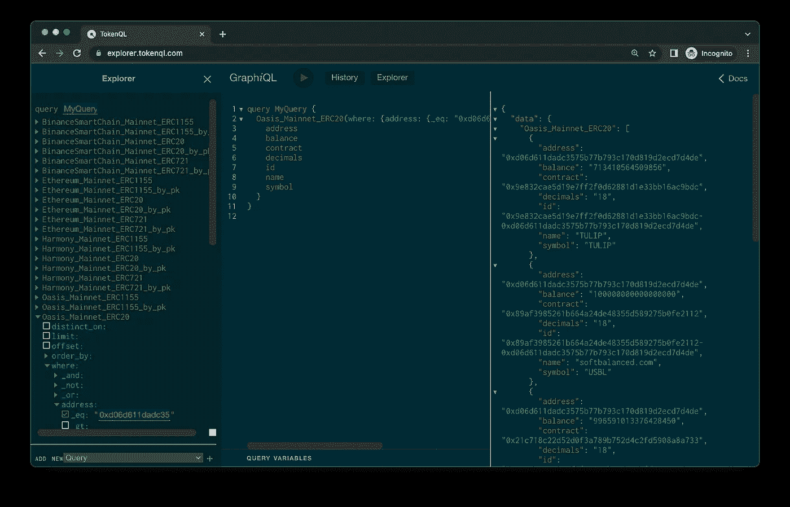
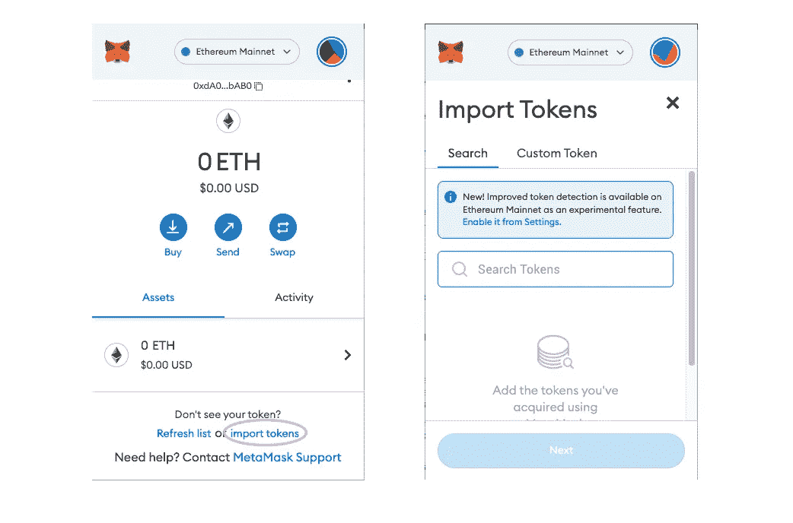

# 我如何得到所有的代币？

> 原文：<https://medium.com/coinmonks/how-do-i-get-all-the-tokens-21ff1607d189?source=collection_archive---------3----------------------->

简单的问题。复杂的解决方案。

# TLDR

(目前)还没有一个万能的解决方案。

# 问题

> 我用 metamask 登录我的网站。但是我想在元掩码中获得所有令牌(如 BNB、RARI 等)的平衡。我如何获得所有代币的余额？

 [## 我如何通过 web3 或其他方式获得我的 Metamask 钱包中的所有令牌？

### 正如你在评论中已经指出的，没有人知道你账户的所有代币余额，甚至元掩码也不知道…

stackoverflow.com](https://stackoverflow.com/questions/67363924/how-do-i-get-all-the-tokens-inside-my-metamask-wallet-by-web3-or-others) 

# 回答

> 正如你在评论中已经指出的，没有人知道你账户的所有代币余额，甚至元掩码也不知道。这是因为令牌不在您的帐户中，而是在跟踪您的令牌余额的令牌智能合约中。

# 解决方案 1:知道合同地址

如果知道合同地址，可以导入到钱包里。

# 解决方案 2:白名单令牌

诸如令牌列表之类的服务聚集了令牌列表😉。这些都是为 ERC 20(可替换的令牌)策划的。

 [## 以太坊令牌列表

### 帮助以太坊社区以包容的方式创建、发现和维护信誉良好的令牌列表…

tokenlists.org](https://tokenlists.org/) 

# 解决方案 3:图表

上述解决方案适用于 ERC-20 令牌(可替换令牌)。ERC-721(不可替代)和 ERC-1155(半可替代)怎么样？

这将需要更多的技术工作，但你可以开始一个图表，将听取合同地址列表。由于该图将于 2023 年在 Q1[关闭托管服务，明智的做法是部署自己的服务。](https://thegraph.com/blog/sunsetting-hosted-service)

 [## 将子图部署到任何 EVM

### 使用 Docker、图、图节点和 OpenZepplin 子图

medium.com](/coinmonks/deploy-subgraphs-to-any-evm-aaaccc3559f) 

# 解决方案 4:数据提供者

有些服务可以提供一些数据

## 道德

[https://docs . moralis . io/moralis-dapp/web 3-API/account # gettoken balances](https://docs.moralis.io/moralis-dapp/web3-api/account#gettokenbalances)

## 魔力

ERC-20:[https://docs . alchemy . com/docs/how-to-get-all-tokens-owned-by-an-address](https://docs.alchemy.com/docs/how-to-get-all-tokens-owned-by-an-address)

https://docs.alchemy.com/reference/nft-api-endpoints

## 图表

[https://the graph . com/hosted-service/sub graph/Leon-do/乐观-erc20-erc721-erc1155](https://thegraph.com/hosted-service/subgraph/leon-do/optimism-erc20-erc721-erc1155)

## 共价的

[https://www . covalenthq . com/docs/API/#/0/Get % 20 token % 20 balances % 20 for % 20 address/USD/1](https://www.covalenthq.com/docs/api/#/0/Get%20token%20balances%20for%20address/USD/1)

## Ankr

[https://documenter . get postman . com/view/19024547/UVsEVUGQ # 1bd 10982-fee 7-4c 71-9623-c 42470 b13a 1](https://documenter.getpostman.com/view/19024547/UVsEVUGQ#1bd10982-fee7-4c71-9623-c42470b13aa1)

每个服务在这里都有其优缺点:[https://medium . com/web 3-magazine/comparison-NFT-API-providers-5f 45368 D2 c7f](/web3-magazine/comparison-nft-api-providers-5f45368d2c7f)

# 解决方案 5:创建自定义索引器

最耗费资源。

*   连接到完整节点
*   获取从块 0 开始的每个事务
*   检查`from`和`to`地址，看是否是 ERC20，721，1155 合同。这需要散列(keccak-256)方法在字节码中搜索它。例`transferFrom(address,address,uint256)` > `23b872dd`
*   侦听发出的事件，并将其保存到数据库中。
*   构建一个 API 层来查询数据库。

> 交易新手？尝试[加密交易机器人](/coinmonks/crypto-trading-bot-c2ffce8acb2a)或[复制交易](/coinmonks/top-10-crypto-copy-trading-platforms-for-beginners-d0c37c7d698c)

# 我如何获得“所有”链的“所有”令牌？

一些数据提供者在链中受到限制，或者它们的数据结构不同。一个选项是聚合上述所有服务并规范化数据。这需要一个单独的后端，api 键和代码。

# 结论

没有万能的解决方案，但有多种选择。如果您对多链令牌索引器感兴趣，请随时联系我们。

Photo by [Stephen Dawson](https://unsplash.com/@dawson2406?utm_source=medium&utm_medium=referral) on [Unsplash](https://unsplash.com?utm_source=medium&utm_medium=referral)