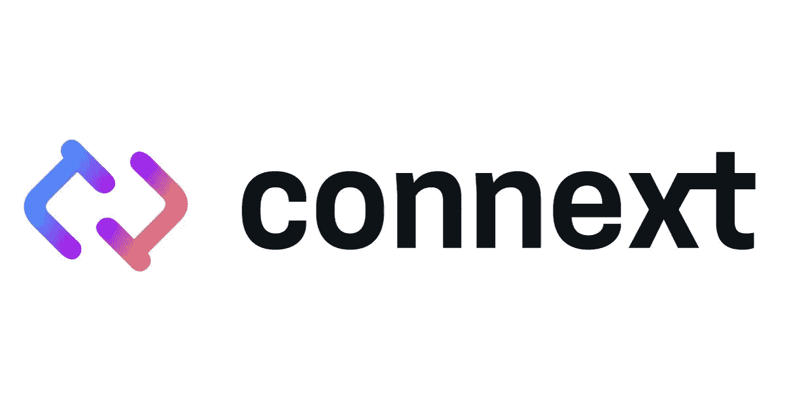

# 我如何参加“贡献者计划”？

> 原文：<https://medium.com/coinmonks/how-do-i-take-part-in-the-contributor-program-57520257864e?source=collection_archive---------51----------------------->

嗨，所有区块链、Web 3.0 和一般加密行业的爱好者们。今天我想告诉你如何参加“贡献者计划”以及它有什么好处。

先简单介绍一下关于 ConnextNetwork，它是一个什么样的项目，做什么的？然后让我们来看看贡献者计划的本质。

Connext 是一种互操作性协议，允许开发者创建完全表达的附加应用(xApps ),并强调安全性。
简单来说，该项目试图解决区块链跨网络互通的问题。为此提供最佳解决方案——其功能性[交叉链桥](https://bridge.connext.network/)。

我想我已经给了你这个项目的想法。在不久的将来，我会写一篇更详细的文章，介绍这个项目本身、它的团队以及它的总体前景。现在让我们回到今天文章的主题，即如何成为项目大使，这样做的好处是什么？

首先，这个项目已经进行了几个月了，但是现在参加还不算太晚。所以如果你还不是这个项目的大使，我建议你申请。一会儿我会告诉你怎么做。

> 交易新手？尝试[加密交易机器人](/coinmonks/crypto-trading-bot-c2ffce8acb2a)或[复制交易](/coinmonks/top-10-crypto-copy-trading-platforms-for-beginners-d0c37c7d698c)

首先加入[不和谐](https://discord.gg/xFEJGXnT)并填写此[表格](https://form.typeform.com/to/tSBsjYxh?typeform-source=medium.com)。基本上，这里没有什么复杂的，你只需要回答几个问题。填写完这张表格后，您将会收到一封电子邮件，其中包含一个途经 KYC 的链接。当你获得 KYC 的批准时，如果你做的一切正确，通常需要 5 分钟到 24 小时。您将再次收到另一封电子邮件，要求您签署与该计划各种细微差别的适当文件。通常这封信不会马上来，我个人 4 天就收到了。是的，如你所见，该项目非常重视大使计划，我认为这是一个很大的优势。

所以你已经做了一切，通过了 KYC，签署了适当的文件，然后呢？然后我们去项目不和谐，在那里我们可以看到，你被赋予了贡献者的角色。接受这个角色后，你需要去#select-track-role，选择你最喜欢的方向，在这个方向上你可以证明自己是最好的。您只能选择一个方向，如果您选择了多个方向，您可能会被取消资格。

现在让我们看看到底有什么方向:

**👫社区领袖**

社区领袖管理着我们的生态系统。他们负责在全球范围内运营本地化的 Connext 社区，支持网络的新用户，向所在地区介绍网络，管理生态系统的社会空间，并通过维护我们的价值观和政策来管理社区。

*   所需人员技能水平:高级
*   所需技术水平:低
*   油液在线-存在 IRL:推荐

**🛠️建筑商**

建设者是网络的核心。构建者负责开发协议的新用例，将 Connext 集成到其他生态系统中，指导正在使用 Connext 的新开发者，并在开发者空间推广 Connext。

*   所需技术水平:高级
*   Web3 精神:必需
*   将臭虫转化为特征的能力:赞赏

**📚内容&教育**

内容创建者和教育工作者帮助世界了解 Connext。他们围绕 Connext 创建高质量的内容(视频、推文、媒体帖子、迷因等)..)，并开发技术和非技术教育资源。

*   所需创造力水平:高级
*   技术知识:优先
*   DeFi/Bridges 知识:推荐

**🗼路由器**

路由器运行网络。作为 Amarok 升级的公共测试网的一部分，这个轨道的成员运行他们自己的路由器(最终是 mainnet！)，构建工具和接口以改善操作路由器的体验，并通常帮助管理路由器社区。

*   所需技术水平:高级
*   对网络 3 基础的热情:必需
*   对自动化的极度渴望:赞赏

**🎁授予**

受赠方是网络的创新者。虽然其他轨道封装了社区成员可以参与的关键机制，但总有我们尚未想到的创新方法来支持网络！受赠方提出并获得资金用于他们希望发展生态系统的特殊一次性项目。

*   所需技术水平:中等
*   创新激情:必需
*   开放心态:受到赞赏

所以，我们已经找出了项目中可用的基本方向。所以，鉴于你的技能，我建议你选择一个你能最好地展示自己的方向。

现在到了有趣的部分，为什么要参加贡献者计划呢？嗯，首先是新知识，对，对，知识是你能获得的最大价值。但是你会说我已经知道很多了，为什么我还需要更多？所以对于像你这样的人，我会把第二个大加称为一个熟悉项目团队的机会。但是你会说我已经有很多朋友了，为什么我还需要更多呢？所以第三大好处是有机会成为项目新产品的首批试用者。但是在这里你可以说你已经尝试了很多产品，你不感兴趣。对于像你这样的人来说，还有第四个非常重要的好处，即你有机会为你的所有努力获得下一个令牌，但在这里你可以说你已经有了这个令牌。以下是一些重要信息:

下一个代币还没有公开发售，所以如果你看到这个代币的任何销售，或者有人给你写了一个私人信息，要求购买代币。知道自己是骗子，千万不要上骗子的当，要经常查资料！

现在，您已经了解了参与贡献者计划所需的所有信息，以及它的细微差别和强大优势。我劝你不要拖，要马上参加这个节目。记住，是你今天的决定决定了你明天会成为什么样的人！

点击此处关注项目:

[网站](https://connext.network/) | [文档](https://docs.connext.network/) | [推特](https://twitter.com/connextnetwork) | [不和](https://discord.gg/connext) | [Github](https://github.com/connext) | [博客](https://blog.connext.network/)