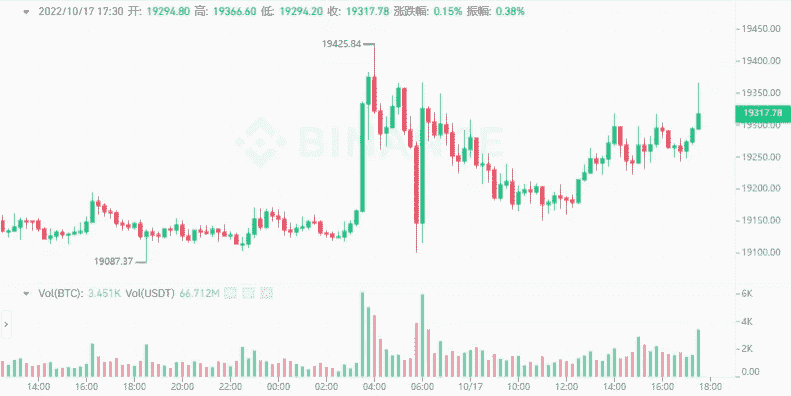

# 密码市场的新玩家如何积累 BTC？

> 原文：<https://medium.com/coinmonks/how-do-new-players-in-the-crypto-market-accumulate-a-btc-4de637e6e7e9?source=collection_archive---------16----------------------->

前几天，我一直在读李笑来的《韭菜修身》。这本书的标题很有趣。看完之后，我有一些收获。

李笑来在互联网上褒贬不一。楚小莲进入密码圈的时间太短了。我只是一个小韭菜，不太了解他的事迹，但是作为一个圈子新人，这三个想法还是挺有好处的。

**1。只投资市场上大多数人看好的标的。**

无论是股市还是密码市场，作为新手，确实很难找到优质的项目，也很难知道哪一个有可能带来十倍的回报。

密码市场波动很大，许多信息是时间敏感的。新手见多识广。当他们看到新闻的时候，基本就是末日了，追高风险极高。

Bitcoin rises and falls

对于初入密码市场的新手来说，最好只专注于交易 top 1–2 的项目，这些项目都是市场筛选出来的。新手不要不靠谱的买，要跟随市场上大多数人的判断，只投资龙头项目。

比如通过数据平台，可以查看哪些是市值最大，流动性最强的，选择前 1–2 的行业。就算归零，也不会这么快。一天不可能有 100 倍的机会，5 分钟也不会是零。

Crypto Market Project Leaderboard

**2。市场有周期。**

大部分新人看到比特币涨到 69k，听到 Dogecoin 和 shitcoin 都出圈了，才姗姗来迟，准备进场。此时已经是疯狂牛市的尾声，入市就意味着被套牢。卡住了。

果不其然，在去年 11 月中旬的狂欢之后，比特币从 69K 持续下跌到今天的 19K，下跌了 5 万美元，跌幅超过 72%。

根据市场波动，如果你去年投资 1000 美元购买比特币，价值只剩 275 美元；如果买其他的 altcoins，大部分都已经归零了。

熊市没有财富效应，市场不景气，大部分人离场，媒体也没有报道。现在是新一轮的低谷，也许是新一轮周期的起点。

Bitcoin’s Cyclical Fluctuations

但大多数人看不到暴涨暴跌、出圈的项目，更谈不上市场机会。大部分人的路径是人多的时候进，没人管的时候出，所以大部分人亏钱。

新手要想有所收获，可能要背离路径依赖，选择一条少走的路，循着循环做正确的事。

**3。降低交易频率，提高场外本金积累强度。**

有些人继续交易和波动。虽然他们有所收获，但一旦踏空，就会被市场束缚。

新人理解不了，反应慢，不如减少操作频率。不懂就不要投。你听到的大概是十倍的机会，大部分都是诱饵，只是忽悠你接受要约。

大部分报道的发家致富的故事都是关于投哪个标的，多少年都忘了，结果涨了很多倍；当然，也有很多项目多年后全部归零。

只有将其置于更长的市场周期中，避免频繁买卖，才有可能等待最后的机会；这个前提就是投资已经被市场看好的项目，受益于大势。

How many BTC do you have?

市场是同一个市场，有些人在上一次牛市中被套了；有的人在 100 倍的 altcoins 里来回切换，被动归零；有些人合同到期，悄悄离开市场。

还有新一轮想在市场上一探究竟的人。不管你是哪种方阵选手，都要多学习，找到适合自己的打法。

以上只是我个人观点，没有投资建议。我是楚小莲，我正在关注元宇宙和 web3。

> 交易新手？试试[加密交易机器人](/coinmonks/crypto-trading-bot-c2ffce8acb2a)或者[复制交易](/coinmonks/top-10-crypto-copy-trading-platforms-for-beginners-d0c37c7d698c)