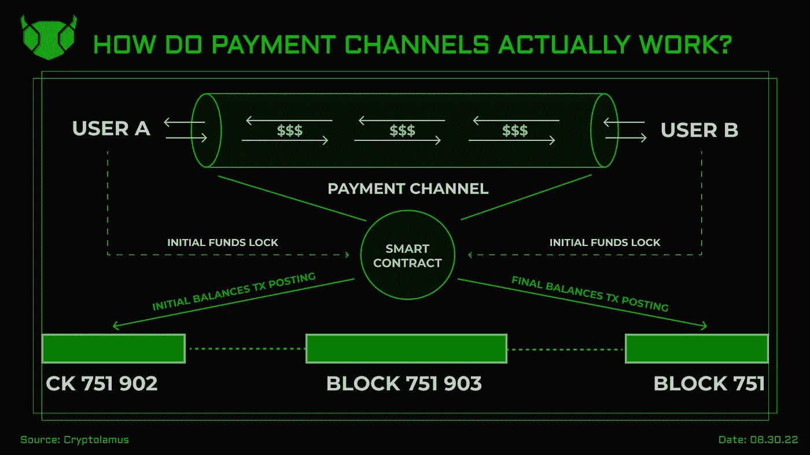

# 支付渠道实际上是如何运作的？

> 原文：<https://medium.com/coinmonks/how-do-payment-channels-actually-work-5c310cc76c75?source=collection_archive---------49----------------------->

Topline schematic algorithm of payment channel settlement

> 每个人都在以汇总的形式谈论以太坊的第二层扩展解决方案，然而，比特币上使用最多的扩展解决方案是基于支付渠道的。事实上，多亏了他们，你可能会在 Twitter 上得到提示，或者通过 crypto 买一杯咖啡。但是它们到底是什么呢？让我们开始吧。

# **什么是支付渠道？**

支付通道是第 2 层扩展解决方案，允许双方或多方之间无需托管的即时离线支付。支付通道通过管理区块链主网(第 1 层)之外的交易，增强了区块链应用程序的可伸缩性，同时仍然受益于主网强大的分散安全范例。

使用最多的支付通道第二层解决方案是闪电网络，它依赖比特币作为第一层。根据 [Defi Llama](https://defillama.com/protocol/lightning-network) 目前闪电网络上的 TVL 达到 9200 万美元。

# 它们是如何工作的？

为了打开与特定交易方的支付通道，个人或实体应在智能合同中存入适当数量的密码，然后智能合同根据一组预定义的规则打开并维护支付通道。一旦初始资金被发送到这个智能合约，它们就会被锁定在 multisig 钱包中。智能合约向基础区块链发送 tx 结果，以验证交易方余额的初始状态。通常，这些余额的总和就是信道容量，并且在信道的生命周期内不会改变(信道具有“容量守恒”属性)。

在初始存款交易已经过账到基础区块链之后，交易对手可以开始自由地在链外彼此之间执行交易。同时，smart contract 应该充当簿记员，在每次成功交易后更新各方的余额。当各方认为支付已经结束时，他们可以关闭他们的支付通道。在接收到双方的签名之后，智能合同将他们的余额的最终结果发布到基础区块链，并且在此之后，资金被解锁并以各自的金额返回给双方。

值得注意的是，尽管支付通道通常存在于两个特定方之间，但是即使他们之间没有开放的支付通道，甲方也完全有可能向乙方发送密码。这要归功于支付途径。节点通常通过经由与其他用户的现有开放支付信道在彼此之间最佳地连接网络用户来执行这种路由。他们通常收取服务费。

# 为什么以及在哪里使用它们？

可伸缩性是区块链目前面临的一个大问题。这就是所有第 2 层解决方案派上用场的地方。支付通道能够大幅提高 TPS、降低 tx 费用、加快 tx 终结等。

许多主要的区块链都有支付渠道解决方案，但最著名的是比特币([闪电网络](https://lightning.network/))和以太坊([闪电网络](https://raiden.network/))的支付渠道解决方案。

闪电网络促进了大多数 B2C 比特币互动(如 BTC 的商品支付)，并与支付处理和其他公司建立了广泛的合作伙伴关系，而雷电网络的吸引力则有限得多，因为以太坊上其他类型的缩放解决方案(如多边形、L2 易拉宝等)很受欢迎。)

# 支付渠道有什么好处？

支付渠道允许用户进行几乎即时的低费用交易。它们还支持微交易，如果直接在第 1 层执行，从经济角度来看，微交易通常是不可行的。通过安排支付交易和二维码发票，可以通过支付渠道方便地安排账单。最后，他们促成了[原子互换](https://www.investopedia.com/terms/a/atomic-swaps.asp#:~:text=An%20atomic%20swap%20is%20an,give%20token%20owners%20total%20control.)，这是一种相对创新的非托管低费用 p2p 令牌交换方式。

# 他们的缺点是什么？

支付通道的第一个缺点是，在双方之间建立支付通道之前，必须锁定智能合同中的资金。这并不总是一种方便的方法，尤其是如果你只是想通过 crypto 购买一个早餐羊角面包和一杯咖啡。此外，由于大多数支付通道解决方案的目的是提供可伸缩性和低费用，所以提供给节点的路由费用通常不足以进行有效和成功的支付路由，这可能导致支付通道用户的失败或缓慢的交易。最后，支付渠道经常遭受黑客攻击和滥用，这可能导致资金损失、网络拥塞、交易失败等。

# 结果

在我们看来，支付渠道是 crypto 中值得跟踪和理解的扩展解决方案类型。它们可以作为特定 B2B 和 B2C 交易(尤其是那些与网络内定期小额支付相关的交易)的非常有效的网关。然而，在当前的发展状态下，它们仍然有一系列的限制，阻碍了它们的进一步采用和利用。

感谢您的阅读，如果您觉得内容有用，请订阅！

> 交易新手？试试[加密交易机器人](/coinmonks/crypto-trading-bot-c2ffce8acb2a)或者[复制交易](/coinmonks/top-10-crypto-copy-trading-platforms-for-beginners-d0c37c7d698c)