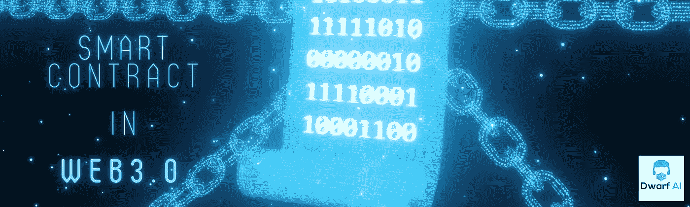

# 矮人 AI 的智能合约解决方案是如何解决 Web 3.0 问题的？

> 原文：<https://medium.com/coinmonks/how-do-smart-contract-solutions-by-dwarf-ai-solve-the-web-3-0-problem-408aecbd1392?source=collection_archive---------52----------------------->

Smart Contract solutions by Dwarf AI

S mart 契约可用性彻底改变了区块链技术的世界。每当这些代码或智能合约满足定义的条件时，它就会自动推送一个平台必须遵循的协议。在当前上下文中，智能合约是分散式应用程序(dapps)的构建模块，有可能获得数百万用户。

Twitter — Cathie wood on smart contract

仅仅在这个非常早期的阶段，Defi 智能合同的价值约为 840 亿美元，这使得市场更加看好其用例，随着时间的变化，用户正在转向定制的解决方案和服务，这就是 [Dwarf AI](https://www.dwarf-ai.com/) 为其客户提供一流服务的目的。

Defi 智能合约需求在经历了 2020 年的繁荣后，到 2028 年将跌至 14.603 亿美元，[以太坊](/me/stats/post/4c2c66624b20)是去中心化应用(dapps)开发商的首选，Polygon、Solana、币安和 Tron 智能合约也在用户中获得了显著的增长势头。

## **关于矮人 AI 提供的 Defi 智能合约服务，大家怎么说？**

智能合同的采用因其高速度和优化的运营成本而激增。作为智能合同开发服务提供商，我们在该领域拥有丰富的专业知识，我们的首要任务是与您分享我们客户的经验，具体如下:

*   **运营成本最低**:[Dwarf AI](https://www.dwarf-ai.com/)解决方案创建了 defi 智能合约，dapps 功能只需最少的人工干预，因此降低了总体成本。
*   **减少或消除风险**:现有的金融系统受够了操纵，在这里[侏儒 AI](https://www.dwarf-ai.com/) 智能联系人解决方案开始发挥作用，在 Defi 智能合约存在的情况下给予系统的输入现在不受任何操纵。
*   **没有或很少中介-** 合同完全是在双方之间签订的，因此不存在这样的中介。
*   **交易的准确性-** 由于自动化是智能合同开发的关键驱动力，交易中的错误已被排除。
*   **实时执行**-为了实时运营财务和业务，defi 智能合约提供了自动执行代码的解决方案，就像以太坊或 Tron 智能合约服务一样。

## **矮人 AI 拥有智能合约部署不同领域的专业知识**

**1。金融服务**

**a)结算—**dwar fai 推荐的智能合约软件，管理双方之间的工作，明确交易金额，只要条件得到满足，转账就会立即进行。

**b)优惠券交易** -智能合约，以这样一种方式创建，它在定义的时间间隔内自动付款，并且当债券失效时，基本金额被偿还。

**c)处理保险索赔-** [Dwarf AI 的](https://www.dwarf-ai.com/)智能合同服务以这样一种方式创建智能合同，即它通过自动化路由器、检查错误以及执行支付的计算和处理来工作。

2) **NFTs &令牌化** -现实世界的资产价值通过智能合约以令牌的形式被冻结，这些现实世界的资产通过智能合约在区块链发挥作用&，它们已经在汇率上被交易和跟踪。

3) **博彩上的分散应用(dapp)**-博彩行业因为操纵等错误做法而成为新闻焦点，尽管该行业发现了智能合同的强大用例。

智能触点可设计用于对抗博彩行业中的以下情况:

1.  博彩赔率
2.  延迟结算
3.  错误的交易

**4)游戏应用** -使用随机可验证函数的智能合约可以改善通过幸运抽奖或抽奖提供的产品。

**5)投机市场**——要获得包括密码市场在内的任何市场的实时动向，推荐的 Dwarf AI 的智能合约软件和数据 oracle 可以同步工作，获得实时执行。

**6)供应链可追溯性-** 供应链中的智能合同通过自动验证和执行所涉及的多项业务交易，抑制了缺乏可追溯性和透明度等复杂性。Dwarf AI 公布了其名为[供应链可追溯性](https://github.com/Dwarf-AI/supply-chain-traceability-contract)的知识库，看看它吧，因为它专门解决了供应链中的复杂问题。

**包装完毕**

智能合约已经彻底改变了世界，尤其是在个人层面的信息交换方面。智能合约开启了金融服务领域出现的大量机会，因此可以说，在未来几天，智能合约将更多地集成到我们的日常移动应用中，类似于 swiggy、zomato、Ola、uber 等。

如果你对你在 Web 3.0 中的商业想法感到兴奋，并希望利用[侏儒人工智能解决方案](https://www.dwarf-ai.com/)，那么联系我们的[区块链开发专家。](https://www.linkedin.com/company/79796323/admin/)

*作者-*

***跟随** [**矮人艾**](https://www.dwarf-ai.com/) **上***

*[**网站**](https://www.dwarf-ai.com/) **|** [**推特**](https://twitter.com/dwarf_ai) **|** [**领英**](https://www.linkedin.com/feed/)*

> *交易新手？尝试[加密交易机器人](/coinmonks/crypto-trading-bot-c2ffce8acb2a)或[复制交易](/coinmonks/top-10-crypto-copy-trading-platforms-for-beginners-d0c37c7d698c)*