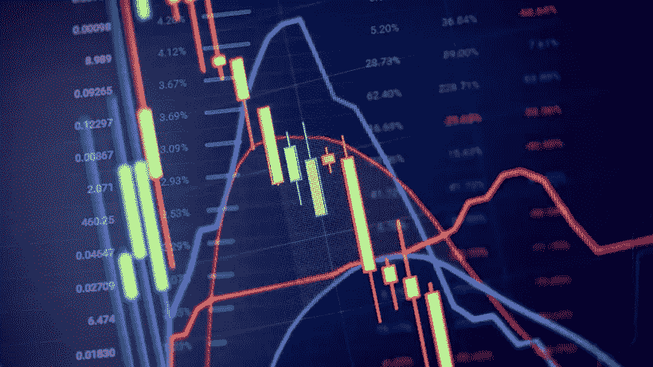

# 当市场下跌时，我们如何受益？

> 原文：<https://medium.com/coinmonks/how-do-we-benefit-when-the-market-goes-down-d17c6aa9ba7f?source=collection_archive---------32----------------------->

## 熊市策略

**Price graph and indicator, red and green candlestick chart on blue theme screen, market volatility, up and down trend. Stock trading, crypto currency background.**

**尽管股票和加密货币最近开始小幅上涨，世界也变得更加欣喜若狂，期待未来的上涨，但保持清醒的头脑并环顾四周是很重要的——通货膨胀继续上升，乌克兰战争仍在继续，塞尔维亚和科索沃之间的局势紧张，以及与中国或** …