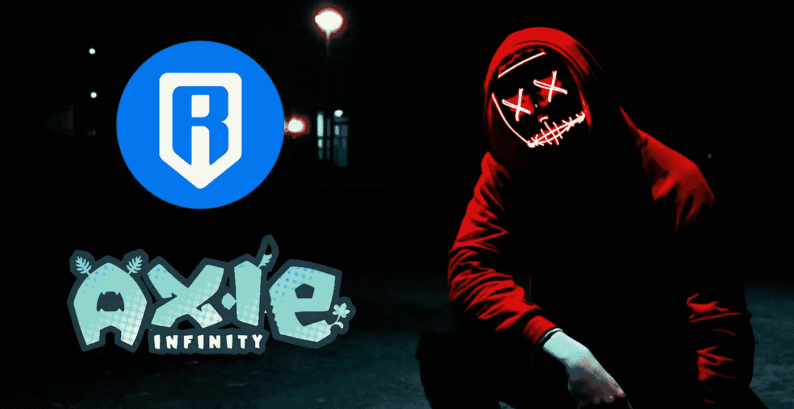
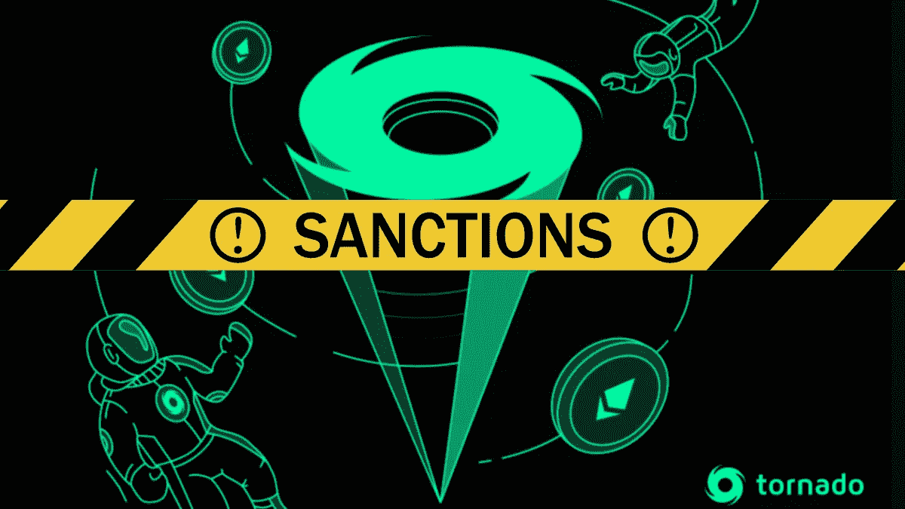

# 你如何禁止软件？

> 原文：<https://medium.com/coinmonks/how-do-you-ban-software-3721d3ead1b2?source=collection_archive---------67----------------------->

Hacks like the one done on the Ronin Bridge really makes you question the security of web3 infrastructure.

当 Axie Infinity 的 Ronin Bridge 今年早些时候被黑客以 6 . 25 亿美元的价格攻击时，它严重震动了加密界。

现在仍能感受到它的影响。

> 不知道什么时候买卖，试试[复制交易](http://coincodecap.com/go/bityard)。

美国刚刚突然果断地禁止其公民使用龙卷风现金。

为什么？

**美国国务院出于国家安全考虑，禁止美国人使用该设备，因为朝鲜黑客涉嫌利用该设备清洗被盗的加密资金**

就像美国怀疑袭击大桥并带走小城市 GDP 的朝鲜黑客使用龙卷风现金“清洗”了数百万美元。

The US gov decided to ban Tornado Cash and sent the web3 world in a mixed frenzy.

Tornado Cash 是一种通过匿名化资金和用复杂的方法隐藏买家身份来混淆交易的服务，混淆了原始发送者的信息。

从本质上讲，黑客窃取了资金，通过 Tornado Cash 传递，隐藏了他们的身份，然后“干净”的资金出现了，他们可以随心所欲地消费。

老实说，这是一个相当聪明的软件(人类很神奇，不是吗？).

但它确实会产生一系列问题，这是没有人能够预见的。

现在，美国已经正式宣布龙卷风现金为非法，并禁止任何公民使用它。

那很棘手。

Vitalik Buterin, cofounder of Ethereum, supports privacy on web3, but with conditions.

有时候你想做一些稍微私密或者你不想让别人知道的交易。

也许你想在周末付钱给你的朋友买啤酒，而不让你的父母知道这件事。

也许是为了支付你不想让雇主知道的健康检查费用。

你是怎么做到的？

另外，禁止一个软件在网上飘，有点怪怪的。

如果有人真的使用了龙卷风现金，他们的身份和资金将被匿名。

他们将如何监管和执行禁令？

隐私不是犯罪。

记住这一点。

Are there cases where anonymous web3 transactions are justified?

也许这就是为什么像 Monero 这样的隐私币这么多年来一直受欢迎的原因。

它掩盖了你的交易，不让别人知道。

它给你提供了你需要的隐私。

像任何强大的工具一样，它可以用来做坏事，也可以用来做好事。

有人会利用它进行毒品交易、武器销售、恐怖活动和各种非法交易。

不管怎样，我们必须找到一个平衡点。

我们是因为一些坏演员而完全取消我们的隐私权，还是支持它并冒着让坏人获胜的风险？

你站在哪一边？

-

政府应该禁止公民的隐私吗？

-

# startups # business # startupx # growth # success # social media # culture # entrepreneur # ban # privacy # monero # tonradocash # axie # ronin #黑客#朝鲜#美国# web3 #区块链#crypto #eth #btc

> *加入 Coinmonks* [*电报频道*](https://t.me/coincodecap) *和* [*Youtube 频道*](https://www.youtube.com/c/coinmonks/videos) *了解加密交易和投资*

# 另外，阅读

*   [瓦济里克斯 NFT 评论](https://coincodecap.com/wazirx-nft-review)|[Bitsgap vs Pionex](https://coincodecap.com/bitsgap-vs-pionex)|[Tangem 评论](https://coincodecap.com/tangem-wallet-review)
*   如何使用 Solidity 在以太坊上创建 DApp？
*   [加密交易机器人](/coinmonks/crypto-trading-bot-c2ffce8acb2a) | [OKEx vs 币安](https://coincodecap.com/okex-vs-binance)
*   [币安 vs FTX](https://coincodecap.com/binance-vs-ftx) | [最佳(SOL)索拉纳钱包](https://coincodecap.com/solana-wallets)
*   [如何在 Uniswap 上交换加密？](https://coincodecap.com/swap-crypto-on-uniswap) | [A-Ads 评论](https://coincodecap.com/a-ads-review)