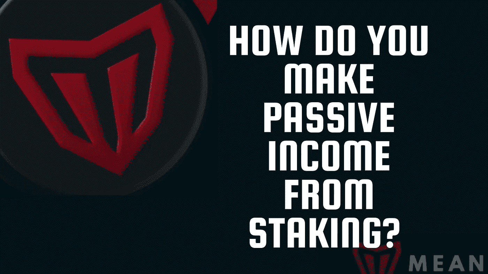
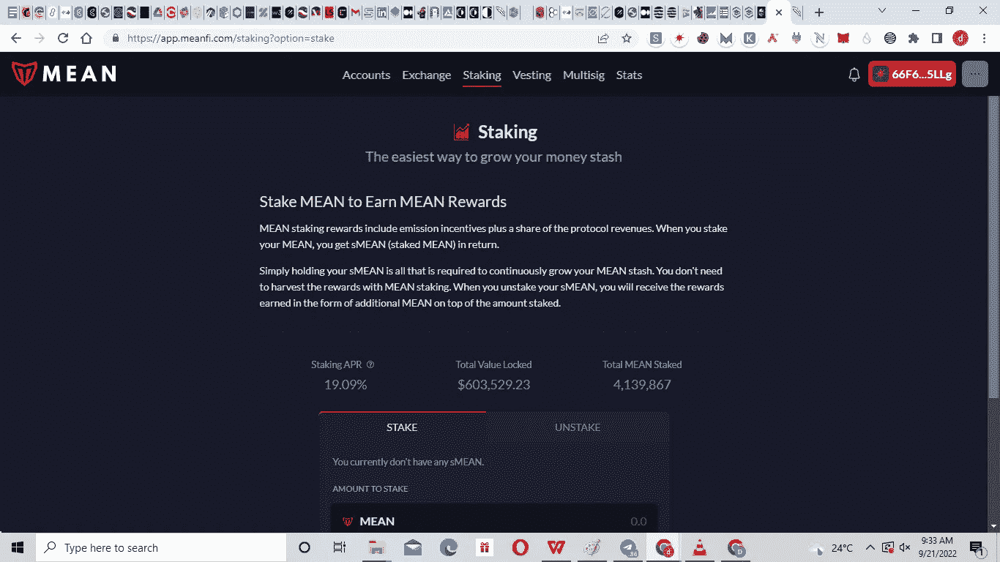

# 你如何从赌注中获得被动收入？

> 原文：<https://medium.com/coinmonks/how-do-you-make-passive-income-from-staking-837a9a48cddf?source=collection_archive---------26----------------------->

不要为钱工作，让钱为你工作—《富爸爸穷爸爸》的作者罗伯特·清崎。

除了资本收益，加密货币和现代分散金融(DeFi)更具吸引力的一个原因是它提供了额外的激励。简而言之，你可以通过持有你的加密资产而不是预期市场价值的上升来被动获利。

[意味着令牌](https://coinmarketcap.com/currencies/meanfi/)是为霍德勒提供这种额外激励的项目之一。

*下注*你的加密资产是从霍德林获利的流行方法之一。

***但是赌注到底是什么意思呢？*** ……..首先，这意味着让你的钱为你工作，就像罗伯特清崎建议的那样。

现在，让我们探索。

抓紧了，我们全速前进！

gif by [Tenor](http://tenor.com)

## **什么是跑马圈地？**

赌注是一个允许代币持有者因将其代币提交给项目生态系统而获得被动奖励的过程。这可以通过在一段时间内锁定令牌来实现。根据被标桩的令牌和用于标桩的平台，标桩的周期可以是固定的或灵活的。

赌注类似于一些传统投资提供的服务，但 DeFi 的投资回报率更高。这一点，以及 DeFi 中的许多其他机会，使其优于传统金融(TradFi)。

## **打桩是如何工作的？**

使用支持[利害关系证明(PoS)](https://www.investopedia.com/terms/p/proof-stake-pos.asp) 共识机制的令牌，标记加密资产是可能的。

共识机制是指区块链网络的管理方式和交易验证方式。以太坊以前使用的[工作证明(PoW)](https://www.investopedia.com/terms/p/proof-work.asp) 共识机制功耗太大，运行成本很高，最近转移到了利益证明(PoS)。以太坊主现在可以用他们的 ETH 来保护以太坊生态系统并赚取更多的 ETH。

PoS 共识机制需要锁定令牌来保护网络。那些锁定令牌以保护网络安全的被称为验证器。锁定最多令牌的验证者更有可能被选择来验证 PoS 网络上的交易。验证奖励通常以网络本地令牌的形式支付。

索拉纳采用了利害关系证明共识机制，这意味着 SOL 令牌可以通过保护索拉纳生态系统来获得额外的 SOL。

通过下注，您可以在下注期间收起您的代币，并且在取消下注之前无法使用它。另一种方法是[液体打桩](/coinmonks/expanding-defi-via-liquid-staking-6c2baf2181b9)。

## **如何获利下注并从中获利**

为了充分利用加密资产，需要考虑一些事情。

gif by [Fanpop](http://fanpop.com)

**1。确定你想要下注的代币:**需要注意的是，加密市场中并不是每个代币都支持下注。通常，构建在 PoS 网络上的令牌更有可能支持赌注。请确保您做了研究，以确定支持赌注的令牌。

**2。考虑风险回报比:**和投资中的其他事情一样，赌注也有其自身的风险。风险回报分析考虑了事情出错的可能性，以及如果一切按计划进行，你会得到什么。项目的 ROI 越大，与之相关的风险就越大。

有多少人愿意赌一个代币也很能说明问题；你不想把钱投在别人认为不值得的地方。在撰写本文时，有超过 400 万的押下均值令牌，TVL 超过 600，000 美元，年利率为 19%

[MeanFi](https://app.meanfi.com/) Staking

**3。桩子:**没错！在勾选了证明你“赌注兴趣”的所有方框后，接下来要做的事情就是点击那个*赌注*按钮。

流行的 web3 钱包支持直接下注，你也可以通过可信和授权的 dApps 下注。你可以在集中交易和分散交易中下注。

[MeanFi dApp](https://app.meanfi.com/) 支持下注功能，允许您下注平均代币并赢取一些额外的平均代币。您将获得与您的赌注等值的赌注平均值(sMEAN)。当你解散时，这将用于赎回你的平均(包括任何额外的平均收入)。

## **为什么要入股？**

如果你已经在考虑成为霍德林的长期投资者，为什么不干脆入股呢？如果你不打算在短期内获利，赌注可以让你从持有中获利。

任何人将资金投入一个项目的原因是因为他们相信它的增长。通过参与象征性的股份，你积极地支持你所投资的项目。

跑马圈地还可以让你在赚钱的同时保护项目的生态系统。已经下注 SOL 令牌的验证者确认整个 Solana 生态系统的交易。作为一个验证者，您积极地为项目生态系统的安全做出贡献。安全的生态系统意味着更安全的投资。

## **结论**

赌注是用加密货币赚钱的一种被动方式。这也是一种激励长期加密货币的方法。然而，和其他投资机会一样，它也不是没有风险的。只投资你愿意失去的东西总是最好的。

感兴趣的赌注意味着令牌和了解其盈利潜力？转到 [MeanFi dApp](https://app.meanfi.com/) 。

或者访问:[网站](https://meanfi.com/) | [不和](https://discord.gg/XzysDuBh) | [推特](https://twitter.com/meanfinance?t=9L4Lc1itq7I73HuuxPV8RA&s=09) | [文档](https://docs.meanfi.com/)