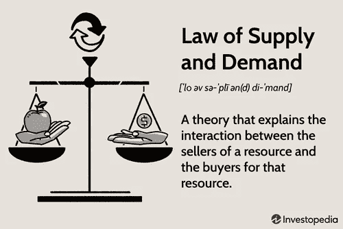
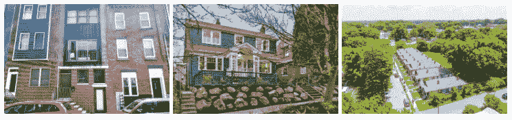
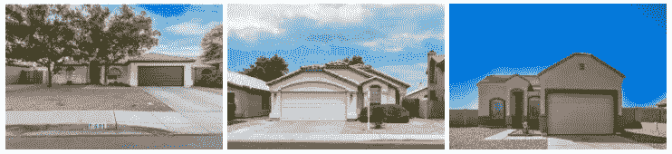

# Ark7 如何选择属性？

> 原文：<https://medium.com/coinmonks/how-does-ark7-select-properties-4d3bd102a08f?source=collection_archive---------17----------------------->

虽然 Ark7 的团队非常努力地向精选资产池中添加新的资产，但我们从未降低我们的选择标准，以获得最佳回报。投资者使用 Ark7 赚取被动月收入，分散投资组合，并在交易或出售时享受长期升值。这些也是我们选择酒店的基本原则。

# 每个投资决策都很重要

一些你可能不知道的有趣事实。

1.  我们的收购团队每月筛选 1000 多处潜在房产，为投资者找到最划算的交易。我们特别针对高增长但不太热的城市中的单户和多户租赁物业，以获得最佳回报。
2.  在将每处房产投入市场进行首次发行之前，Ark7 根据市场状况，采用现金策略或融资策略(带杠杆)进行购买，然后将策略传递给投资者。我们通常持有每项资产 1%至 10%的股份，并像其他投资者一样作为股东按比例对经营损益负责。
3.  我们自己或通过我们当地的战略合作伙伴管理每一处房产，以确保它得到良好的维护，并达到最大的入住率和租金价格潜力。租户通过 Ark7 Renter 应用支付租金、提交请求并与管理人员沟通。租赁、物业管理、会计和税务申报流程通过我们的内部工具实现自动化或半自动化，以确保准确性并进一步提高效率。

这种商业实践确保 Ark7 与我们的投资者分享共同利益，并使我们能够充满信心和完全透明地为社区服务。我们知道投资者做出的每个投资决定都很重要，我们也一样。

# 采购财产是艺术和科学

Ark7 通过利用大数据和本地专业知识，使整个房产收购流程现代化。我们的模型有助于评估 100 多项指标，包括社会经济因素、房地产市场状况和特定于房地产的微观因素，以确定能够推动稳定增长的目标。

## 位置很重要

**投资者根据“供求法则”来评估一个地方的潜力。在相对较长的时期内，三个因素通常会推动需求上升:大规模的社会经济发展、人口流入和友好的国内政策。当住房需求高速增长，但住房供应不足时，价格可能会上涨，直到再次达到平衡。租金和房价都是如此。**

(Data source: [https://www.investopedia.com/terms/l/law-of-supply-demand.asp)](https://www.investopedia.com/terms/l/law-of-supply-demand.asp))

以最近的 2 个 Ark7 案例为例，我们列出了费城中心的 3 处房产，那里是其未来生命科学创新中心——大学城——正在发展，还有 3 处靠近菲尼克斯-梅萨-卡萨格兰德地区，所有这些房产距离未来的硅谷(准确地说是硅沙漠)都不到 20 分钟。这两个地区都在总体城市发展计划之下，吸引着大型雇主和创意初创企业将其称为家园。随之而来的是高技能劳动力的繁荣和收入的增加，带来了年轻的家庭、租户和业主。

**这种影响可以逐渐反映在其住房市场上。**自从主要半导体制造商 TSMC 及其供应商宣布新的建设计划以来，卡萨格兰德的房屋价值中值同比上涨了 34.1%。5 年复合年增长率(CAGR)达到 13.39%，并有望持续。我们会在两个时间段甚至更长时间(过去 10 年)内考察这一指标，以考虑短期影响和长期市场趋势。

## 趋势属性

From left to right: Philadelphia-D2, Seattle-D1, Memphis-M4

## 以凤凰城附近的单身家庭为特色——下一个硅谷

From left to right: Chandler-S4, Chandler-S5, Arizona City-S6

**好消息是，Ark7 做了所有的尽职调查来评分并找到合适的投资租赁房屋，因此我们的投资者不必进行耗时的部分。在我们不断与投资者分享市场见解的同时，我们收购团队的专家会预先审查每处房产，并在 Ark7 网站和手机应用程序上披露其关键财务数据和运营细节，以帮助投资者做出自信的决策。**

在收购时评估的其他因素与**房地产市场条件和该房产周围的社区**有关。一个社区里的好房子，交通便利，外观漂亮，有高等级的公立学校、公园和其他生活必需品，更有可能呈现出更大的升值潜力。看看上市的可比住宅在市场上停留多长时间，以及它们相对于上市价格的售价，也有助于预测潜在物业的受欢迎程度。我们进一步研究租金率、租售比、当地关于租赁或分区的政策、可能影响保险和维护成本的自然因素、财产税和租金销售税等，以反映物业与其市值相比每月获得积极和稳定收入的能力，按上限税率衡量。

## 每个家都是独一无二的

当我们放大到一个特定的物业时，即使是同一街道的邻居，评估分数也可能有很大的不同。我们可能会喜欢大学校园附近的 10 间卧室的复式公寓作为学生宿舍，就像我们的费城-D2 公寓，或者是一层楼(开放式平面图)的儿童友好型独栋住宅，可供钱德勒或亚利桑那市的科技公司员工使用。

此外，建造年份、建筑外观(外观、结构和平面图)、考虑到当地地形的基础设施条件，在下订单之前都很重要。Ark7 与专业检查员合作，仔细检查每处房产，并根据我们的租赁策略为合适类型的租户出租。

# 我们策划的财产清单

经过 Ark7 团队数千小时的辛勤工作，你在市场上找到的是我们精心策划的高收益租赁房屋。我们把我们对每处房产的了解转化成投资者容易理解的信息。我们这样做是因为 Ark7 相信房地产投资决策和运营的“沉重性”可以通过技术和数据洞察实现现代化，房地产投资在黑箱中的历史已经一去不复返了。

我们还通过将所有权划分为我们的投资者可以购买和交易的股份，使房地产投资变得更加容易，每股价格从几美元到几百美元不等。请注意，贸易二级市场正处于其发展和法律审查的最后阶段，并将很快向投资者开放。

Ark7 随着投资者群体的增长而增长，我们的收购策略也可能随之调整。今年以来，在市场波动的情况下，我们更加重视稳定的租金收入。目前，我们正在评估亚特兰大和达拉斯的单户住宅，目标是年化回报率超过 3%，并继续关注罗利/坦帕市场和奥斯汀/泰勒德克萨斯州市场。我们继续寻求高回报的多户住宅，年回报率目标为 6%+。

[访问 Marketplace](https://www.ark7.com?utm_source=Medium&utm_medium=Organic&utm_campaign=How+does+Ark7+select+properties&tc=XYIFD) 查看我们当前列表的全部选项，并关注未来的发布。

**延伸阅读**

[阅读](/coinmonks/the-booming-philadelphia-real-estate-market-523a9e24eed7)我们的费城市场深入了解为什么它是一个投资的好城市。

> 交易新手？尝试[加密交易机器人](/coinmonks/crypto-trading-bot-c2ffce8acb2a)或[复制交易](/coinmonks/top-10-crypto-copy-trading-platforms-for-beginners-d0c37c7d698c)