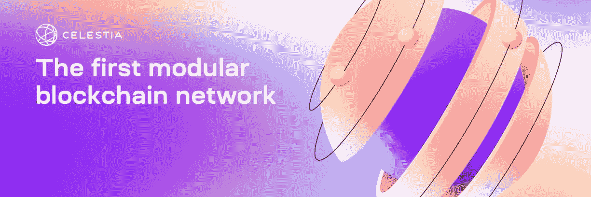
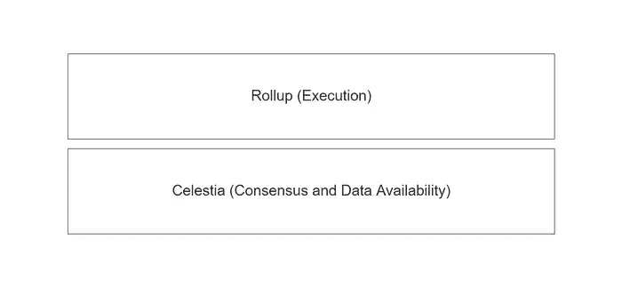
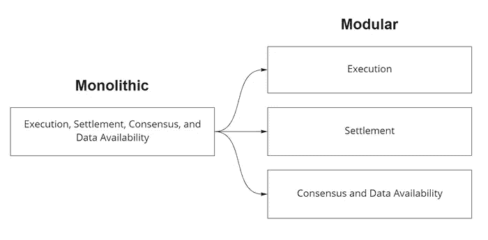
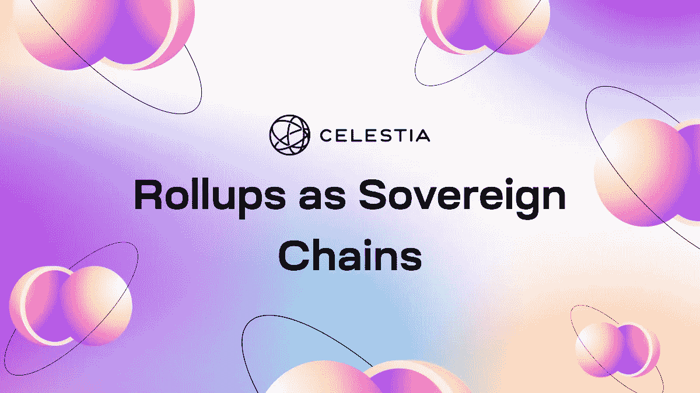
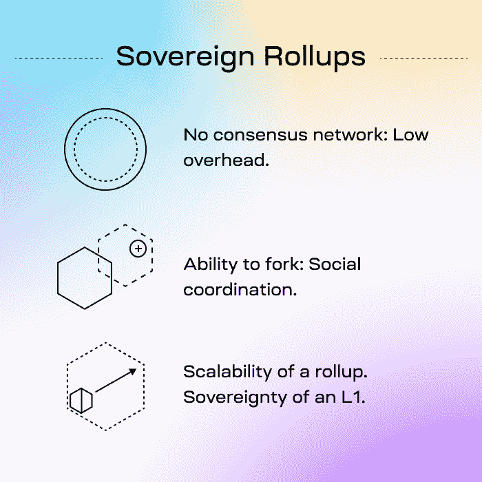

# Celestia 对模块化区块链生态系统有何贡献？

> 原文：<https://medium.com/coinmonks/how-does-celestia-contribute-to-the-modular-blockchain-ecosystem-3858ccfc1f5b?source=collection_archive---------22----------------------->

# 什么是 Celestia？

[Celestia](https://celestia.org/) 是**第一个提供数据可用性和共识层的模块化区块链网络**。 [Celestia](https://celestia.org/) 也为开发商开发一些结算层，比如 [Optimint](https://docs.celestia.org/developers/optimint) 。结合 [Celestia](https://celestia.org/) 和 [Optimint](https://docs.celestia.org/developers/optimint) ，只剩下执行层供开发者创建新的区块链。

# 什么是模块化区块链？

模块化区块链是区块链发展的一个即将到来的趋势，我们将区块链分成多层。开发人员只负责开发上层，比如执行层和结算层。较低层，如共识和数据可用性，是可重用的，这与传统的单片区块链形成对比，在传统的单片中，开发人员必须开发从执行到数据可用性层的整个区块链堆栈。

模块化区块链由多层组成。Celestia 将区块链分为四层:

*   **执行层**是处理事务的层。该层将由每个 dApps 定制。**开发者必须自己开发这一层。**
*   **如果您正在构建第二层区块链，则沉降层**是必需的可选层。这一层负责在以安全和性能为中心的链之间传递消息。Optimint 提供了这一层。
*   共识层是管理共识的一层。如果使用利害关系证明共识，这一层使用户能够标记所需的令牌，以帮助验证交易。上层可以共享共识层，以帮助减轻设计共识的工作量。天青石提供了这一层。
*   **数据可用性层**是一个充当区块链存储的层。这一层维护数据的可用性，以允许在任何时候获取数据的任何部分。天青石提供了这一层。

[https://celestia.org/static/93aa9237db5a4c3adc06d79827fb2595/08048/article-1-image-1.webp](https://celestia.org/static/93aa9237db5a4c3adc06d79827fb2595/08048/article-1-image-1.webp)

将 Celestia 与 Optimint 结合使用后，您可以只开发执行层。

开发人员可以自定义执行层，通过将智能合约模块集成到您的链中，使外部开发人员能够开发更多 dApps。基于 Cosmos SDK 或 Optimint 的 chain 可以集成 CosmWasm 模块，以允许外部开发人员将 dApps 开发到您的链中的应用层。

# 模块化区块链的优势

# 主权国家

新的模块化区块链可以像第 1 层一样独占，尽管利用了其他层。个人开发者可以立即提供升级/热修复和安全补丁，而无需底层的许可。每个模块化区块链也是独立的，所以如果一个受到攻击，另一个不会。

# 轻松推出新区块链

区块链开发将像智能合约开发一样简单，因为开发人员只需要开发执行层，它定义了他们的应用程序的逻辑，就像智能合约一样。由于开发很容易，新区块链可以很快创建和启动。

# 可量测性

多层组合成一个模块化的区块链。不同的专业团队可以独立开发每一层，以达到最大的可伸缩性。一旦组成一个区块链，它将可能比传统的单块系统具有更大的可伸缩性。而且，不会牺牲去中心化。

# 模块化区块链与传统的整体式区块链有何不同？

[https://celestia.org/static/54fa3c4c5754c057c4fbcd751d15c21e/c8502/article-1-image-2.png](https://celestia.org/static/54fa3c4c5754c057c4fbcd751d15c21e/c8502/article-1-image-2.png)

比特币和以太坊等单片区块链在一个区块链中包含了所有需要的层。将每一层都放在一个区块链中会导致可伸缩性、可维护性和灵活性问题。相比之下，模块化区块链将层分成多个区块链。模块化区块链仅包含一些层，并集成了其他模块化区块链的剩余层。

类似于软件开发，模块化区块链被比作微服务架构，而单片区块链被比作单片架构。如今，软件开发已经采用了微服务架构，生产实践证明，微服务架构比单片架构具有更好的可扩展性和可维护性。区块链的未来可能会遵循这一趋势，所以在未来，区块链将是模块化的。

# 什么是 Optimint？

[https://blog.celestia.org/content/images/size/w2000/2022/07/Frame-52.png](https://blog.celestia.org/content/images/size/w2000/2022/07/Frame-52.png)

Optimint 是由 Celestia 开发的官方主权汇总结算层。Optimint 利用乐观汇总将新链上的执行层连接到 Celestia 中的共识和数据可用性层。Optimint 还充当 Tendermint 的替代品，tender mint 是 Cosmos SDK 的底层共识层。

# Optimint 和 Tendermint 或 Cosmos SDK

Optimint 与 Tendermint 或 Cosmos SDK 的不同之处在于共识和数据可用性的工作方式。在 Tendermint 中，共识和数据可用性发生在链中。用户必须将链的本地硬币委托给链的验证者。在 Optimint 中，共识和数据可用性发生在 Celestia 的外部链中。创建结算层是为了在链内的执行层和 Celestia 中的共识和数据可用性层之间架起一座桥梁。用户不需要将任何令牌委托给链，因为 Celestia 已经有了自己的验证器，其一致性和数据可用性适用于基于 Optimint 的链。

# Optimint 定制

您可以像定制 Cosmos SDK 一样定制 Optimint。Cosmos SDK 有一个模块系统，您可以在其中编写自己的模块或导入自定义模块来扩展链的功能。Optimint 还兼容任何 Cosmos SDK 模块。Optimint 可以使用任何 Cosmos SDK 模块。

# 使用 Optimint 的好处

[https://twitter.com/CelestiaOrg/status/1554868106073219072/photo/1](https://twitter.com/CelestiaOrg/status/1554868106073219072/photo/1)

在使用 Optimint 时，您只需专注于开发区块链的执行层。你永远不必担心共识是如何工作的，以及如何在对等体之间存储和同步数据。只关注执行层的开发对开发人员非常有利，因为必须考虑共识机制的业务方面对开发人员来说是痛苦的。由于优秀的开发工具，更多的开发人员可能会加入并为基于 Optimint 的项目做出贡献。Optimint 还提供了 L1 汇总主权的可伸缩性。Optimint 比智能合约更灵活，因为它是一个链。

Optimint 的区块链开发体验将和智能合约开发一样好。按照这种趋势，模块化区块链可能会破坏智能合约，因为它具有更大的灵活性。

# Optimint 的使用案例

[https://lagged.com/th/th/g/wordle](https://lagged.com/th/th/g/wordle)

[Celestia](https://celestia.org/) 已经为 [Optimint](https://docs.celestia.org/developers/optimint) 提供了两个例子: [Wordle chain](https://docs.celestia.org/category/wordle) 和 [CosmWasm](https://docs.celestia.org/category/cosmwasm) 。

# 结论

[Celestia](https://celestia.org/) 是**第一个提供数据可用性和共识层的模块化区块链网络**。 [Celestia](https://celestia.org/) 也为开发商开发一些结算层，比如 [Optimint](https://docs.celestia.org/developers/optimint) 。模块化区块链由 4 层组成:执行层、结算层、共识层和数据可用性层。如果开发人员使用 [Celestia](https://celestia.org/) 和 [Optimint](https://docs.celestia.org/developers/optimint) 创建一个新的链，他们只负责开发执行层。 [Optimint](https://docs.celestia.org/developers/optimint) 是由 [Celestia](https://celestia.org/) 组建的官方主权汇总结算层，与 [Cosmos SDK](https://docs.cosmos.network/) 完全兼容。开发者可以将任何 [Cosmos SDK 模块](https://docs.cosmos.network/v0.46/modules/)集成到 [Optimint](https://docs.celestia.org/developers/optimint) 中。 [Celestia](https://celestia.org/) 已经为 [Optimint](https://docs.celestia.org/developers/optimint) 提供了两个例子: [Wordle chain](https://docs.celestia.org/category/wordle) 和 [CosmWasm](https://docs.celestia.org/category/cosmwasm) 。

> 交易新手？尝试[加密交易机器人](/coinmonks/crypto-trading-bot-c2ffce8acb2a)或[复制交易](/coinmonks/top-10-crypto-copy-trading-platforms-for-beginners-d0c37c7d698c)