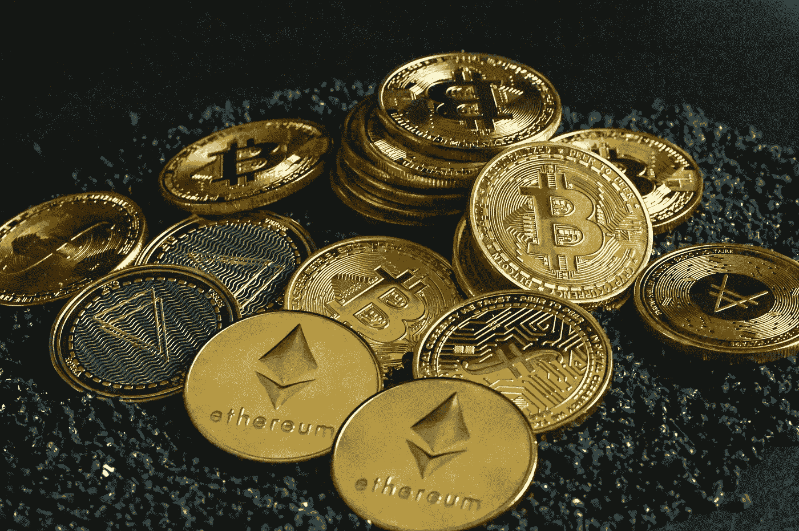

# 加密货币是如何工作的？

> 原文：<https://medium.com/coinmonks/how-does-cryptocurrency-work-6215ceb80cc8?source=collection_archive---------64----------------------->

加密货币在名为区块链的分布式公共账本上运行。

此外，采矿会产生新的加密货币单位。这一过程利用计算机能力破解复杂的数学问题，从而产生硬币。

此外，用户可以从经销商处获得货币。然后通过加密钱包囤积和消费。

拥有 crypto 并不一定意味着你拥有有形的东西。你只有一把钥匙，允许你把一个单位或一份记录从一个人转移到另一个人。

尽管 BTC 已经存在了大约 13 年，但加密和区块链的应用仍在经济上具体化，热心者们预见了未来的进一步应用。

这项技术将最终带来涉及股票、债券或其他金融资产的交易。

> 交易新手？试试[密码交易机器人](/coinmonks/crypto-trading-bot-c2ffce8acb2a)或者[复制交易](/coinmonks/top-10-crypto-copy-trading-platforms-for-beginners-d0c37c7d698c)

你可以用加密货币支付日常商品和服务。

虽然加密是一种非常好的资产类别，但购买它是有风险的。因此，你必须进行大量的研究来理解这个系统是如何工作的。

区块链技术的支持者承认，它可以提高网络透明度、信任度和数据安全性。但是批评家暗示它效率低，笨重，昂贵，并且消耗大量能源。

明智的投资者只有在相信母公司区块链的效用和实力时，才会购买数字资产。

事务组作为“块”在“链”中操作这验证了交易的真实性，并保持网络运行。

公共分类账将交易打包。任何人都可以看到领先的区块链上发生的任何交易，如比特币或以太坊。

加密货币投资者不会在确定的银行账户中使用他们的资产。

相反，他们利用数字地址。这些地址有公钥和私钥——冗长的字母和数字——使加密投资者能够发送和接收资金。

私钥允许用户发送或解锁任何加密货币。相比之下，公钥使所有者能够从任何发送者那里接收密码。

加密货币市场是分散的——它们不受任何中央机构(例如政府)的支持或发行。

> 加入 Coinmonks [电报频道](https://t.me/coincodecap)和 [Youtube 频道](https://www.youtube.com/c/coinmonks/videos)了解加密交易和投资

# 另外，阅读

*   [OKEx vs KuCoin](https://coincodecap.com/okex-kucoin) | [摄氏替代品](https://coincodecap.com/celsius-alternatives) | [如何购买 VeChain](https://coincodecap.com/buy-vechain)
*   [ProfitFarmers 回顾](https://coincodecap.com/profitfarmers-review) | [如何使用 Cornix Trading Bot](https://coincodecap.com/cornix-trading-bot)
*   [如何匿名购买比特币](https://coincodecap.com/buy-bitcoin-anonymously) | [比特币现金钱包](https://coincodecap.com/bitcoin-cash-wallets)
*   [瓦济里克斯 NFT 评论](https://coincodecap.com/wazirx-nft-review) | [比茨盖普 vs 皮奥克斯](https://coincodecap.com/bitsgap-vs-pionex) | [坦吉姆评论](https://coincodecap.com/tangem-wallet-review)
*   [如何使用 Solidity 在以太坊上创建 DApp？](https://coincodecap.com/create-a-dapp-on-ethereum-using-solidity)