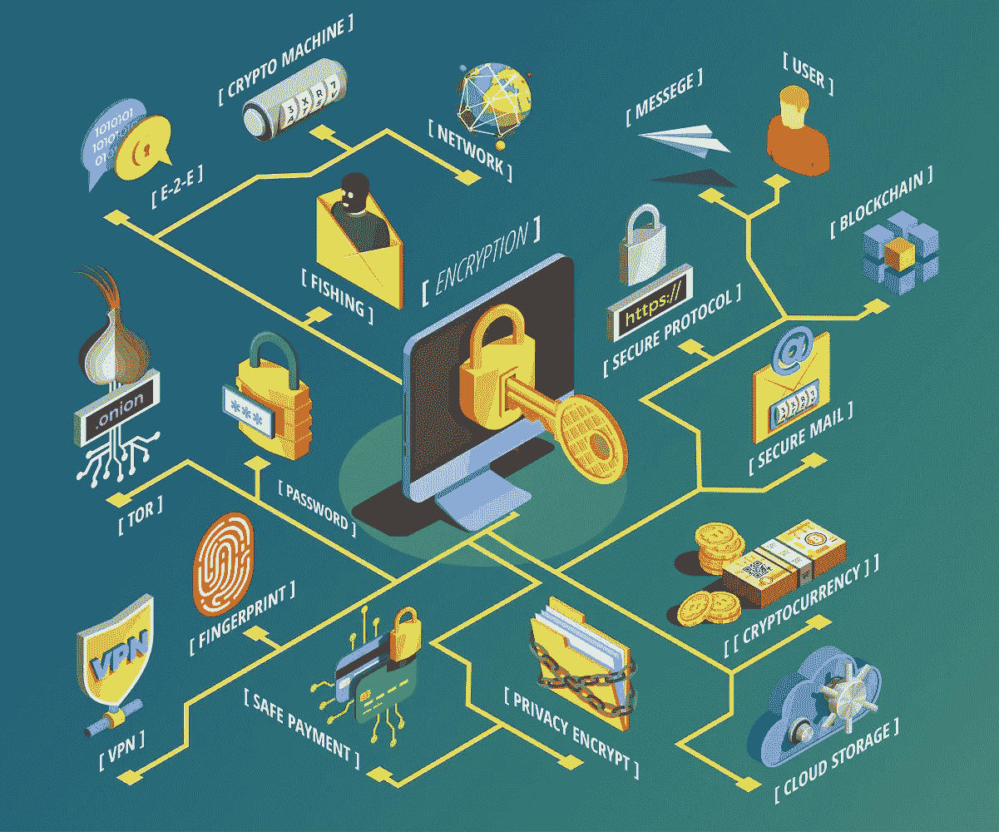

# 加密货币是如何工作的？

> 原文：<https://medium.com/coinmonks/how-does-cryptocurrency-work-d666d3026e92?source=collection_archive---------15----------------------->

## 你需要解释加密货币是如何工作的？简单。

Image by macrovector on [Freepik](https://www.freepik.com/free-vector/data-encryption-isometric-flowchart_5974438.htm)

# 什么是加密货币？

不要被名字迷惑:虚拟货币是**而不是**加密货币的唯一用例，但将加密货币用作虚拟货币是一种流行的用例。

## 什么是货币？