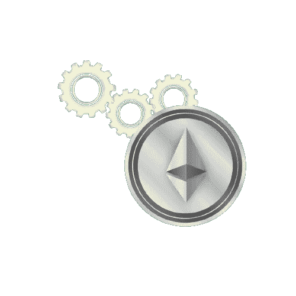
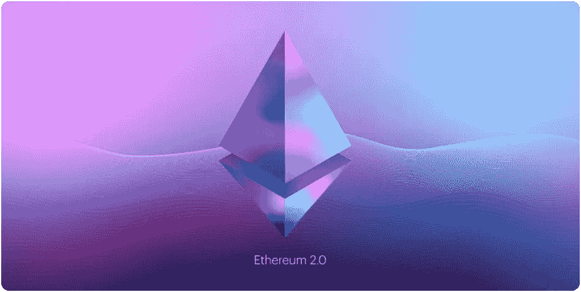

# 以太坊是如何运作的？

> 原文：<https://medium.com/coinmonks/how-does-ethereum-work-485916555beb?source=collection_archive---------20----------------------->

# **以太坊是什么？**

以太坊由来自世界各地的 8 名开发者共同创立。他们于 2014 年 6 月 7 日在瑞士楚格首次会面，并联手合作。俄裔加拿大人 Vitalik Buterin 是最知名的开发者。Vitalik 是 2013 年以太坊白皮书的原作者，他一直是以太坊发展的积极贡献者，并继续开发该平台。

你可能之前听说过比特币，但还有一种有用的技术叫做以太坊。基本上，以太坊是一个去中心化的区块链平台，它建立了一个对等网络，安全地执行和验证应用程序代码，称为智能合约。智能合约允许参与者在没有可信的中央机构的情况下相互交易。

当我们在其网站上查看以太坊的定义时，它说:

*“以太坊是一种让你花很少的费用向任何人发送加密货币的技术。它还支持每个人都可以使用且无人能拆除的应用程序。”*

简而言之，以太坊希望通过去中心化现有的客户端-服务器模型，成为“世界计算机”。

这是世界上可编程的区块链。

以太坊建立在比特币的创新之上，有一些很大的不同。

两者都允许你在没有支付提供商或银行的情况下使用数字货币。但是以太坊是可编程的，所以你也可以用它来处理很多不同的数字资产——甚至是比特币！

这也意味着以太坊不仅仅用于支付。这是一个金融服务、游戏和应用的市场，不会窃取你的数据或审查你。

# **以太坊是加密货币吗？**

以太坊本身本质上不是加密货币，以太坊这个词指的是数字平台。实际的令牌(用于网络支付)称为以太网。换句话说，以太是以太坊网络的“加密燃料”(或加密货币)。说到交易，你看到的价格会参考以太。尽管如此，你通常会看到被称为以太坊的加密货币。

# **以太坊和比特币有什么区别？**

以太坊的区块链技术类似于比特币，然而比特币只使用了区块链技术的一个特定应用。最终，它是一个电子现金系统，可以实现在线比特币支付。以太坊区块链确实追踪数字货币的所有权，但也专注于运行一系列分散应用程序的编程代码。

这两种加密货币的主要区别在于以太坊是一种可编程的区块链。

因此，我们可以假设它在许多领域都是有用的。

## **人人银行**

不是每个人都能获得金融服务。但是，你只需要一个互联网连接就可以访问以太坊及其借贷和储蓄产品。

## **更私人的互联网**

使用以太坊应用程序不需要提供所有个人信息。以太坊正在建立一个基于价值的经济，而不是监视。

## **一个对等网络**

以太坊允许你直接和其他人转移资金或达成协议。不需要通过中介公司。

## **抵制审查**

任何政府或公司都无法控制以太坊。这种去中心化使得任何人都几乎不可能阻止你接受付款或使用以太坊上的服务。

## **商业担保**

以太坊创造了一个更加公平的竞争环境。客户有一个安全的内置保证，即只有当你提供了约定的内容，资金才会转手。做生意不需要大公司的影响力。

## **win 的兼容性**

因为以太坊产品默认兼容，所以一直在打造更好的产品和体验。公司可以建立在彼此成功的基础上。

以太坊也有一些好处。让我们看看他们。

> 交易新手？尝试[加密交易机器人](/coinmonks/crypto-trading-bot-c2ffce8acb2a)或[复制交易](/coinmonks/top-10-crypto-copy-trading-platforms-for-beginners-d0c37c7d698c)

以太坊提供了一个非常灵活的平台，可以在这个平台上使用本地 Solidity 脚本语言和以太坊虚拟机来构建分散式应用程序。在以太坊上部署智能合约的分散式应用程序开发人员受益于开发人员工具的丰富生态系统，以及随着协议的成熟而形成的最佳实践。这种成熟度还延伸到以太坊应用程序的普通用户的用户体验质量，MetaMask、Argent、Rainbow 等钱包提供了简单的界面，通过这些界面可以与以太坊区块链和部署在那里的智能合约进行交互。以太坊庞大的用户群鼓励开发者在网络上部署他们的应用，这进一步巩固了以太坊作为像 DeFi 和 NFTs 这样的去中心化应用的主基地的地位。将来，目前正在开发的向后兼容以太坊 2.0 协议将提供一个更具可伸缩性的网络，在此基础上构建需要更高事务吞吐量的分散式应用程序。

# **那么，什么是以太坊智能合约呢？**

智能合约是在时机成熟或满足适当条件时不受任何干预的程序。诸如 Solidity、Serpent、LLL 等语言通常用于编写智能合同。最受欢迎的是坚固性。

智能合约是驻留在区块链上特定地址(称为合约地址)的应用程序代码。应用程序可以调用智能合约函数，更改它们的状态，并启动事务。智能合约用 Solidity、Vyper 等编程语言编写，由以太坊虚拟机编译成字节码，在区块链上执行。

智能合约是以太坊账户的一种。这意味着他们有一个平衡，他们可以通过网络发送交易。然而，它们不受用户控制，而是被部署到网络上，并按程序运行。然后，用户帐户可以通过提交执行智能合约上定义的功能的交易来与智能合约进行交互。智能合同可以像常规合同一样定义规则，并通过代码自动执行这些规则。默认情况下，不能删除智能合同，并且与智能合同的交互是不可逆的。

# **什么是交易？**

以太坊交易是指由外部拥有的账户发起的行为，换句话说，是由人管理的账户，而不是合同。例如，如果 Bob 发送给 Alice 1 ETH，Bob 的账户必须被借记，Alice 的账户必须被贷记。这种状态改变动作发生在一个事务中。

## **汽油和费用**

气体对以太坊网络至关重要。是燃料让它运转，就像汽车需要汽油才能行驶一样。

## **什么是气？**

Gas 是指测量在以太坊网络上执行特定操作所需的计算工作量的单位。

由于每个以太坊交易都需要计算资源来执行，所以每个交易都需要费用。气是指在以太坊上成功进行一笔交易所需的费用。

## **基本费用**

每个区块都有一个作为底价的基本费用。为了有资格被包括在区块中，每种气体的报价必须至少等于基本费用。基本费用是独立于当前块计算的，而是由它之前的块确定的，这使得用户可以更好地预测交易费用。当矿块被开采出来时，这种基础原料就被“烧掉”,不再流通。

## **优先权费(小费)**

在伦敦上调价格之前，矿商将从一个区块的任何交易中获得全部天然气费用。

随着新的基本费用被烧掉，伦敦升级版引入了优先费用(tip ),以激励矿商将交易纳入区块。如果没有小费，矿工会发现经济上可行的开采空区块，因为他们将获得相同的区块奖励。

## **最大费用**

为了在网络上执行交易，用户可以指定他们愿意为要执行的交易支付的最大限度。这个可选参数称为 maxFeePerGas。对于要执行的交易，最高费用必须超过基本费用和小费的总和。交易发送者被退还最高费用与基本费用和小费之和之间的差额。

伦敦升级的主要好处之一是改善用户在设定交易费用时的体验。

# **EIP-1559**

伦敦升级版中 [EIP-1559](https://github.com/ethereum/EIPs/blob/master/EIPS/eip-1559.md) 的实施使交易费机制比之前的天然气价格拍卖更加复杂，但它的优势是使天然气费用更具可预测性，从而形成更有效的交易费市场。用户可以提交具有 maxFeePerGas 的交易，maxFeePerGas 对应于他们愿意为将要执行的交易支付的金额，他们知道他们不会支付超过市场价格的汽油(baseFeePerGas ),并且获得任何额外的退款，减去他们的小费。

你可能听说过以太坊 2.0。它也被称为宁静。那么，它是什么，它能改变什么？

以太坊 2.0，也被称为 Eth2 或“宁静”，是以太坊区块链的升级版。此次升级旨在提高以太坊网络的速度、效率和可扩展性，从而避免瓶颈并同时处理更多交易。

我们可以这样简单解释一下。

# **以太坊 2.0 何时发生？**

以太坊 2.0 分几个阶段推出，第一次升级称为信标链，将于 2020 年 12 月 1 日上线。信标链将本地桩引入以太坊区块链，这是网络向 PoS 共识机制转变的一个关键特征。这是一个独立于以太坊主网的区块链。

第二阶段称为“合并”，预计在 2022 年第二季度，将合并信标链和以太坊主网。

最后一个阶段是碎片链，它将在扩展以太坊网络中发挥关键作用。碎片链不是将所有操作都放在一个区块链上，而是将这些操作分散到 64 个新的链上。

据以太坊基金会称，以太坊 2.0 的全面升级预计将于 2023 年进行。

主要区别在于，以太坊 1.0 使用一种被称为工作证明(PoW)的共识机制，而以太坊 2.0 将使用利益证明(PoS)机制。

# umutcan AKAR-Ulu da 大学

## **来源:**

[*https://www . CMC markets . com/en-SG/learn-cryptocurrences/what-is-ether eum*](https://www.cmcmarkets.com/en-sg/learn-cryptocurrencies/what-is-ethereum)

[*https://ethereum.org/en/what-is-ethereum/*](https://ethereum.org/en/what-is-ethereum/)

*【https://aws.amazon.com/blockchain/what-is-ethereum】T5[T6](https://aws.amazon.com/blockchain/what-is-ethereum)*

* [## 以太坊 2.0 是什么？以太坊的共识层和合并解释-解密

### 期待已久的以太坊 2.0 升级近了。多阶段升级旨在提高网络的可扩展性和…

decrypt.co](https://decrypt.co/resources/what-is-ethereum-2-0) 

> 加入 Coinmonks [电报频道](https://t.me/coincodecap)和 [Youtube 频道](https://www.youtube.com/c/coinmonks/videos)了解加密交易和投资

# 另外，阅读

*   [最佳加密交换平台](https://coincodecap.com/best-crypto-swap-platforms) | [最佳加密交易所](https://coincodecap.com/crypto-exchange)
*   [购买比特币印度](/coinmonks/buy-bitcoin-in-india-feb50ddfef94) | [Pionex 评论](/coinmonks/pionex-review-exchange-with-crypto-trading-bot-1e459d0191ea) | [加密交易机器人](/coinmonks/crypto-trading-bot-c2ffce8acb2a)
*   [n ave 零点回顾](/coinmonks/ngrave-zero-review-c465cf8307fc) | [Phemex 回顾](/coinmonks/phemex-review-4cfba0b49e28) | [PrimeXBT 回顾](/coinmonks/primexbt-review-88e0815be858)
*   最佳[区块链分析](https://bitquery.io/blog/best-blockchain-analysis-tools-and-software)工具| [赚比特币](/coinmonks/earn-bitcoin-6e8bd3c592d9)
*   [Cloudbet 赌场评论](https://coincodecap.com/cloudbet-casino-review) | [点火赌场评论](https://coincodecap.com/ignition-casino-review)*