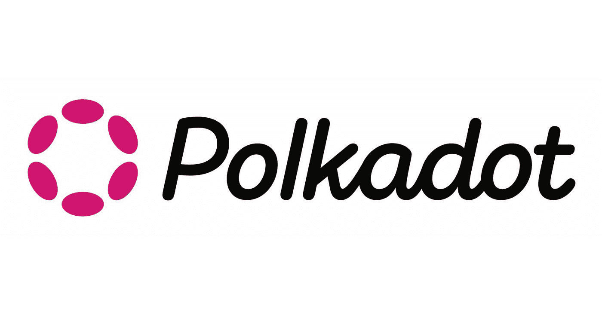

# Polkadot 如何用经济模型捕捉价值？

> 原文：<https://medium.com/coinmonks/how-does-polkadot-capture-value-with-the-economic-model-8d701a6eb261?source=collection_archive---------1----------------------->

# **背景**

即使对公共连锁店的狂热消退，一些人继续坚持他们对市场的要求。

回顾去年的热情，所有的公共连锁店都采取了激励措施来吸引资金支持其发展。像给红包这样的想法让人们参与到公共链生态系统的建设中来，被证明是有效和富有成效的。因此，一些公共链(如 Avalanche 和 Polygon)锁定的总价值很快超过了 10 亿美元。

**随着这些活动的进行，我们也看到了公有链生态系统所承载的代币的良好表现。** 其他公链紧随其后以类似的方式吸引用户。在这种背景下，作为主流公链的 Polkadot 似乎在这场角逐中有所缺失。

原因是多方面的。波尔卡多特仍处于起步阶段。更重要的是，其特殊的架构和定位决定了不同的发展道路。自然，波尔卡多特捕捉价值的方式与众不同。那么，我们应该如何确定波尔卡多特所承载的价值呢？像发红包这样的想法在 Polkadot 上行得通吗？

# **以太坊是如何获得其价值的？**

随着 DeFi 和 NFT 的持续火热，以太坊现已成为最大的区块链平台，其市值也相应飙升，并越来越接近比特币。

强劲的势头不仅是以太坊繁荣的生态系统的结果，也是其精心设计的经济模式的结果。

以太坊网络支持其本地货币 ETH 和基于以太坊的项目的令牌的转移。但是，每次转让这些代币都必须支付汽油费。同样，许多公共连锁店采用了类似以太坊的方法，这是其容易获取价值的秘密。

以太坊在经历了漫长的起步后，逐渐构建了自己的生态系统。**最重要的是，随着 DeFi 和 NFT 应用的进步，以太坊上涌现出了大量的项目和参与者，开发者也在不断使用该平台。现在它是一个巨大的资源池，包括人才、用户和资金，这证明了以太坊的网络效应。**

为了在该资源池中执行任何功能，必须在 ETH 中支付气费。随着大部分用户选择坚持以太坊，这就变成了持续的需求。此外，平台上的用户和资源所吸引的新项目可能会产生新的需求和相当大的市场。

因此，以太坊的这种经济模式可以被视为“税收模式”。任何人想使用以太坊的超级计算机，都必须在 ETH 缴纳使用平台上任何项目的燃气费。

这种价值获取方式背后的逻辑是，当生态系统中有相当多成熟的应用程序(通常伴随着早期分红)时，就需要使用这些应用程序。随着需求的增加，将支付更大数额的 ETH 作为税收。因此，对 ETH 的需求更大，价值更高。

**在这种经济模式下，即便是以太坊上成功应用的用户也必须付费。**这样的设计肯定会提升代币的价值。然而，该项目的整个区块生态系统可能负担沉重。简而言之，投机者赢，用户输。

# **波尔卡多的价值是什么？**

**与大多数公共连锁店不同，波尔卡多的建筑与普通项目不同。毫不奇怪，它的经济模式是以一种独特的方式设计的。**

其他公共链会在设计中参考以太坊的经济模式，因为他们相信以太坊的很多设计都是成熟的、经过测试的、可行的。

然而，波尔卡多与众不同。作为波尔卡多的创造者，加文对以太坊及其问题了如指掌。他认为以太坊这样的税务设计是不合理的，因此在设计波尔卡多时放弃了这个想法。

在 Ethereum 等公共链上的生态系统中使用该项目时，用户不仅需要为服务和功能支付代币，还需要向网络支付 ETH。

**然而，在波尔卡多，项目在生态系统中独立存在，经济模式可以定制。Polkadot 生态项目的任何用户都可以执行该功能，而无需向网络支付任何天然气费。**他们只需要为生态项目的经济设计支付代币。这只是一次支付，交易费甚至可以减少到零。这将鼓励更广泛地利用该平台。

为什么以太坊和波尔卡多在设计上有区别？埃塞瑟姆是在比特币的基础上发展起来的，他的初衷是让货币具有可编程性。其引入 ETH 仅用于支付交易费，以防止垃圾交易。换句话说，这只是一种反垃圾邮件技术。

因此，以太坊最初被设计在比特币的基础上，并沿袭了比特币的风格。这是一项基于比特币的创新，旨在让区块链的技术变得更容易。尽管如此，相似的设计也会带来相似的问题。**以太坊虽然在智能合同方面进行了成功创新，但它的经济模式设计成了用户需要支付高额汽油费**这是一种极为令人不快的体验。

加文想到了这一点，并设法解决了他设计波尔卡多特的根本原因。他采用了另一种机制来处理垃圾邮件。例如，随着 ID 系统连接到 oracle，我们不再需要设置这么多固定元素。因此，在 Polkadot 上没有设置帐户或货币。用户不再需要担心煤气费或支付他们使用的任何功能。

Polkadot 最初被设计成更加通用、灵活和可定制的。它自下而上地重塑了区块链技术。来自创造的最初愿望的东西最终可能是问题的真正关键。

幸运的是，加文就是这样的理想主义者和实践者，就像埃隆·马斯克和史蒂夫·乔布斯一样。

由于他的设计，Polkadot 生态系统中的用户可以以更容易和更便宜的方式使用这些应用程序，但这对 Polkadot 本身没有增加多少价值。相比以太坊的经济模式，Polkadot 让用户赢，投机者输。

话虽如此，也没必要过度担忧。这个逻辑并不完全适用于 Polkadot，因为它的架构和设计更加复杂。正因如此，它获取价值的方式就不那么明确了。这可能是为什么许多 Polkadot 参与者长期困惑于它是如何获得价值的。

# **波尔卡多特如何捕捉它的价值？**

## **1。互操作性证明**

Polkadot 如何获取价值的故事都始于它的主要功能:互操作性，也称为跨链可组合性。

波尔卡多特由中继链和副链组成。副链通过中继链上的插槽交换信息。具有非副链结构的公共链只能通过使用桥重新连接到中继链来实现跨链可组合性。**因此，中继链上的一个插槽可以访问 Polkadot 的跨链可组合性。**

插槽由 parachain 插槽拍卖分配，其中项目需要通过标桩点投标。拍卖获胜者可以使用 parachain 插槽 24 周到 96 周。当插槽租约到期时，保税点被释放回原来的所有者，然后插槽准备进行另一次拍卖。

当与 DOT 租赁插槽时，参与者实际上支付了保税 DOT 的机会成本，以换取他们喜欢的 parachain 项目的令牌。另一方面，Parathreads 采用“现收现付”的方式进行跨链信息交换，这意味着参与者以 DOT 进行实际支付。

上面的两个模型是 Polkadot 如何获得价值的一部分。也就是说，项目或个人需要使用 DOT 来实现跨链的可组合性。这表明，开发良好的副链可以鼓励开发者更广泛地参与 Polkadot 生态系统，并推动更多高质量的项目。随着这些项目的发展，对 DOT 的需求显著增加，这将有助于 Polkadot 获得更多价值。

## **2。对跨链可组合性的充分需求**

一旦对跨链可组合性的需求被证明是一个巨大的市场，一些具有广泛共识的 cryto 资产(如 BTC 和 ETH)或稳定的 coins(如 USDT 和 USDC)将通过桥跨链到 Polkadot 生态系统，从事各种应用。这也将推动对 crosschain 可组合性的需求，进而对 DOT 产生更强的需求。因此，波尔卡多特更有价值。

## **3。常见商品副链的点使用场景**

波尔卡多特在未来获取价值的另一种方法是通过公益副链。因为这样的副链不寻求拥有自己的原生令牌，所以 DOT 可以用于流通或经济模型的设计。

以发行 CBDC、代币、稳定币和 NFT 等资产的国家铸币局为例。Polkadot 生态系统的健康发展将增加 Statemint 发行的资产数量，从而创造对 dot 的巨大需求，并帮助 DOT 获取巨大价值。

## **4。Polkadot 生态系统中的重要认可资产**

此外，作为 Polkadot 生态系统中最可信的资产，dot 正在成为 parachains 上许多项目的背书资产，类似于 ETH 在以太坊上对 DeFi 的作用。

这就好比黄金除了工业使用价值之外，又增加了一个新的属性，作为一种可信赖的资产，从而增加了它的金融价值，价格有了质的提升。这就是为什么 ETH 会随着 DeFi 的繁荣而崛起。

随着 Polkadot 生态系统的逐渐发展，对 dot 的需求将会赶上。DOT 的价值将与生态系统的繁荣密切相关。

**但最重要的是，一般来说，一个公链的生态系统只是赋能一枚硬币。因为 Polkadot 是第 0 层，所以它有许多第 1 层的副链。如果每个副链上的 DeFi 对 dot 都有可信资产的需求，那么就会有 100 个副链共同赋能 DOT，Polkadot 生态系统给 DOT 带来的赋能至少是单个链带来的数倍效果。**

# **总结**

波尔卡多特以更长期的方式获取价值，对生态系统的负担最小，而以太坊这样的公共链设计直接提高了价值，但破坏了生态系统。随着它们的发展，事情应该变得更便宜、更快、更容易。

尽管规模巨大，以太坊的价值捕捉却是以整个生态系统为食，这是违背发展规律的。互联网的历史证明了这一点。如果每个用户在平台上从零售商那里购买产品时都需要向亚马逊支付交易费，亚马逊就不会有今天。

Polkadot 的价值捕获方法将压力转移到项目本身，这也是为什么 parachain slots 是通过拍卖获得的，最长租期只有两年。Gavin 在这里尝试做的是使用这种机制来测试项目。如果项目进展顺利，可以续租。如果不是这样，项目将不得不返回槽并切换到 parathreads。虽然具有挑战性，但它推动了适者生存，特别是淘汰了那些只想在首次拍卖后恶意抢钱的项目。因此，只有优质项目才能留在 Polkadot 生态系统中。

# **透过不同的镜头看波尔卡多特**

也就是说，Polkadot 的价值捕获可以从另一个类似于互联网平台估值模型的角度来看。例如，一些互联网平台的估值越来越高，即使不赚钱也能不断获得资金。这是因为他们做有价值的事情，有网络效应。他们的潜力随着互联网的长期发展而增长。

同样，Polkadot 所做的是将整个区块链连接起来，作为行业的主要基础设施。因为它有利于区块链行业的长期福祉，所以它所做的事情变得非常有价值，并且它所获取的价值随着其生态系统的发展而增长。在庞大的波尔卡多特生态系统中，除了丰富的副链项目，每条副链都可以生长出自己的生态系统。因此，Polkadot 将培育一个生态集群，其规模远远超出其他公链生态系统的规模。因此，非同寻常的网络效应。

这种网络效应会影响新进入者。当 Polkadot 生态系统中有足够的副链、应用、用户和资金时，新项目团队更喜欢直接在生态系统中发布项目，或者通过桥梁链接到这个巨大的网络。因此，Polkadot 的网络效应在这种良性循环中不断增强。

目前，草间弥生上正在进行几十个 parachain 项目，其中一些已经开发了早期生态系统。草间弥生的这一有希望的进展再次肯定了对波尔卡多特生态系统的信心。随着时间的推移，波尔卡多特将会打击那些只关心价格而不关心生态项目潜力的人。当那一天到来的时候， **Polkadot 将被带到越来越多的人的聚光灯下，他们对它有更高的期望，就像亚马逊发生的事情一样。**

# **波尔卡多特生态系统正在加速**

Polkadot 团队敏锐地意识到，Polkadot 只能与生态系统中的项目一起成长。因此，他们也采取各种措施支持波尔卡多特生态项目。

比如取消了上限的新版 Grants，更多鼓励和推广项目的黑客马拉松，以及密集推广“Builders For Builders”等。最后一个例子是与 parachain 团队分享基质建造者计划的最佳实践，以支持他们的项目，并使他们能够开发自己的生态系统和繁荣的建造者社区。这将丰富整个波尔卡多特生态系统。

# **波尔卡多特在不断进化**

上面的讨论仅仅是在诸如 Polkadot 的交叉链可组合性和公共善副链方面的当前观察的回顾。**关于 Polkadot 的可扩展性，副链与其自身功能之间相互作用的新价值，更多的可能性在等待。**比如 Polkadot 本身先进的架构就为其 NFT 生态系统带来了更多的可能性。

Polkadot 的原生 NFT 标准(如 RMRK)比 ERC721 和 ERC1155 具有更强大的功能。这种先进的标准将支持更好的 NFT 或区块链奥运会，因此拥有巨大的潜力。项目在发展，Polkadot 也在发展。

# **后记**

随着 Polkadot parachain 在去年年底正式启动，我们接受了 Polkadot 的一个关键功能，即互操作性(也称为跨链可组合性)。如上所述，副链项目的繁荣将有助于波尔卡多特生态系统的健康发展，因为它反映了波尔卡多特的重要价值。

当然，我们将继续密切关注 Polkadot 系统中项目的发展，Polkadot 如何与现有的成熟公共链相结合，以及它们之间的跨链授权的用例，这些用例构成了 Polkadot 价值获取过程中的重要环节。

正如著名剧作家凌克在《香雪海》中写道:“时间，这位老人，总是迈着同样的步伐。然而，它的意义和价值各不相同。”对于波尔卡多特和其他公共连锁店来说，时间以同样的方式流逝。但是，价值和结果却千差万别。手段是否与目的相匹配仍是后人的决定。

> **关于我们**
> 
> 波尔卡多特生态研究所成立于 2020 年，专注于波尔卡多特生态发展的研究和分析。在向用户传递专业而有深度的内容的同时，我们将不断探索 Polkadot 生态的价值。

**在 Twitter 上关注我们:**[**@ Polkadot _ ERI**](https://twitter.com/Polkadot_ERI)

> 交易新手？试试[加密交易机器人](/coinmonks/crypto-trading-bot-c2ffce8acb2a)或者[复制交易](/coinmonks/top-10-crypto-copy-trading-platforms-for-beginners-d0c37c7d698c)