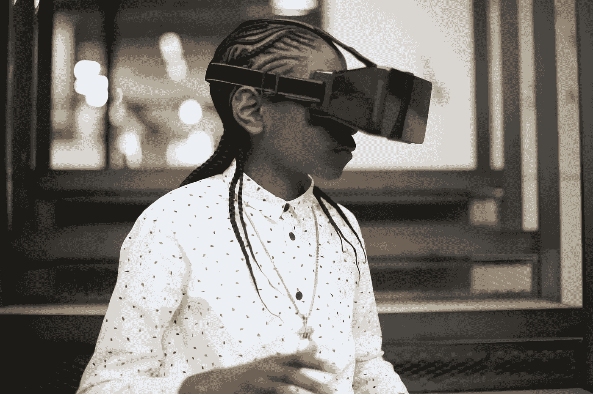

# 元宇宙是如何工作的？

> 原文：<https://medium.com/coinmonks/how-does-the-metaverse-work-bc493249e07f?source=collection_archive---------42----------------------->

Photo by [UK Black Tech](https://unsplash.com/@ukblacktech?utm_source=unsplash&utm_medium=referral&utm_content=creditCopyText) on [Unsplash](https://unsplash.com/s/photos/metaverse?utm_source=unsplash&utm_medium=referral&utm_content=creditCopyText)

谁会想到一本写于 90 年代末的小说会成为像元宇宙这样的技术的基础？

尼尔·斯蒂芬森(Neal Stephenson)写的小说《雪灾 》讲述了一个帮助人们逃离现实的虚拟世界。

事实上，“元宇宙”这个词是在科幻小说中创造的。

在小说中引入元宇宙的概念后，几家公司开发了在线社区，允许用户在三维景观中与自己互动。

虽然它们被开发出来了，但是这些公司没能让大众接受。

这个概念在 2021 年开始流行，当时 Meta(原名脸书)告诉公众他们将建造一个元宇宙。

# **什么是元宇宙？**

元宇宙是一种结合虚拟现实、增强现实、社交媒体和互联网的技术，可以帮助用户在虚拟世界中与自己交流和互动。

这项技术的功能是增强用户体验。

我知道你在想什么。这难道不是互联网现在正在做的事情吗？好吧。你是对的。

不过，这是有区别的(也许是很大的区别)。元宇宙并没有试图脱离互联网；它是建立在这个基础上的。

## **互联网和元宇宙的区别**

***什么构成了互联网？***

互联网由数十亿台相互交互的计算机和设备组成。

你可能认为你正在使用社交媒体平台与朋友聊天。实际上，这只是您的设备相互通信。

元宇宙的概念要多得多。

***为什么会这样？***

元宇宙使用虚拟、混合和增强现实将现实世界输入到虚拟世界中，以增强用户的体验。

更简单地说，你将在多元宇宙中视觉化，听觉化，如果可能的话，感觉化。

在元宇宙驾驶汽车也许是可能的。把元宇宙想象成一个模拟器，但要复杂得多。

你在网上浏览，却住在元宇宙。

## 元宇宙是如何工作的？

你现在应该知道元宇宙是如何工作的了。你应该能想象得到。

让我们深入一点。

要使用元宇宙，你需要一个头像。虚拟世界中会有一个化身代表你。

不要告诉我你认为人类会神奇地出现在这个仙境。(哈哈)。

使用你的头像，你可以做很多事情。你可以社交、上课、聚会、旅行、工作等等。

元宇宙是一个现实世界和数字世界交汇的地方。

**结论**

专家估计，到 2040 年，元宇宙将变得更加精致。

一些公司已经将他们的一些资源投入到这个概念上。Meta 在 2021 年宣布，他们拨款 100 亿美元建造元宇宙。

尽管从那时起他们就面临着各种障碍，但 Meta 公司决心让这项技术成为现实。

如果你理解元宇宙的概念，请跟我来。

我也在区块链、加密货币、科技、金融科技等网站上发布内容。

> 交易新手？试试[加密交易机器人](/coinmonks/crypto-trading-bot-c2ffce8acb2a)或者[复制交易](/coinmonks/top-10-crypto-copy-trading-platforms-for-beginners-d0c37c7d698c)