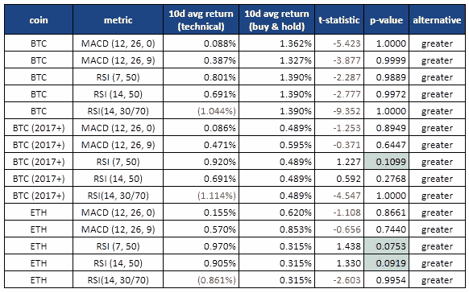

# 技术指标的有效性如何？

> 原文：<https://medium.com/coinmonks/how-effective-are-the-technical-indicators-ef5aa5d82da6?source=collection_archive---------50----------------------->

## 这是一个很好的小练习，可以检验 MACD 和 RSI 是否可以用于加密货币市场以产生超额回报

## 0.介绍

技术分析是，尤其是在 Web 3 中，一个主流的个人加密货币分析工具，尽管它的存在明显的仇恨。关于技术指标的有效性，关于它们是否可以用来提取 alpha，已经有几十年的论文了；然而，它们的有效性直到今天还在激烈争论。

“激烈辩论”并不意味着技术分析是一种没有根据的信念，它意味着技术分析具有双重性——有时有效，有时无效。在伦敦证交所行得通，但在纽约证交所可能行不通。

在传统金融领域已经有了关于该主题的广泛研究，所以我想更进一步，将相同的方法应用于两种主要的加密货币，以检查技术指标在 Web 3 市场中是否有效。

## 1.相关研究

Chong 等人(2014)表明，使用 MACD 和 RSI 振荡指标的交易规则可以为买入并持有策略带来超额回报，这将是这个小练习的基础。

公平地说，让我提一下 Yamawaki 等人(2007)表明 MACD 和 RSI 在预测价格变动方面几乎没有用处，因此没有任何意义。

## 2.方法

我在这个练习中只使用了两种硬币，BTC 和 ETH，因为它们的时间序列最长，也是目前最重要的两种硬币。我有 BTC 2014 年到现在的收盘价，还有瑞士联邦理工学院 2017 年的收盘价。

交易规则如下:

*   MACD (12，26，0):当 EWA(26)-EWA(12)从下方穿过 0 时买入，反之亦然
*   MACD (12，26，9):当 EWA(26)-EWA(12)从下方穿过 EWA(9)时买入，反之亦然
*   RSI (7，50):当 RSI(7)从下方穿过 RSI(50)时买入，反之亦然
*   RSI (14，50):当 RSI(14)从下方穿过 RSI(50)时买入，反之亦然
*   RSI (14，30/70):当 RSI(7)跌至 30 以下时买入，反之，当它升至 70 以上时买入

我会将买入并持有策略的 10 天收益与上述交易规则的 10 天收益进行比较，并使用 t 统计来检验交易规则的 10 天收益是否大于买入并持有(B&H)的 10 天收益。

## 3.结果

Statistics summary

对 BTC 来说，所有交易规则产生的回报都远低于 B&H。

对于 ETH 来说，有点不一样。总体 p 值比 BTC 的要小得多，对于一些策略来说——RSI(7，50)，RSI (14，50)——技术指标看起来它可以产生一些超额回报。

我将 BTC 归入 BTC (2017 年或自 2017 年以来)，因为我认为不同的时间线和市场的成熟度可能发挥了作用。

对于 BTC (2017+)，结果与瑞士联邦理工学院的结果非常相似；RSI (7，50)和 RSI (14，50)是最重要的，总体上比 BTC (2014+)的 p 值好得多。

## 4.结论

然而，基本上没有交易策略建议上述产生有意义的超额收益低于 5%的显著水平。事实上，大多数交易规则的平均回报率远低于简单的 B&H 回报率。

BTC (2017+)和瑞士联邦理工学院的数据可能会显示，相对强弱指数可以作为良好的技术指标，但我们需要记住，我不得不人工按摩 BTC 的数据来获得结果。

我的发现与过去对 TradFi 市场的研究非常一致。技术分析具有双重性——有时有效，有时无效。

一些技术分析天才可能用她的分析技巧赚了一大笔钱，但这可能仅仅是因为她在正确的时间进行技术分析，或者可能是因为她与技术指标无关的动物精神。

无论如何，这位天才绝不会仅凭技术指标就产生这样的回报。她需要正确的时机或者自己的直觉。

这里的教训是，你应该在跟踪技术指标时非常谨慎，因为你不知道这次是否会成功。

> 交易新手？试试[加密交易机器人](/coinmonks/crypto-trading-bot-c2ffce8acb2a)或者[复制交易](/coinmonks/top-10-crypto-copy-trading-platforms-for-beginners-d0c37c7d698c)