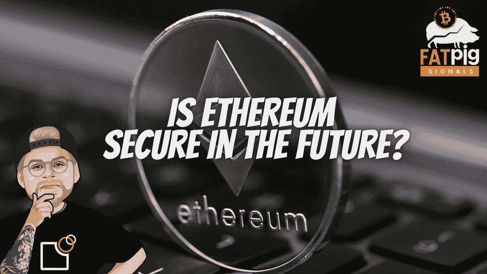

# 以太坊的货币政策如何改变以太网的安全性！

> 原文：<https://medium.com/coinmonks/how-ethereums-monetary-policy-is-changing-the-security-of-the-eth-network-e89da2202755?source=collection_archive---------9----------------------->

合并将如何影响以太坊的货币政策？通货膨胀会上升还是下降？跟踪狂“优惠利率”是什么意思？开发商是否在没有合法性的情况下实施货币政策？

手放在心上。我们认为技术和理想主义是必不可少的。但是当我们看加密货币时，它总是关于…钱和安全！什么…