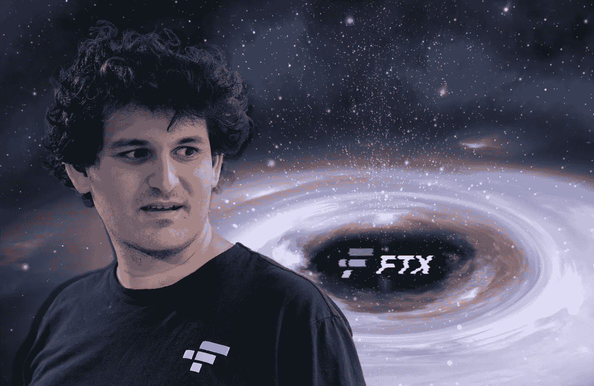
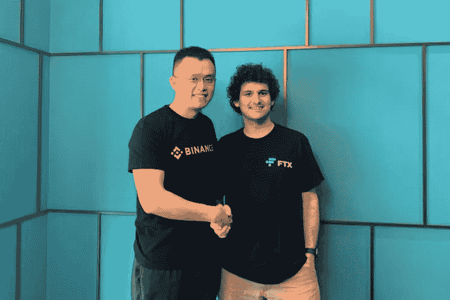
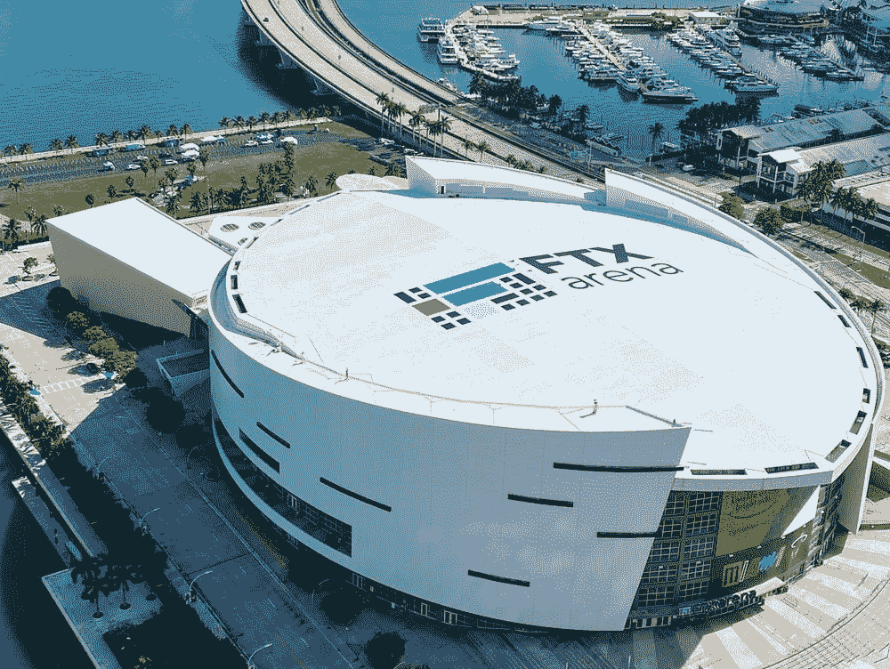
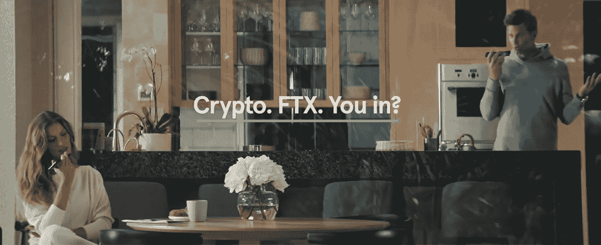
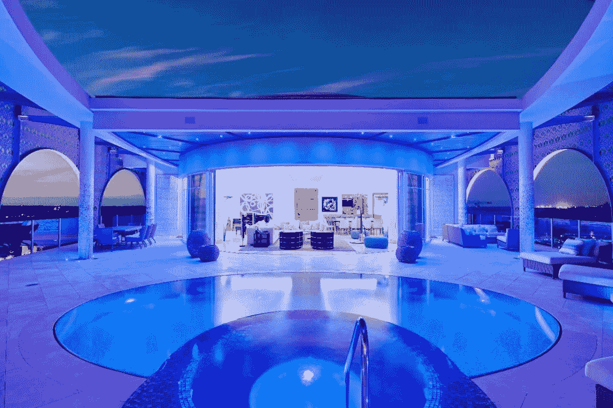

# 密码世界的变化有多快

> 原文：<https://medium.com/coinmonks/how-fast-things-can-change-in-the-crypto-world-8eca9e222074?source=collection_archive---------21----------------------->

**Between Nov.** **8–9, Bankman-Fried’s net worth plummeted to from $15.2 billion to $991.5 million**. That’s around a 94% drop.

我一个月前才写了这篇文章，看看它有多过时！

在某种背景下，我注意到加密世界的其他人是如何遭受由 Luna / Terra 崩溃引起的传染或席卷系统的普遍熊市的。

我一点也不知道灾难会袭击 FTX。进一步摧毁市场。

我将在另一篇文章中分享我对 SBF 和 FTX 的看法，但这实际上是为了强调秘密世界的发展速度是多么令人不安，以及即使是所谓的天使也可以从天而降，在一瞬间烧毁我们所有的信任和希望。

我确定两件事。

市场将继续流血一段时间，但加密将会持续下去。

剩下的取决于我们对这个系统的信任和我们的乐观。

-

CZ from Binance and SBf from FTX were friends that grew into titans of the industry.

<this was="" an="" older="" article="" i="" wrote="" weeks="" ago="" prior="" to="" ftx="" disaster=""></this>

FTX 就像是自助餐队伍中唯一剩下的人，他们胃口很大。

是的，市场仍然是红色的。

而空袭警报并没有停止。

大屠杀仍在继续，crypto 在 2022 年受到了打击。

每个主要的网络 3 和加密公司都受到了负面影响。

削减成本，解雇员工，减少福利，残酷裁员，CEO 下台，一夜之间破产。

除了 FTX。

他们似乎在这里好运连连。

FTX paid $135M for the rights to name the Miami Heat’s arena.

让我们看看他们去年都做了些什么。

2021 年，FTX 的收入达到了 100 亿 1B 美元。

FTX 有 120 万注册用户(尽管与比特币基地的 1 亿用户相比相形见绌)。

尽管其他公司都在裁员，FTX 仍在继续招聘。

FTX 出价 14.22 亿美元收购航海家数码公司的资产并胜出，尽管他们只支付 5100 万美元现金(多么划算的交易！).

早在 2021 年，FTX 就以 1.35 亿美元的价格购买了 NBA 迈阿密热火体育馆的冠名权。

FTX 和 VISA 合作在 40 个国家发行加密借记卡。

FTX 将从 1B 筹集 100 亿美元的资金，这一消息尚未披露。

FTX 可能是这个可怕的熊市中唯一的一家公司，正在疯狂购物，收购不良资产及其竞争对手。

就好像他们是自助餐队伍中唯一剩下的人，而其他人不是出局就是回家了。

As per [**Forbes’**](https://www.forbes.com/sites/chasewithorn/2022/11/10/exclusive-these-investors-stand-to-lose-the-most-from-ftxs-implosion/?sh=6dc443ce2670) Chase Withorn, as of June 2021, [**Tom Brady**](https://www.essentiallysports.com/tag/tom-brady/) and Gisele Bündchen each held 0.15% and 0.09% of FTX, respectively.

当其他人不再有任何形式的流动性和购买力时，为什么他们有看似无限的现金来买东西？

或许他们比其他人更好地管理风险。

也许他们在市场崩溃前采取了正确的行动，并且比贪婪更谨慎。

或者可能只是因为其他人都喝醉了，他们选择保持清醒。

不管怎样，令人惊讶的是，他们有足够的流动性和权力去四处购物，进一步扩大他们的馅饼。

但这似乎好得令人难以置信。

真的有人仔细研究过他们的书吗？还是我们根本不在乎？

Sam Bankman-Fried’s **$40m** Bahamas penthouse reportedly up for sale.

我最近读了一篇对萨姆·班克曼-弗里德的采访，萨姆说购买体育场的转播权远比其他形式的营销更值得。

引起我注意的引语是:

“问一千个人他们是如何听说 FTX 的，通常是以下四种途径之一:我们的超级碗广告、FTX 竞技场、我们对美国职业棒球大联盟裁判制服的赞助，以及汤姆·布拉迪。这些已经打动了我，我想做更多这样的事情。”

多么迷人的洞察力。

在所有花费在付费广告、代言、网络品牌等方面的数百万美元中，体育场冠名权是迄今为止最有效的。

这表明，户外的实体广告在当今世界仍然很受欢迎。

如果你把它放在战略上。

谁会知道呢？

最好的广告形式，到达人们的头脑，实际上是站在他们面前。

广告的首要位置仍然起作用，即使是像 FTX 和加密这样的数字产品。

我一直想知道为什么，谁会疯狂到支付数亿美元来命名一个体育场几年，以及投资是否有任何实际回报。

现在我知道了。

-

FTX 会在 2023 年击败比特币基地吗？

-

# startups # business # startupx # growth # success # social media # culture # entrepreneurs # strategy # eth # BTC # crypto # ftx # sambankmanfried # bear market # NFT # exchange # coin base # crypto # advertisement

> 交易新手？试试[加密交易机器人](/coinmonks/crypto-trading-bot-c2ffce8acb2a)或者[复制交易](/coinmonks/top-10-crypto-copy-trading-platforms-for-beginners-d0c37c7d698c)