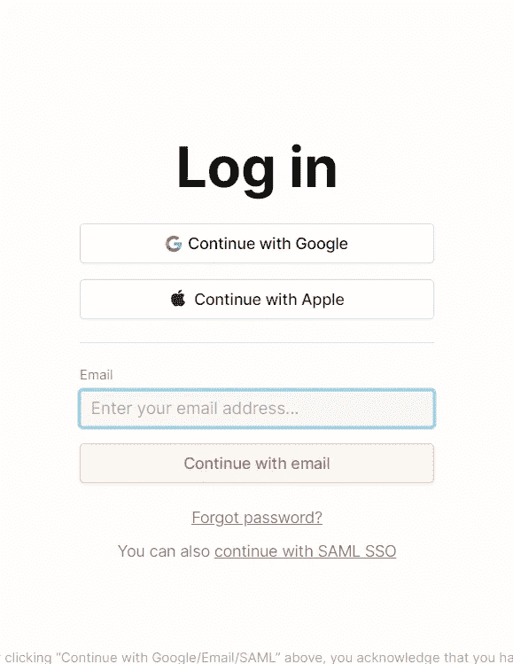
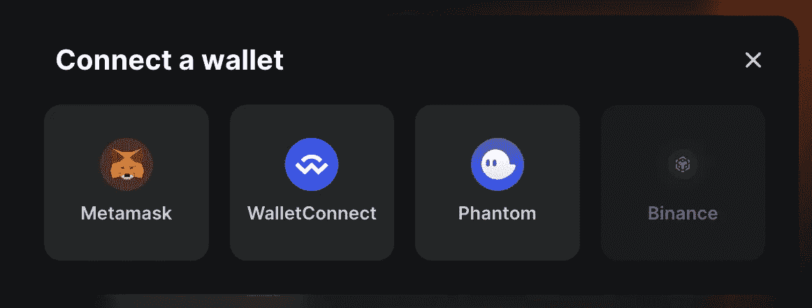

# 前端开发如何从 Web 2.0 升级到 Web 3.0

> 原文：<https://medium.com/coinmonks/how-frontend-dev-can-upgrade-from-web-2-0-to-web-3-0-b95d55c86504?source=collection_archive---------4----------------------->

> 🧐，你的这个 Web 3.0 到底是谁？

加密变得越来越流行，在对话中听到“web3”变得越来越常见。

这篇文章将讨论开发人员为过渡到 Web 3.0 所做的实际准备。

我想谈谈这个话题，因为我自己在 2021 年 12 月考虑过转型，并且已经在 2 个月后转向全职加密。

💡如果你是领跑者，你已经有 90%准备好转换到 Web 3.0 了

## 什么保持不变？

你仍然需要在前端制作用户界面👀

您仍然需要关注用户友好的界面、用户可访问性和优化。你所有的框架知识(React、Vue、Svelte 等)仍然是相关的，并且在这个过程中是需要的。最终，这都归结为 DOM 操作。不同之处在于 Web 2.0 和 Web 3.0 应用程序处理数据和身份验证的方式。

## 有什么不同？

Web 3.0 中的主要模式转变发生在流程的数据和认证阶段。

**认证。**

不用在 Web 3.0 的每个网站上为任何项目设立账户，你所要做的就是拥有一个加密钱包。您的钱包是您拥有的数据和资产的存储库，您可以在任何 dApp 中使用。

> 💡dApp 是一个 Web 3.0 网站或应用程序

web2.0 auth

web3.0 auth

使用社交网络的非常相似的授权界面已经迁移到在网站上选择一个钱包来连接。这种授权方法的优点是我们不会留下我们的联系地址，这是通过社交网络授权时最常传递给应用程序的。你可以保持你的加密钱包尽可能的人性化，在所有平台上授权，并且不会收到任何垃圾邮件。此外，分散式应用程序不需要您通过任何验证和额外的 KYC(了解您的客户)

**与服务器交互**

您开始直接从区块链读取数据，而不是向集中式 API 服务器发出网络请求。通常，智能合约用于实现这一点。作为一名 Web 3.0 工程师，您将每天与智能合约进行交互。确保你很好地理解什么是智能合约，它是如何工作的，智能合约的 ABI 是什么，等等。

> 💡你可以在 [**阅读**智能合约****](https://academy.binance.com/ru/articles/what-are-smart-contracts) **，**有一篇关于 **ABI 在** [**habr**](https://habr.com/ru/company/raiffeisenbank/blog/338172/) 的有趣文章

此外，数据突变的工作变化很大。如果在 Web 2.0 中，您只是将用户的“POST”请求发送到后端，那么在 Web 3.0 中，您需要将带有智能合约调用的事务发送到区块链。用户必须为通话支付佣金(同样的气体在高乙醚负荷时期会涨到数万美元)。所以开发者**必须小心在前端**调用智能合约。确保调用正确的函数，并且参数以正确的格式接收有效数据，这一点很重要。智能合约和区块链上的一切在本质上都是不变的。数据一旦进入区块链，就会一直留在那里。如果你想改变你发送的数据，这是要花钱的，有时这是不可能的，这取决于你正在交互的智能合约的性质。

在 Web 3.0 中处理数据也比在 Web 2.0 中花费更长的时间。Web 2.0 中的 POST 请求通常需要几百毫秒。智能合约调用和交易可能需要几分钟到无限长的时间。

这是因为网络节点必须将每个事务添加到新的区块链。发送交易和将其添加到区块链之间的延迟取决于您的用户愿意支付的汽油费(即成本)。因此，您需要记住请求的正确处理。骨架，降低，错误处理。智能合约中的事务可以在发送到区块链后返回，因此您还必须处理它并等待它在池中得到验证。

除此之外，还有大量不同的网络。如果你的智能合约在以太坊网络，用户在 Polygon 的时候是无法执行的。在我正在开发的产品中，我们支持完全不同的区块链，我们需要在许多类似 EVM 的网络中发送事务，但除此之外，还有对 Solana 的支持，它是用 Rust 编写的，有完全不同的智能合同(在 Solana 中它们被称为程序)

*但是如果你不理解任何关于可靠性、智能契约调用和块处理的交互，也不要沮丧。有许多开源解决方案可以简化您的 Web 3.0 体验:*

[*【https://github.com/viaprotocol/web3-wallets】*](https://github.com/viaprotocol/web3-wallets)[*https://github.com/wagmi-dev/wagmi*](https://github.com/wagmi-dev/wagmi)[*https://github.com/Web3Modal/web3modal*](https://github.com/Web3Modal/web3modal)[*https://github.com/MoralisWeb3/react-moralis*](https://github.com/MoralisWeb3/react-moralis)

## 接下来是🧑代码💻

我可以不停地谈论区块链、事务等等，但是为了理解，最简单的方法是展示 Web 2.0 和 Web 3.0 工作负载之间的视觉差异🌓

1.  与 Web 2.0 中通过 cookies 进行的传统授权相比，在 Web 3.0 中，你通常会要求用户将他们的钱包连接到网站。虽然连接钱包的代码可能是样板文件并且令人困惑，但是有许多库提供了高级抽象。

**2。读取数据** Web 2.0 中用什么来检索数据？选项真的不多，我只能想到`*取*和` *axios* `。

在 web3 中，首先使用协定地址及其 ABI 创建一个智能协定实例。 [**Ethers**](https://docs.ethers.io/) 是与区块链互动最流行的库之一。作为一名前端工程师，你必须记住的重要事情是，当你试图从智能合约(如余额)中读取一个数字时，你得到的值的类型将是` *BigNumber* `,而不是一个数字。这意味着您必须使用` *toString()* `方法将返回的数据转换为字符串或数字。

**3。写入数据** 向 web3 读写数据都是通过智能合约函数调用来完成的。如您所见，写入智能协定的语法与从中读取的语法没有什么不同。

需要对接收到的智能合约函数调用 promis 调用` *wait()* `方法等待交易确认。` *wait()* `方法也返回一个 promis，该 promis 在事务同步后被解析。

> 📌请注意，我们还将“signer”字段传递给了实例，没有它，我们只能调用智能契约的 read 方法。[官方文件](https://docs.ethers.io/v5/api/signer/)😉会有助于理解更多

## 向导

所以，为了回答这篇文章标题中的问题，让我们总结一下你需要知道什么。如果您想作为前端开发人员开始学习 Web 3.0，这是一个示例指南，可以作为参考。该指南的灵感来自于我的个人经历和我看到的其他人的做法。

-学习区块链和以太坊的基础知识(你可以在这一点上停留很长时间，只学习要点)
-了解智能合约。
-了解 Web 3.0 中的钱包和连接钱包(`*提供商*`、`*签名者*`，各种钱包提供商)

A series of videos to help you understand the first 3 steps of the guide

*   制作[**第一个前端项目**](https://wagmi-xyz.vercel.app/guides/connect-wallet) ，它只是让你连接一个钱包，并显示连接的钱包的地址(关于这类项目有很多指南，我会在文末附上很多源码)
    ——查看为 Web 3.0 创建的开源项目。找到可以进行一些更改的拉取请求的位置。不要直奔与 ISP、RPC 和图书馆合作的根本。您可以将您的知识应用于编写测试、优化包或者编写有用的文档。
    -开始找工作😎在指南的这一步，你已经具备了成为 Web 3.0 前端工程师的所有基础知识。我已经发布了一系列 Web 3.0 工作网站，试着申请那里的 8-10 个职位空缺，你会明白市场缺少开发人员，即使是大项目也准备接受新手。

> 📚就在我写这篇文章的时候，我发现了几篇关于“我如何适应 Web 3.0”的文章。
> ——你只需要几次演示，一点胆识和一般的英语(作者来自独联体)就能找到工作。甚至不知名的项目也缺少工人。任何倡议都会受到少量代币的惩罚。
> ——尽管标题是“官方雇佣”，但不太可能是官方的。
> 在这里阅读

## 可供探索的资源精选

一篇没有大量附加文章的文章算什么？把一切都加到自己身上，安排时间去探索，建立路线图。我还没有完全研究和阅读所有的资源，但它们都是在 Web 3.0 开发的~~6 个月~~ *8 个月*内编译的。我将省去付费课程，因为在公共领域有如此多的信息。把你的钱存起来，去看心理医生或者买你的第一部 NFT😉

**享受🎉让我们从课程开始吧**

-[build space . so](http://Buildspace.so)——不会停止推荐这些家伙，最容易学的。所有的课程都是免费的，他们有自己的工作委员会
-[learn web 3 . io](http://LearnWeb3.io)——他们的不和已经持续了很长时间，但从来没有走过他们的轨迹。似乎非常类似于 buildspace。
-[https://www.web3.university/](https://www.web3.university/](http://web3.university))——另一个我还没来得及去过的 Bildspace 模拟
-[https://rabbithole.gg/](https://rabbithole.gg/](https://rabbithole.gg/))——一个你做 Web 3.0 活动和学习协议
-[[https://cryptozombies . io/](https://cryptozombies . io/)](https://cryptozombies.io/](https://cryptozombies.io/))拿报酬的地方——一个坚实基础的经典。*剧透提醒:最后你会学到 jQuery
-[-https://capturetheether.com/](https://capturetheether.com/](https://capturetheether.com/))-游戏再来一遍，再来一遍关于坚固性
-[https://speedrunethereum . com/](https://speedrunethereum . com/)](https://speedrunethereum.com/](https://speedrunethereum.com/))-没有 speedruns 算什么指南？
-【https://a16z.com/crypto-startup-school/】-——(不仅仅是开发者)
-[https://eth.build/](https://eth.build/](https://eth.build/))——(已经在指南的 3 点给出了他们播放列表的链接)

**路线图**

-[https://vitto . cc/web 3-and-solidity-smart-contracts-development-roadmap/](https://vitto.cc/web3-and-solidity-smart-contracts-development-roadmap/](https://vitto.cc/web3-and-solidity-smart-contracts-development-roadmap/))
-[https://github.com/OffcierCia/DeFi-Developer-Road-Map](https://github.com/OffcierCia/DeFi-Developer-Road-Map](https://github.com/OffcierCia/DeFi-Developer-Road-Map))
-[https://web3.smsunarto.com/](https://web3.smsunarto.com/](https://web3.smsunarto.com/))——(不仅限开发者)

**文件**

-[https://www.openzeppelin.com/contracts](https://www.openzeppelin.com/contracts](https://www.openzeppelin.com/contracts))—就像 CSS 中的 BEM，你逃不出 OpenZeppelin
-[https://github.com/ethereum/wiki/wiki/](https://github.com/ethereum/wiki/wiki/[Russian]-)-[https://docs.ethers.io/v5/](https://docs.ethers.io/v5/](https://docs.ethers.io/v5/))—前端 Web 3.0 开发者最重要的库
-[https://www.trufflesuite.com/tutorial](https://www.trufflesuite.com/tutorial](https://www.trufflesuite.com/tutorial))—了解如何调试一个区块链
-[https://ether eum . org/en/developers/docs/standards/tokens/ERC-20/](https://ethereum.org/en/developers/docs/standards/tokens/erc-20/](https://ethereum.org/en/developers/docs/standards/tokens/erc-20/))—ERC-20 应用程序、转移、造币等。
-[https://wagmi.sh/](https://wagmi.sh/](https://wagmi.sh/))-两个非常适合阅读文档的图书馆📝
-[https://scaffold-eth.github.io/eth-hooks/](https://scaffold-eth.github.io/eth-hooks/](https://scaffold-eth.github.io/eth-hooks/))-两个非常适合阅读文档的图书馆📝

**多合一。**

-[https://www.useweb3.xyz/](https://www.useweb3.xyz/](https://www.useweb3.xyz/))——(不只是针对开发者)
-[https://based.builders/](https://based.builders/](https://based.builders/%E2%9A%99+Based+Web3+Studies))——(不只是针对开发者)
-[https://solidity-by-example.org/](https://solidity-by-example.org/](https://solidity-by-example.org/))——很多不同的关于坚固性的现成契约的例子，你可以看到黑客攻击的例子
-[https://cryptomarketpool.com/](https://cryptomarketpool.com/](https://cryptomarketpool.com/))——关于严肃的事情
-[https://login.xyz/](https://login.xyz/](https://login.xyz/))——关于 EVM 钱包授权的一切
- [全栈以太网完全指南](https://www.youtube.com/watch?v=a0osIaAOFSE)

## 感谢阅读。订阅我的频道，欢迎来到 Web 3.0🎉

> *交易新手？试试* [*密码交易机器人*](/coinmonks/crypto-trading-bot-c2ffce8acb2a) *或* [*复制交易*](/coinmonks/top-10-crypto-copy-trading-platforms-for-beginners-d0c37c7d698c)