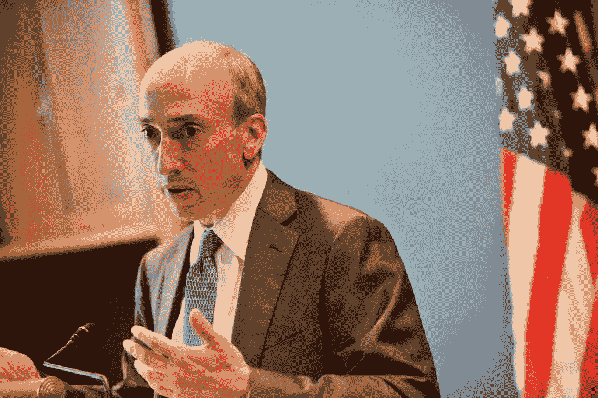

# FTX 是如何骗过美国证券交易委员会并在巴哈马群岛的顶层公寓挥霍客户资金的

> 原文：<https://medium.com/coinmonks/how-ftx-fooled-the-sec-and-squandered-client-money-from-a-penthouse-in-the-bahamas-cf91a62eb51e?source=collection_archive---------1----------------------->

SEC president Gary Gensler — Image credit [Third Way Think Tank](https://www.flickr.com/photos/thirdwaythinktank/)

FTX 的破产是可耻的。每天都有更多令人愤慨和可耻的事情被揭露出来。我试图总结一些最近的见解。

FTX 的案件继续主导加密讨论。币安的救助现在已经不在讨论范围内了，因为看一看它的账目显然是一个太大的威慑…