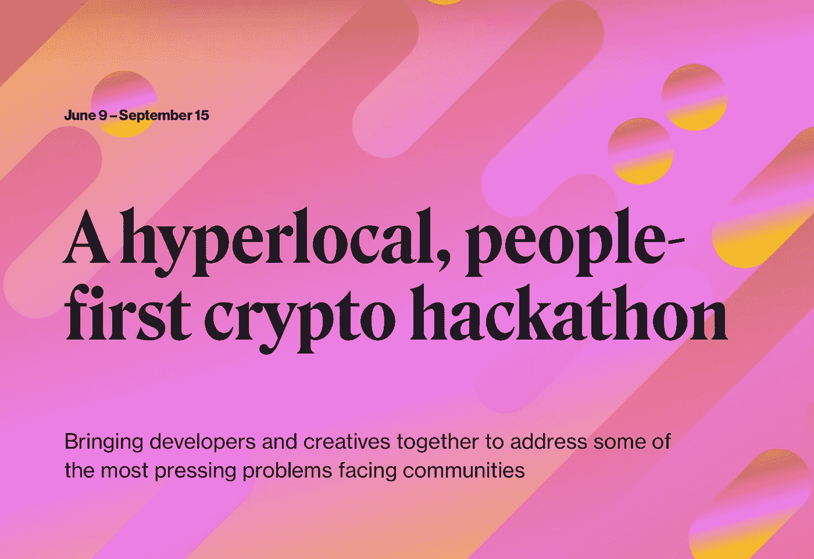

# 黑客马拉松如何加强 Web3 社区

> 原文：<https://medium.com/coinmonks/how-hackathons-strengthen-the-web3-community-ff58c36036cd?source=collection_archive---------8----------------------->

[Isaiah Jackson](https://twitter.com/bitcoinzay?lang=en) ， [Coindesk 的社区密码](https://www.coindesk.com/tv/community-crypto/community-crypto-july-7-2022/)的主持人，也是《比特币和美国黑人》的作者，与黑客马拉松的组织者和参与者谈论了是什么让他们伟大，以及为什么他们帮助发展 Web3 社区。

在本帖中，我们将回答以下问题:

*   **什么是黑客马拉松？**
*   他们如何帮助 Web3 多样化？
*   **web 3 athon 如何帮助社区？**
*   **黑客马拉松需要哪些技能？**
*   **移动优先应用带来了什么？**
*   **体验的多样性如何改变设计？**

# **什么是黑客马拉松？**

对于那些不知道的人来说，黑客马拉松是一项将开发人员和非技术型创始人以及其他创意人员聚集在一起的活动。他们组成团队，为以挑战形式呈现的一系列问题中的一个问题构建解决方案。

虽然黑客马拉松的竞争精神很强，但它们也是构成 Web3 的社区发展的驱动力。

[Ashar Shahid](https://twitter.com/Ashar2shahid) 是 [API3](https://twitter.com/API3DAO) 的开源协议开发人员之一，他强调了结识对 Web3 同样充满热情的新人的能力，这也是他开始参加这些活动的原因之一。当被问及为什么开始参加黑客马拉松时，他说:

> “对我来说，我最初的几次黑客马拉松只是为了见面……了解加密，了解开发”。

在描述最近的 ethDenver 时，他谈到在城堡体育场的多层看到一排排的电脑是多么酷，人们为了参加比赛排了几个小时的队。

但是有道理。有很多信息共享和网络，参与者有机会在黑客马拉松的过程中发展很多。看到不同团队的独特过程都在为手头的问题开发他们自己的解决方案，会导致交叉授粉，从而提升每个相关人员的设计和编码技能。

> 正是思想的非同质性导致了大创新。

# **发展多样化考勤**

由 CoinDesk 和 [CRADL](https://project-cradl.notion.site/Crypto-Research-and-Design-Lab-50a7127f34ed4c88ad95c7cedf7fbe36) 举办的 Web3athon 认识到了这一点，创作者认为，除了创造更好的产品，更具包容性的开发空间将有助于加快 Web3 技术的采用。该活动将持续到 9 月 15 日，旨在为迄今为止的任何黑客马拉松带来最广泛的人群。

他们促进多元化出席的方式之一是在网上举办活动。经常组织黑客马拉松的[黑客地球](https://twitter.com/HackerEarth)的 Ellis Norman 说，在 COVID 之前，向在线活动的过渡就已经发生了，疫情只是巩固了这种形式。在线活动对更广泛的人群更具包容性，因为他们可以在下班后或他们的孩子睡觉后加入，或者从另一个城市、州或国家参加——更不用说参加人数没有上限。

# 【Web3athon 如何帮助社区

Web3athon 将解决 5 个具有全球意义的问题，但其解决方案需要在超本地层面上实施:

*   世代财富
*   财务健康
*   可持续文化和社区
*   环境健康
*   救灾和救济

> CRADL 的联合创始人和领导者 Tricia Wang 将这些描述为“几个世纪以来世界各地的社区一直在处理的真正的人类问题。”

该活动将在 3 个月内分两个阶段进行，包括令人惊叹的 17 个链条，参与者可以选择在这些链条上发展。第一阶段以问题为中心，鼓励参与者在选择他们将在哪个链上开发之前，深入研究他们选择的问题如何影响他们的本地用户群。随着对问题的深入理解，开发人员能够更好地利用 17 个区块链的细微差别，找出最适合他们解决方案的一个。

这一特定标准强调了多样化、多链 Web3 环境的价值。

# **黑客马拉松的技巧**

对于那些有兴趣参与黑客马拉松，但没有技术经验的人，不用担心！您可以通过一些练习和指导来自学编码。Ashar 将 Ethereum 特有的语言 Solidity 放在了希望进入黑客马拉松和 Web3 开发的人的技能列表的首位。学习起来如此容易的原因之一是有很多专家，比如阿沙尔，会发布操作指南。深度[文档](https://docs.soliditylang.org/en/v0.8.15/)也是流行的语言。

他的第二个建议是学习 reaction，这样你就可以构建你设计的任何应用的前端。“展示很重要，”阿沙尔说，这是真的——政府网站是最不适合使用的，因为它们大多是糟糕的 UX 和用户界面。您还需要记住，黑客马拉松是一种竞赛，而赞美功能的外观是一种成功的组合。

Ashar 在黑客马拉松中开发的过程很简单:

*   通过看问题来定义你想发展的想法；已经存在哪些解决方案，以及它们的优缺点是什么(您可以通过查阅“[设计思想](https://www.interaction-design.org/literature/topics/design-thinking)”来进一步充实这一点)。
*   将您的概念转换为伪代码，在伪代码中，您可以用人类语言写出逻辑，但是要保持足够接近代码，以便您和您的团队可以很容易地将它分成几个部分并开始工作。
*   想想您的程序将如何适应您将在“反应”中构建的前端。

他将此描述为“黑客马拉松过程中的面包和黄油”，但提醒每个人一定要表达自己的风格。

> 编码是美丽的，因为你必须以计算机能理解的方式进行创造，同时忠实于你的思维过程。这真的是一种自我表达的方式。

# **Hackathon 的成功可能来自移动第一应用**

在 Web3 上开发的想法可能会从一个提交变成 Web3 社区的一个支柱。Uniswap 有这样一个故事，海登·亚当斯能够在黑客马拉松中接近 Vitalik Buterin，并当场谈论他的项目。

他的推介之所以成功，是因为他的手机上有可用的代码，重要的是要记住，在您的开发过程中，世界上大部分地区首先是移动的。 [BNB 连锁店](https://www.bnbchain.io/)的投资总监 Gwendolyn Regina 解释说，许多新兴市场正在跳过硬连线服务，直接进入 4g 和 5G。这导致大多数人主要通过智能手机访问银行和互联网。

Web3athon 强调了赞助商之一的 [Celo](https://celo.org/) 对于移动类型的应用程序来说是伟大的。每个链更好或更差地满足了不同的需求，因此在开始为特定的区块链写作之前，了解您正在解决的问题和您服务的人群是非常重要的。

# **更多的体验，更好的解决方案**

通过在线托管使参与不受地点限制，Web3athon 消除了进入计算机和互联网连接的障碍。这种类型的开放，我相信是 Web3 的核心，将增加人类体验的多样性，影响来自空间的解决方案。由于技术的进化本质，更多样的思想只会导致更强大的 Web3 产品向前发展。

互联网是连接的工具，虽然 Web2 大公司的共同商业模式通过划分用户创造利润，但 Web3 的架构从根本上改变了激励机制——个人被赋予权力，并鼓励为共同目标而合作。

随着远程工作变得司空见惯，这一时刻正是新人入职的大好时机。通过创建一个促进协作的在线空间，Web3athon 正在加强 Web3 文化的租户:任何人，任何地方，无论他们的背景如何，都可以有所作为；他们的想法和职业道德的质量才是最重要的。

> 如果你从这篇文章中学到了什么:
> 
> 与另一个好奇的人分享
> 
> 给它鼓掌
> 
> 在这里关注我，在 Twitter 关注[。](https://twitter.com/omnomtomnom)
> 
> 交易新手？尝试[加密交易机器人](/coinmonks/crypto-trading-bot-c2ffce8acb2a)或[复制交易](/coinmonks/top-10-crypto-copy-trading-platforms-for-beginners-d0c37c7d698c)