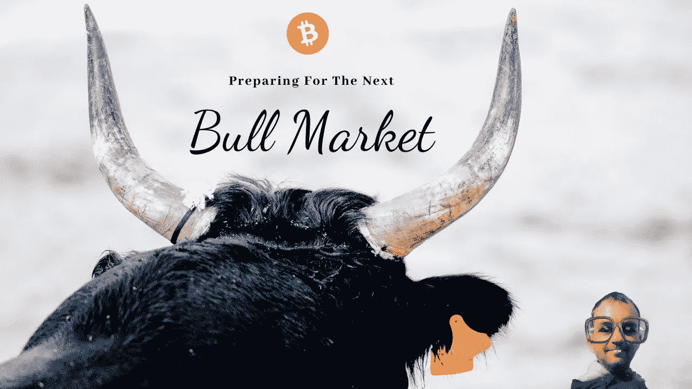

# 我如何为下一个加密牛市做准备

> 原文：<https://medium.com/coinmonks/how-i-am-preparing-myself-for-the-next-crypto-bull-market-9bf0761b4317?source=collection_archive---------5----------------------->

有一点是肯定的，无论是熊市还是牛市，这些周期都不会永远持续下去。每一次牛市，每一次熊市，迟早都会走到尽头。

**知道了这一点，我正在利用当前的加密货币熊市为下一个即将到来的牛市做准备。这是我正在做的事情。**

Found on [Pixabay](https://pixabay.com/), edited with [Canva](https://www.canva.com/join/sailing-jury-reliable).

# 正确的心态

对下一轮牛市最重要的准备是建立正确的心态。这是必要的基础工作。其他的一切都会跟随你的想法。

今年到目前为止非常艰难。Terra Luna 生态系统崩溃了，像 Celsius 和 BlockFi 这样的大型贷款公司甚至像 FTX 这样的大型加密货币交易所都破产了。数以千计，如果不是数百万计的用户和客户已经失去了他们的资金，有些人甚至失去了他们一生的积蓄。似乎这一切还不够糟糕，加密货币的价格迅速下跌。比特币从之前的历史高点下跌了 75%，一些替代币甚至下跌了 90%以上。

可以理解的是，许多投资者要么被冻结在恐惧、不确定性和怀疑中，要么已经完全放弃了。那是熊的悲观。嗯，我们毕竟处于熊市，所以市场参与者的情绪完全可以理解。

**要明白的关键是，你需要用乐观的牛市心态取代悲观的熊市心态！**

如果你现在在比特币交易价格低于 2 万美元时悲观，那么当比特币最终达到 10 万美元时，你可能会成为 FOMO 的一员。

每个人都知道。就是“低买高卖”但是即使每个人都知道这一点，大多数人倾向于做完全相反的事情。当价格达到历史新高时，他们在牛市顶部 FOMO。这是因为人类就是人类，他们只是跟随自己的自然情感。

投资加密货币的最佳时机是现在价格低的时候，而不是价格高的下一个牛市期间。问题是，如果你现在在熊市中抱着悲观的心态，你就会对这类事情视而不见。以乐观的公牛心态，你会认识到这一点。这是熊市带来的机会之一，价格便宜的密码。在这个动荡的时代，你实际上被投资机会所包围，但如果没有乐观的心态，你就看不到它们。

真正的投资机会可以在熊市中找到。在接下来即将到来的牛市中，你要做的就是保护你的资本。换句话说:在当前熊市期间拥有牛市的乐观心态，在下一个牛市期间拥有熊市的悲观心态。

 [## 加密熊市？我已经看好下一个牛市了！

### 加密冬天来了？不，不是的。Crypto Winter 已经来了快一年了。这是最冷的天气之一…

medium.com](/@cryptonator_s/crypto-bear-market-i-am-already-bullish-for-the-next-bull-market-5eef7e4cc47c) 

# 有策略

在你摆正心态之后，是时候拿出一个适合自己现状的计划了。例如，如果你有一些风险资金可以投资，那么现在就是最好的时机。

如果你没有任何储蓄，或者因为失去资产而归零，那么你需要专注于赚取加密货币。请记住，加密货币领域的发展速度非常快，只要你在困难时期保持乐观，你失去的所有加密技术都可以赚回来。

没关系，如果你的策略涉及购买或赚取加密货币，我建议规划一个多元化的投资组合，不要全押在任何东西上，只投资你也能承受损失的东西。

另一个行之有效的投资策略是平均成本法(DCA)。萨尔瓦多目前在练 DCA，当时总统决定每天买一个比特币。这种方法对于加密货币等波动性很大的资产尤其有用。

过去我已经在 Publis0x 的博客上写了一篇关于 DCA 的详细文章:“ [**美元成本平均策略——随着时间的推移建立一个加密组合**](https://www.publish0x.com/cryptonators-investments/dollar-cost-averaging-strategy-building-up-a-crypto-portfoli-xkpyejq?a=5xe7xNOa7r&tid=Medium) ”继续阅读这篇文章是对这篇文章的一个很好的补充。

# 投资和积累

当你的计划涉及赚取密码，那么请记住，你可以赚取硬币和代币在一个非常好的利率了。尽可能多地赚取和积累，然后 HODL，但不是永远，只有到下一个牛市。不要和你的 altcoins 结婚，在下一次牛市中获利。

如果你是加密货币的初学者，那么比特币和以太坊是明智的选择，因为这两种区块链都被认为是成熟的蓝筹币。从长期来看，我认为这两种加密货币或多或少都是安全的赌注。

然而，真正的利润可以通过正确的替代硬币获得。我怀疑我们会在短期内看到 100 倍的比特币或以太坊。这两项资产的市值已经太高了。有了替代币，这种利润仍然是可能的，但当然，投资替代币也比投资顶级加密货币比特币和以太坊风险大得多。目前排名前 20 位的大多数加密货币将在几年内消失。

为了降低风险，你必须对潜在的另类投资进行非常仔细的研究。当我去 DYOR 的时候，我总是从警惕危险信号开始。一旦我发现了其中的一个危险信号，我就知道是时候进入下一个项目了。你这样做，直到你得出结论，你找到了下一个低市值的创业板，并在你的投资组合中增加了一点。

我在之前的文章中强调了这些危险信号，标题是“ [**”当你自己研究加密货币项目和替代货币**](/coinmonks/red-flags-to-watch-out-for-while-doing-your-own-research-on-cryptocurrency-projects-and-altcoins-9b2b76df7c1e) 时，要小心这些危险信号

 [## 当你自己研究加密货币项目和替代货币时，要小心危险信号

### 如果你现在投资正确的替代货币，那么你可以期待在下一轮牛市中获得巨大的回报。这很冒险，而且…

medium.com](/coinmonks/red-flags-to-watch-out-for-while-doing-your-own-research-on-cryptocurrency-projects-and-altcoins-9b2b76df7c1e) 

这就是我目前如何为下一轮牛市做准备，我希望我能指出为什么拥有正确的心态是至关重要的。

当然，我也对你的策略感兴趣。你是如何为日益成熟的牛市做准备的？请在评论中告诉我。

最后，我想提醒你，我写这篇文章的意图不是要取代你自己的研究。我可能在我的个人资料照片上看起来很聪明，但我不是你的财务老师，所以不要把它当成财务建议。

感谢您的阅读，如果这是您喜欢在 Medium 上阅读的内容，请点击下面的按钮。

如果你喜欢，你也可以在 Twitter 和 Publish 上关注我，这是一个让你获得写作和阅读密码的平台。

> 交易新手？尝试[加密交易机器人](/coinmonks/crypto-trading-bot-c2ffce8acb2a)或[复制交易](/coinmonks/top-10-crypto-copy-trading-platforms-for-beginners-d0c37c7d698c)