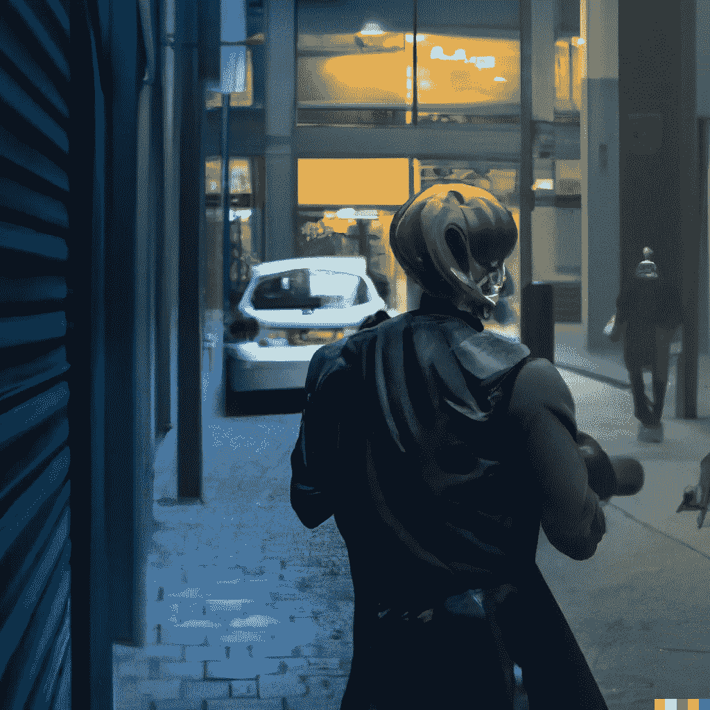

# 我如何避免加密中最大的缺省

> 原文：<https://medium.com/coinmonks/how-i-avoided-the-largest-defaults-in-crypto-f085a62c6598?source=collection_archive---------25----------------------->

# 从 2013 年起，我就进入了加密领域。

做好了一些事情，也犯了一些错误。

幸运的是，尽管我是一名用户，但我已经成功避免了每一次大规模的公司内爆。

阅读这些建议可以帮助你在将来避免同样的事情发生。

# **Mt. Gox (2013)**

Mt. Gox 是 2013 年最大的加密交易所，也是我用的第一个。

我在那里购买并持有了数百枚比特币。

当时，我知道冷藏是理想的。然而，作为一个新用户和冷钱包稀疏，我对自我保管感到紧张。

我想慢慢来，学习如何建立冷藏的适当解决方案。

在某个时候，用户开始报告取款延迟。

那时候，信息更真实。你没有今天误导市场的叙述。

谣言一开始，我就撤回了我的 BTC。

过了一会儿，Gox 山倒塌了。

**课程:**

学会自我保管你的硬币，然后这样做。

如果你听到一个谣言，不要惊慌，但要尽职尽责。

今天有相对分散的交易所。存取款更轻松，0 手续费选项。

# 《地球露娜》(2021 年):

2021 年第一次开始用主播。

在那年夏天 UST 大幅回调和脱钩之后，我买入了 LUNA。

LUNA 当时大约 6 美元。

尽管与美元脱钩令人担忧，但也并不令人意外。

它所证实的只是 peg 维护的需求是多么的集中和手工。

通常情况下，营销在加密中胜出。

我原本预计市场价格会回升。

所以我买了露娜，押了布鲁纳，并从 Anchor 借了$UST 做多。

我一般不建议这样做。但我对市场形势和风险感到放心。

返回 Luna 并收回股份的 21 天解锁期应该是一个警告信号。

同样，这些参数可能作为技术需求出售；他们不是。

它们是为了防止用户冲到门口被锁在里面。

2021 年秋天，我开始放弃赌注，等了 21 天。

我收回了抵押品，还清了 UST 的贷款，不久后卖掉了我的 LUNA。

**教训:**

不要认为协议中的所有参数决策都是技术要求，或者是为了您的最佳利益。

一般来说，他们是为了营销和锁定你。

相信那句古老的谚语，“如果它看起来好得不像是真的，它很可能就是真的。”20%的收益率是不可能持续的。

提出问题，相信你的直觉。不要被好斗的群体欺负。

如果你因为问问题而感觉不好，那应该是一个巨大的危险信号！

诚实的演员，在合理的范围内，一般欢迎提问！

不仅在密码中如此，在生活中也是如此。

# **摄氏网络(20200–2021):**

2020 年开始用摄氏。

期待市场开始反弹。我用我持有的$BTC 和$ETH 的一小部分去贷款。

2021 年，随着价格上涨，我请求了几次反向追加保证金。

这释放了我的部分初始抵押品，我可以提取以降低我的风险。

最后，我用我最后一笔反向保证金催缴金额还清了债务，把平台的资金全部提走了。

为什么我会担心在站台上拿硬币？

首先，作为加密货币的初始点，我相信自我保管，并对持有自己的硬币感到舒适。

第二，平台上的硬币没有投保。

即使是这样，管辖权的差异也很可能使任何保险无效。

**课程:**

保管好你自己的硬币。无论哪种方式，都要瞄准大型、有保险的平台。

我相信币安至少在某些方面是有保险的。

不管怎样，只要拿着你自己的硬币或者把它们分散开，至少可以降低你的风险。

高收益是不可持续的。不要让 APY 的“Y”愚弄了你。

如果持续一年的话，只有每年的%。

将收益率解释为我们目前在市场周期中所处位置的函数。

市场上涨，收益率上涨，市场下跌，收益率下跌。

你也可以问我，我可以尽力帮忙。

我非常喜欢阅读 T&C 和白皮书。

这个列表并不意味着我是一个无所不能的加密用户。

有些事我做得很好，也犯过错误，和你一样。

避免使用大尺寸地毯帮助我生存了下来。

**我希望这个列表能帮助你在下一个周期里多准备一些工具。**

以后我会贴更多这样的内容！

因此，如果你觉得这很有帮助，一定要跟随我，[《秘密高潮》](https://medium.com/u/ac6a6e914928?source=post_page-----f085a62c6598--------------------------------)，从不同的经验层次获得洞见和帮助。

我将开始一个免费的每周时事通讯，内容是你在其他地方找不到的。

针对整个加密领域所有经验水平的切实可行的见解、研究和技巧。

一定要在下面订阅！

 [## 每周简讯的加密高潮- Revue

### 通过 Crypto Climax 在 Crypto、Web3、NFT 和元宇宙市场尖端的可行见解和策展，帮助…

www.getrevue.co](https://www.getrevue.co/profile/thecryptoclimax) 

> 交易新手？尝试[加密交易机器人](/coinmonks/crypto-trading-bot-c2ffce8acb2a)或[复制交易](/coinmonks/top-10-crypto-copy-trading-platforms-for-beginners-d0c37c7d698c)