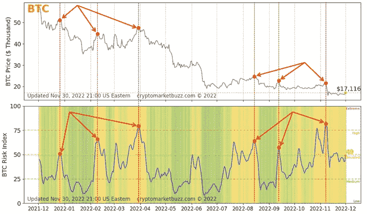

# 我如何使用加密风险指数避免 2022 年 11 月的加密崩溃

> 原文：<https://medium.com/coinmonks/how-i-avoided-the-nov-2022-crypto-crash-using-the-crypto-risk-index-4258a1b1d2cb?source=collection_archive---------34----------------------->

## 你交易工具箱中的另一个工具

本文将带您了解在 2022 年 11 月加密市场崩溃之前，加密投资风险升高(**高加密风险指数**)的实际用例，以及投资者如何看到信号并避免损失他们的资本投资。

Photo by [Traxer](https://unsplash.com/@traxer?utm_source=medium&utm_medium=referral) on [Unsplash](https://unsplash.com?utm_source=medium&utm_medium=referral)

在[介绍加密风险指数:您的加密货币交易需求的终极技术指数](/@CryptoRiskIndex/introducing-crypto-risk-index-the-ultimate-technical-index-for-your-cryptocurrency-trading-needs-f0204a952e4e)中，我们概述了**加密风险指数**([T5【https://cryptomarketbuzz.com/】T6](https://cryptomarketbuzz.com/)推出的创新指数，提供了加密货币市场投资风险水平以及前 5 大加密货币的风险水平)。这个指数是你的加密交易工具箱中的另一个工具，可以为你的交易策略提供信息。

在这篇文章中，我们研究了两个案例，其中加密风险指数在比特币和以太坊价格下跌之前向投资者提供了崩溃信号。

下图来自 2022 年 11 月 30 日的[https://cryptomarketbuzz.com/](https://cryptomarketbuzz.com/)，显示了比特币过去 365 天的价格和风险指数趋势。总的来说，正如我们在网站上以及在[我们的介绍文章](/@CryptoRiskIndex/introducing-crypto-risk-index-the-ultimate-technical-index-for-your-cryptocurrency-trading-needs-f0204a952e4e)中解释的那样，当风险**高的时候，**价格调整的机会显著增加。原因是风险指数考虑了短期、中期和长期价格变动、短期交易量变化以及中短期波动性。因此，高指数表明价格高度不稳定。让我们看看 2021 年 11 月至 2022 年 11 月之间的比特币风险指数和价格趋势。在 2021 年 12 月 25 日，价格为 50，800 美元+/-并且风险指数为 51(升高)。2 月 9 日，价格下降到 44300 美元+/-而风险指数上升到 61(高)。这是一个价格修正信号(低价格，高风险)。但之后更可怕的事情发生了。3 月 29 日，即使价格小幅上涨至 47，500 美元，风险指数也升至 77(非常高)。当比较 3 月 29 日的价格和 12 月 25 日的价格时，我们可以看到价格低了 7%，但风险指数却高了 50%。这意味着，与去年 12 月相比，这种资产更便宜，但更不稳定，投资风险更高。这应该是一个强烈的信号，表明价格即将回调，而事实也确实如此！在 4 月信号发出后，比特币立即进入自由落体模式，并在 2022 年 4 月至 6 月期间损失了 61%的价值。我希望你没有陷入困境！

现在我们来看看 2022 年 8 月到 2022 年 11 月之间的比特币。2022 年 8 月 13 日，比特币交易价格为 24400 美元，风险等级为 60(提升)。2022 年 11 月 5 日，比特币价格为 21300 美元，风险指数为 78(非常高)。基本上，价格低 13%,风险高 30%!这告诉我们什么？是啊！红色信号表明价格调整即将到来，事实也的确如此！在 2022 年 11 月 5 日至 11 月 9 日期间，比特币的价值损失了约 27%。

Bitcoin Price and Risk Index From Dec 2021 to Dec 2022 from [https://cryptomarketbuzz.com/](https://cryptomarketbuzz.com/)

# 最后的想法…

加密风险指数不是灵丹妙药。它也不是一个预测指数(不存在这样的东西！).加密风险指数只给你更多关于加密市场的信息，这是你交易工具箱中的另一个技术指数。在交易加密资产时，您需要充分了解加密货币市场的基本原理，并结合自己的知识、直觉和风险承受能力使用技术指标。

看看 2022 年初和 2022 年末的比特币案例，我们可以吸取一些教训:

*   一般来说，不要在风险指数高于上限时交易。风险指数越高，价格调整的可能性就越大。
*   关注短期、中期和长期价格/指数趋势。当两个日期之间的价格较低但风险较高时，很可能会出现价格回调。
*   加密投资是一项有风险的业务，知道你的风险偏好，有一个交易策略，知道什么时候进入，有一个退出策略(或 HODL 策略)。

[CMB 网站](https://cryptomarketbuzz.com/)上提供的信息以及加密风险指数仅供参考，不构成投资建议、财务建议、交易建议或任何其他类型的建议，您不应将网站的任何内容视为此类建议。

我们不建议交易加密货币，包括购买、出售或持有任何类型的加密货币。你需要自己做研究，了解加密货币市场的潜在波动性以及法律和政治方面。此外，在投资加密货币之前，您需要咨询您的法律、金融和税务顾问。加密货币投资存在风险。自己做研究，明智投资。本文或 CMB 网站不对您的资金损失负责。

> 交易新手？在[最佳加密交易](/coinmonks/crypto-exchange-dd2f9d6f3769)上尝试[加密交易机器人](/coinmonks/crypto-trading-bot-c2ffce8acb2a)或[复制交易](/coinmonks/top-10-crypto-copy-trading-platforms-for-beginners-d0c37c7d698c)