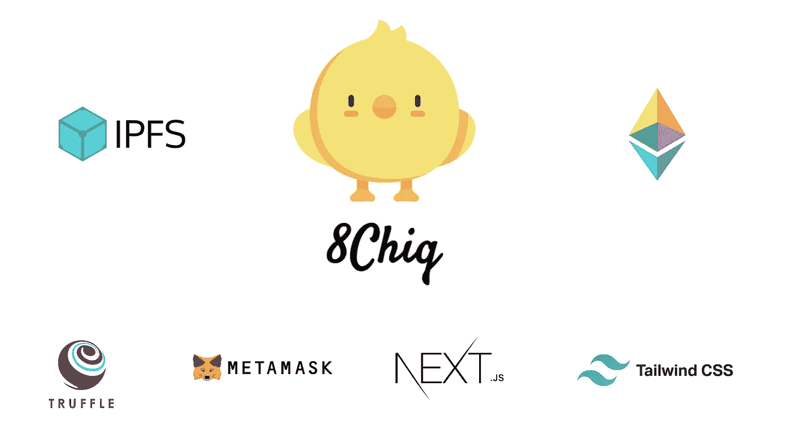

# 我如何建立区块链&基于 NFT 的 9Gag 克隆和 Meme 市场

> 原文：<https://medium.com/coinmonks/how-i-built-a-blockchain-nft-based-9gag-clone-and-meme-marketplace-24fb6a235334?source=collection_archive---------8----------------------->



8Chiq — Meme Marketplace

在过去的几周里，我构建了 **8Chiq，**基于 NFT 的 9gag 克隆，并将其部署在 ***Goerli 测试网络*** 上。这个项目是我的 fullstack Web3 学习之旅的一部分，虽然你可以在这个 [github repo](https://github.com/said017/8chiq) 中查看完整的源代码，但本文不会解释前端(Next JS，Tailwind)的详细过程，而是将重点放在 Solidity & Truffle 部分以及如何迁移然后部署到网络上。

# 项目概述

顾名思义，8Chiq 就像 9gag 一样，是一个迷因平台，在这里你可以上传迷因，喜欢或不喜欢，评论并使用你最喜欢的社交媒体如 Twitter 或脸书分享给你的朋友。不同之处在于，模因被视为非功能性词汇，所有数据(评论、喜欢、不喜欢)都存储在区块链。


8Chiq Meme Marketplace

最重要的是，用户还可以在 8Chiq 的市场页面上买卖迷因。

市场系统本身是非常标准的，并且受到许多已经存在的项目的启发。当用户出售迷因时，它将被转移到市场，当用户购买迷因时，物品将被转移到买方，然后再转移到卖方。刊登费将在买方交易完成时收取，从卖方转到市场所有者。

我认为结合这两个概念会赋予 NFT 更多的社会价值，因为模因通常会在多个社交媒体上共享，因此很难证明模因的原始所有者。这个想法会给模因创造者带来更多的好处。

# 工具和技术堆栈

该项目的技术栈被广泛使用，并被认为是 Web3 开发的最佳实践:

**Web App 框架** — [Next.js](https://nextjs.org/) ，[Tailwind](https://tailwindcss.com/)
**Solidity Dev 环境** — [松露](https://trufflesuite.com/)， [Infura](https://infura.io/)
**文件存储** — [IPFS](https://ipfs.io/)
**以太坊 Web 客户端** — [Web3.js](https://web3js.readthedocs.io/en/v1.7.4/)

我使用的工具:

**代码编辑器** — [可视化代码](https://code.visualstudio.com/)
**项目注释&跟踪** — [批注](https://www.notion.so/)

# 项目设置

首先，我们通过在终端上键入以下命令来初始化 Next.js 应用程序:

```
npx create-next-app meme-nft-marketplace
```

进入目录，然后安装项目所需的库:

```
cd meme-nft-marketplacenpm install [@metamask/detect-provider](http://twitter.com/metamask/detect-provider) [@openzeppelin/contracts](http://twitter.com/openzeppelin/contracts) [@truffle/hdwallet-provider](http://twitter.com/truffle/hdwallet-provider) axios ethers ipfs-http-client web3 swr dashify
```

# 顺风 CSS 设置

正如本官方指南所述，正确设置顺风与下一个 JS。首先，您必须通过 npm 安装`tailwindcss`及其对等依赖项，然后运行 init 命令来生成`tailwind.config.js`和`postcss.config.js`

```
npm install -D tailwindcss postcss autoprefixernpx tailwindcss init -p
```

在`tailwind.config.js`文件中添加所有模板文件的路径。

tailwind.config.js

将每个顺风层的`@tailwind`指令添加到你的`./styles/globals.css`文件中。

globals.css

仅此而已。对于其余的前端组件和页面，可以在 [github repo](https://github.com/said017) 上查看。

# 松露装置

Truffle 是使用以太坊虚拟机(EVM)的区块链的 solidity 开发环境、测试框架和资产管道。

首先，您必须全局安装 truffle，在您的终端中键入这个命令，然后转到您之前创建的项目目录，并在那里初始化 truffle bare 项目:

```
npm install -g trufflecd meme-nft-marketplacetruffle init
```

一旦该操作完成，您现在将拥有一个包含以下与 Truffle 相关的项目的项目结构:

*   `contracts/`:关于[担保合同的目录](https://trufflesuite.com/docs/truffle/getting-started/interacting-with-your-contracts)
*   `migrations/`:可脚本化部署文件[的目录](https://trufflesuite.com/docs/truffle/getting-started/running-migrations#migration-files)
*   `test/`:用于[测试您的应用和合同](https://trufflesuite.com/docs/truffle/testing/testing-your-contracts)的测试文件目录
*   `truffle-config.js`:松露[配置文件](https://trufflesuite.com/docs/truffle/reference/configuration)

为了这个项目的简单，我们将不做任何测试脚本功能。也许我会在不久的将来添加这些。但是现在让我们关注`contracts/`目录，这里定义了 solidity smart 契约。

# Meme NFT 和市场合同

[OpenZeppelin](https://www.openzeppelin.com/) 是包含大量标准令牌代码/框架的库，因此我们可以轻松地利用它来创建 NFT，我们从框架中继承 [ERC721 标准](https://eips.ethereum.org/EIPS/eip-721)。

> 交易新手？尝试[加密交易机器人](/coinmonks/crypto-trading-bot-c2ffce8acb2a)或[复制交易](/coinmonks/top-10-crypto-copy-trading-platforms-for-beginners-d0c37c7d698c)

我试图将所有的 NFT 和市场功能放在一个合同中，从用户体验的角度来看，为了简单和容易的交互(更少的交易请求)，作为交换，合同代码和大小变得更大。我将在本文中尝试解释每一个重要的函数和数据结构。您可以随时在 [github repo](https://github.com/said017/8chiq) 上查看完整代码。

**基本 Meme Marketplace Solidity 契约结构，继承 ERC721**

MemeMarketplace.sol contract structure

**Solidity** 是使用最多的智能合约语言，带扩展`**.sol**`。在代码的顶部，你必须声明**可靠性**版本来使用`pragma solidity 0.x.x`。(可选)使用代码顶部的`SPDX-License-Identifier`来确定代码的许可。`contract`是定义智能合同对象的关键字，后跟其名称，非常类似于 OOP 概念。

如你所见，`MemeMarketPlace`契约继承了`ERC721URIStorage`和`ReentrancyGuard`。然后，您必须为 ERC721 定义包含契约和令牌名称的构造函数。

**变量和数据类型**

接下来，我们将关注契约中使用的特定变量和数据类型。

Meme variables and data types

现在我们将关注数据结构中的`struct`类型，`struct`是自定义的类型，可以将几个变量分组，很像 Javascript 中的 object。

我们用它来创建`MarketToken`，它存储了与 meme NFT 令牌相关的信息，如制造商、卖家、所有者、价格、物品状态等。`TokenLikesComment`存储每个 NFT 的信息社交相关数据，例如喜欢、不喜欢和评论。然后`Comment`数据类型帮助我们存储评论和评论者的地址。

我们还使用映射将`tokenId`映射到带有`idToMarketToken`的`MarketToken`。并用`idToTokenLikes`将`tokenId`映射到`TokenLikesComment`。映射数据类型本身的工作方式类似于其他编程语言中的映射。

映射类型使用语法`mapping(KeyType => ValueType)`，映射类型的变量使用语法`mapping(KeyType => ValueType) VariableName`声明。`KeyType`可以是任何内置值类型、字节、字符串或任何契约或枚举类型。不允许其他用户定义的或复杂的类型，如映射、结构或数组类型。`ValueType`可以是任何类型，包括映射、结构或数组。

**铸造代币并创建市场项目功能**

为了在 marketplace 中创建 meme 和创建项目，我们定义了在创建 meme 后直接创建 market item 的函数，并根据用户输入决定是否出售它。

mint and create marketplace token in MemeMarketplace.sol

`mintToken()`利用 OpenZeppelin ERC721 功能创建 NFT 迷因，并将 URI 放在上面。然后我们根据用户输入使用`makeMarketItem`或`makeMarketItemNonSale`创建`MarketToken`，看他们是否想卖。

**读取或查看功能**

然后，我们定义所有与数据/变量相关的视图函数。在可靠性方面，函数的结构非常重要，因为修改智能合同数据需要 gas，而读取数据则不需要。因此，我们必须清楚地说明只读函数和修改数据函数的区别。

Solidity function structure

我不会在这篇文章中解释所有关于可靠性的功能，因为你可以阅读他们的文档。定义只读函数时的重要参数是让函数有`external`参数，因为我们希望前端能够读取它，`view`明确声明这个函数是读取函数，`returns (<return type>)`定义这个函数返回什么类型。

View function in MemeMarketplace.sol

一般来说，我们使用查看或读取功能有两个目的，从合同中读取数据，如`getListingPrice()`和`fetchMarketAllTokens()`，或者检查某种状态，如`isTokenExists()`。

**购买 Meme &取消列表功能**

之后，我们创建从市场购买 meme 的功能，并作为所有者取消列表。

Buy and cancel listing functions

**合同迁移文件**

最后，转到 truffle 生成的`migrations/`文件夹，删除文件夹中的初始文件，创建`1_migrate_marketplace.js`。

1_migrate_marketplace.js

这就是关于 Meme Marketplace 合约的所有关键信息。接下来，我们转到部署步骤。

# 块菌结构

我们可以在`truffle-config.js`文件中定义部署和迁移的行为，如`contracts_build_directory`和合同部署的网络。

在这个项目中，我使用 Infura 并定义了几个网络。 [Infura](https://infura.io/) 为开发者提供 API，只需改变`providerOrUrl`就能轻松与区块链网络交互。在本文中我们将使用 ***Goerli 测试网络*** 中的`goerli_infura_testnet`配置。确保您查看了关于如何设置项目的[信息文档](https://docs.infura.io/infura)，并将您获得的项目 id 的`INFURA_PROJECT_ID`放入您的仪表板并放入`.env`。

**合同迁移执行**

最后，在终端中使用这个 truffle 命令迁移契约:

```
truffle migrate# or do this if previously alredy run and do some modification to contract, just in case
truffle migrate --reset# or migrate with spesific network configuration
truffle migrate --network=<network_name> --reset
```

然后可以使用`npm run dev`命令在本地启动前端，或者使用 vercel 进行部署。您可以通过以下链接查看最终结果演示:

[**演示链接**](https://8chiq.vercel.app/)

# 后续步骤

从这里，你可以随时在 [github repo](https://github.com/said017/8chiq) 上查看完整的代码。我还将发布更多关于 **Web3.js** 以及如何与 Meme Marketplace 合同互动的信息。

与此同时，您可以使用这些资源，我发现这些资源很有帮助，并且在创建这个项目时参考了很多:

**坚实基础**—**[https://www . udemy . com/course/ether eum-and-Solidity-the-complete-developers-guide/](https://www.udemy.com/course/ethereum-and-solidity-the-complete-developers-guide/)**

****Solidity 和下一个 JS 项目**—[https://www . udemy . com/course/Solidity-ether eum-in-react-Next-JS-the-complete-guide](https://www.udemy.com/course/solidity-ethereum-in-react-next-js-the-complete-guide)**

> **加入 Coinmonks [电报频道](https://t.me/coincodecap)和 [Youtube 频道](https://www.youtube.com/c/coinmonks/videos)了解加密交易和投资**

# **另外，阅读**

*   **[印度最佳 P2P 加密交易所](https://coincodecap.com/p2p-crypto-exchanges-in-india) | [柴犬钱包](https://coincodecap.com/baby-shiba-inu-wallets)**
*   **[八大加密附属计划](https://coincodecap.com/crypto-affiliate-programs) | [eToro vs 比特币基地](https://coincodecap.com/etoro-vs-coinbase)**
*   **[最佳以太坊钱包](https://coincodecap.com/best-ethereum-wallets) | [电报上的加密货币机器人](https://coincodecap.com/telegram-crypto-bots)**
*   **[交易杠杆代币的最佳交易所](https://coincodecap.com/leveraged-token-exchanges) | [购买 Floki](https://coincodecap.com/buy-floki-inu-token)**
*   **[3Commas 对 Pionex 对 Cryptohopper](https://coincodecap.com/3commas-vs-pionex-vs-cryptohopper) | [Bingbon 评论](https://coincodecap.com/bingbon-review)**