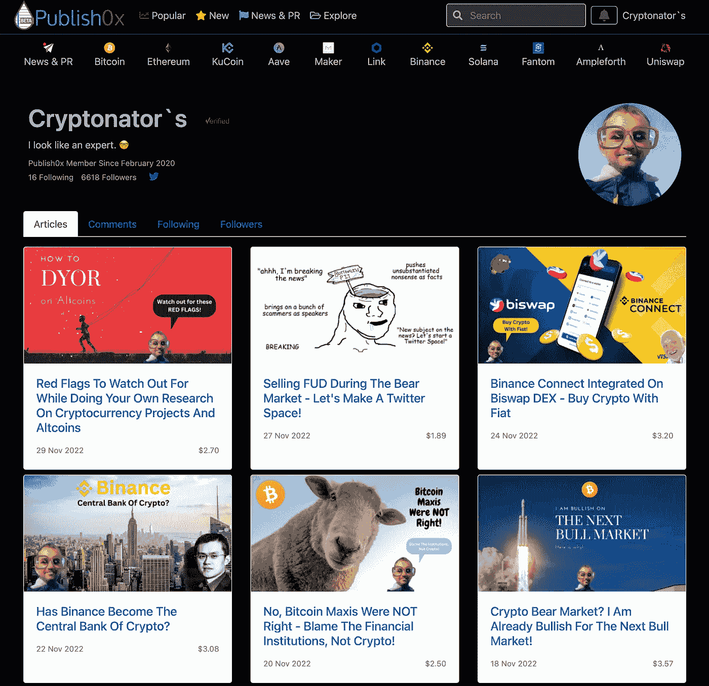
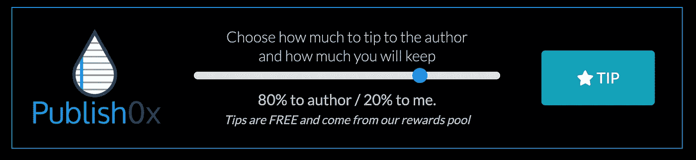
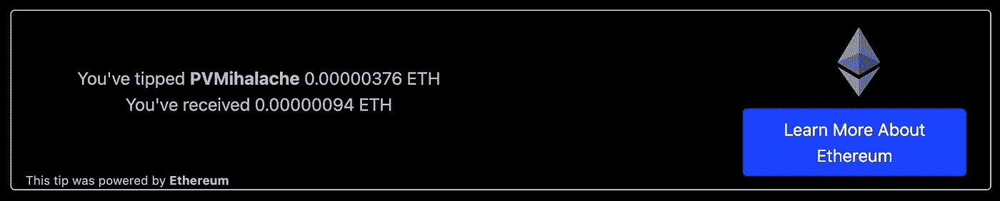

# 我如何通过写作和阅读关于密码的文章来获得以太坊

> 原文：<https://medium.com/coinmonks/how-i-earn-ethereum-for-writing-and-reading-about-crypto-3c63311fffc7?source=collection_archive---------10----------------------->

Medium 是发现各种主题的新作者和有趣读物的好地方，包括加密货币。

我最近才开始在 Medium 上写作，但是我已经写了将近三年的关于加密货币的博客了。我开始在一个叫 [**Publish0x**](https://www.publish0x.com/@Cryptonators-Airdrop-Hunt?a=5xe7xNOa7r&tid=Medium) 的小型博客平台上工作。

这是一个特殊的加密不可知的平台，用加密货币奖励作者和读者。

Publish0x 上的小费令牌经常变化。现在，你可以通过阅读和写作获得以太坊和 Ampleforth。

Screenshot of my crypto blog on [Publish0x](https://www.publish0x.com/@Cryptonators-Airdrop-Hunt?a=5xe7xNOa7r&tid=Medium).

这是我在 Publish0x 上的博客截图。如你所见，我于 2020 年 2 月在 Publish0x 上开始了我的旅程。从那以后，我经常发表文章，随着时间的推移，我已经获得了 6500 多名追随者。

Publish0x 最酷的事情之一是，不仅作者获得了加密货币的提示，读者也是如此。这可能是和 Medium 等其他博客平台最大的区别。

当你看到 Publish0x 上的一篇文章的底部时，你会发现一个类似这样的小费者。

Screenshot of the Publish0x tipper.

你一天有七个免费的小费，通过这个小费器，你可以决定给帖子作者多少小费，自己留多少。你可以把 100%的小费给作者，也可以自己留 80%的小费。所有提示都是免费的，由 Publish0x 奖励池提供。

这些提示现在在以太坊或安普尔福思被随机给出。过去的小费代币是基本注意代币、戴稳定币、项目水电、收获金融和 Statera。所有这些代币都是在区块链以太坊运行的 ERC20 代币。

你可以马上开始作为一个读者赚钱。如果你想在 Publish0x 上开始写作，你需要首先被批准为作者。在最好的情况下，你以前已经发表过一些东西，例如在 Medium 上。

你基本上可以写任何你喜欢的类似于 Medium 的东西。然而，由于 Publish0x 和平台上的读者对 crypto 感兴趣，这些类型的帖子通常表现得更好。

如果你想成为 [**出版 0x**](https://www.publish0x.com/@Cryptonators-Airdrop-Hunt?a=5xe7xNOa7r&tid=Medium) 的作者，那么你可以填写一份简单的表格。如果你只是想从阅读中赚钱，那么你可以在简单注册后马上开始！

我猜你们中的大多数人不知道仅仅通过阅读加密货币就可以获得以太坊。在这个意义上，我希望我能为喜欢阅读加密货币的你提供一些有用和有帮助的信息。

感谢您的阅读，如果这是您喜欢在 Medium 上阅读的内容，请关注我以获取更多内容。

如果你喜欢你也可以在 [**Twitter**](https://twitter.com/cryptonator_s) 和 [**Publish0x**](https://www.publish0x.com/@Cryptonators-Airdrop-Hunt?a=5xe7xNOa7r&tid=Medium) 上关注我。

> 交易新手？尝试[加密交易机器人](/coinmonks/crypto-trading-bot-c2ffce8acb2a)或[复制交易](/coinmonks/top-10-crypto-copy-trading-platforms-for-beginners-d0c37c7d698c)