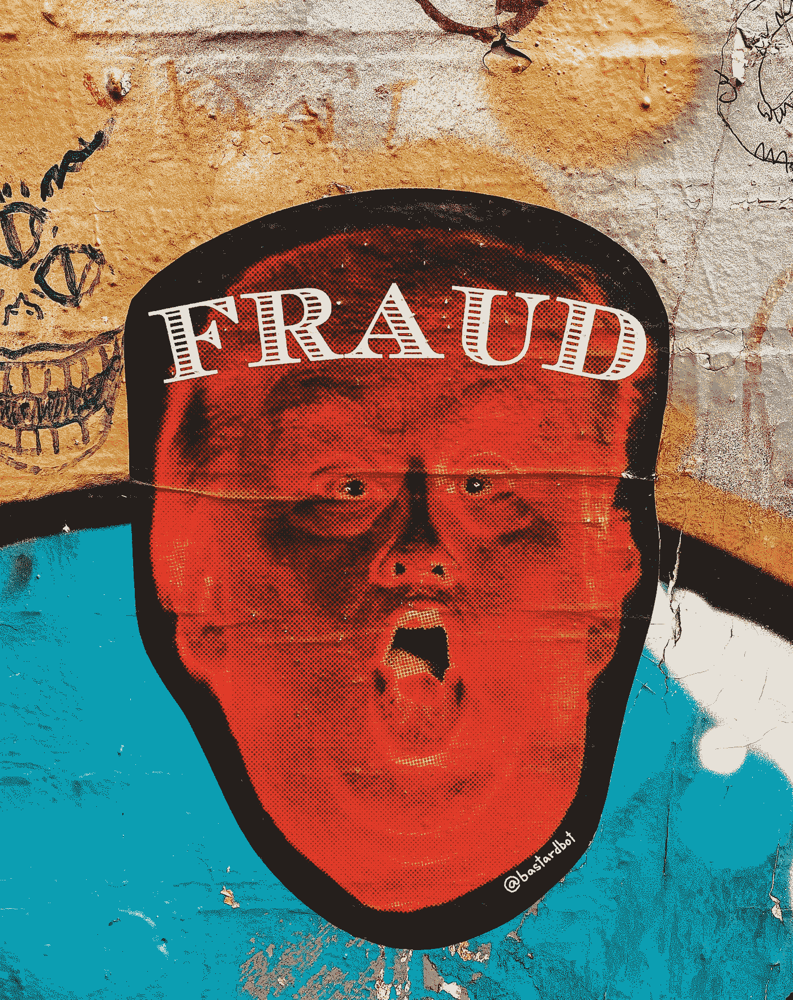
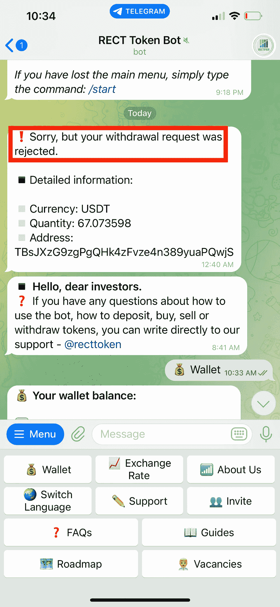
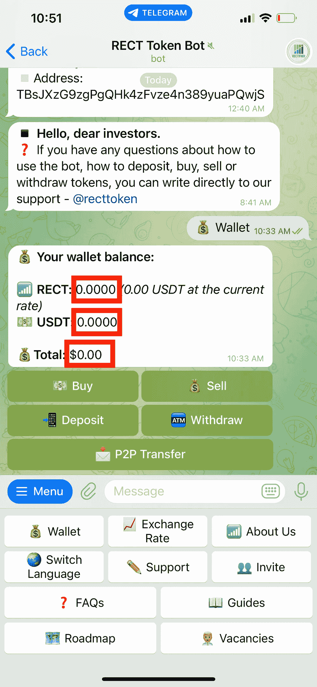

# 被这个加密平台骗了！

> 原文：<https://medium.com/coinmonks/how-i-got-scammed-by-this-project-fe9f80894fd6?source=collection_archive---------2----------------------->

## 为什么我一点都不惊讶？！不要成为骗局的受害者—第 1 部分。

Photo by [Jon Tyson](https://unsplash.com/@jontyson?utm_source=medium&utm_medium=referral) on [Unsplash](https://unsplash.com?utm_source=medium&utm_medium=referral)

加密货币的世界充满了希望和梦想。有些可能太一厢情愿了。大多数都以骗局告终。这是其中之一。

我最近参加了一个项目，我认为它有一些很好的基础。这个项目叫做**整流现金(RECT)** 。这是一个“基于电报的零汽油费 P2P 传输系统”。零油费…？**红旗。**

我之所以投资是因为他们的历史回报。每天都是绿色的一天。日常…？**红旗。**

这好得令人难以置信。

然而，我知道我的东西。如果事情太真实，独立网站大多以骗局告终，对吗？这就是为什么我只投资了很少一部分——**$ 50 usdt。很快，这 50 美元在一周内变成了 68.14 美元。好得难以置信，嘿？！所以，我试着退出。事情是这样的:**

**噗。被拒。**

这对所有人来说都是一个警告。始终做好自己的尽职调查。只投资我们能承受的损失。

网址为**避开**:[https://rectifier.cash/](https://rectifier.cash/)

*如果你觉得这篇文章很有帮助，记得去*👉 ***跟着*******拍手👏*******共享*** 👐*和你的朋友一起吧！***

*****电报:****@ The _ Crypto _ Auto***

> **交易新手？尝试[加密交易机器人](/coinmonks/crypto-trading-bot-c2ffce8acb2a)或[复制交易](/coinmonks/top-10-crypto-copy-trading-platforms-for-beginners-d0c37c7d698c)**