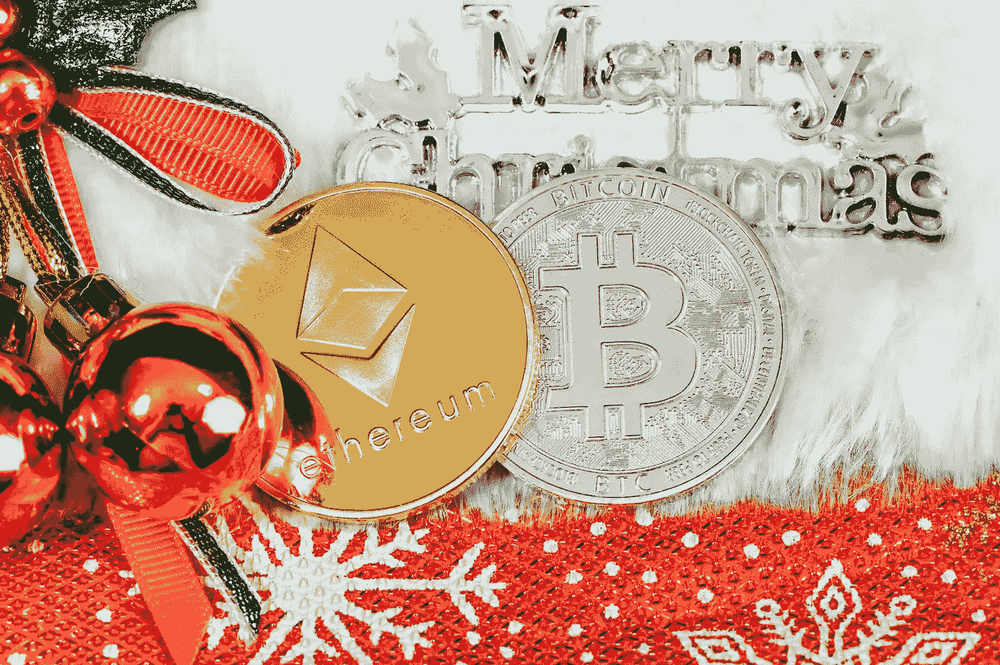

# 我如何在圣诞节前投资 300 美元

> 原文：<https://medium.com/coinmonks/how-i-invested-300-before-christmas-dec72c599cfd?source=collection_archive---------48----------------------->

Source photo [Free Bitcoin Image on Unsplash](https://unsplash.com/photos/-Bh-6k-jB-k)

# 比特币(BTC)-100 美元

在加密货币市场，比特币(BTC-美元)相当于一只蓝筹股。今年它的估值有很大的波动，但长期前景是光明的。通货膨胀放缓，加上美元贬值，可能为投资高风险资产提供了一个有吸引力的机会。