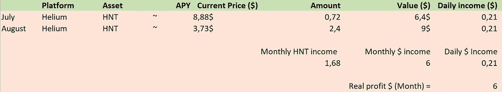

# 我如何在熊市赚了 300 多美元；八月

> 原文：<https://medium.com/coinmonks/how-i-made-300-in-crypto-during-a-bear-market-august-c4de3ca4f41e?source=collection_archive---------9----------------------->

# 你好。

感觉几个月过得飞快，感觉就像刚刚上传了上个月的更新。在幕后，我正在为几个不同的项目努力工作，事实上我的笔记本电脑坏了，在此期间我什么也做不了。这是一个快速的月份，区块链有一些非常好的发展，我们在这里和那里看到一些不错的集会！

我已经为 web3 公司和 Dao 做了很多慷慨的自由职业者的工作，他们的报酬相当不错！旅行时这是一个完美的组合，认识这么多的人和这么酷的项目真是太棒了。以太坊在即将到来的合并中也对我们很好，在市场主导地位中获得了近 1.5%的份额。我一直在兑换以太币和其他一些较小的代用币。不管怎样，让我们进入正题，看看我们在八月份都做了些什么！

# 结果！

## 斯特思

stETH 仍然是我最大的包，仍然是我赚最多的钱。我仍然在生态系统上投入很多，我正在慢慢进入以太坊。我的奖金工作大部分也在 ETH 得到支付，帮助 DCA 策略。我个人的预测是以太坊迟早会登陆 10K，希望是在下一轮牛市。**"如果"**以太坊在某个时候达到 10k，我现在每个月做的 0.023 ETH，结果会是 230$一个月，太疯狂了！合并发生后，APY 也将得到提振，因为以太坊将变得通货紧缩，回报将飙升。一些预测说合并后以太坊的 APY 将会移动到 8-10%左右…我迫不及待想亲眼看看了！

## beFTM

我的 BeFTM 赌注仍然给我一些不错的回报，几乎每天 2 英尺。FTM 让我百感交集，因为它的生态系统令人惊叹，它运行着近 300 个项目和协议，费用低廉，使用起来也很便宜，但似乎每个人都在离开 FTM。这个链条已经慢慢失血而死，在过去的半年里损失了将近 95%的价值。这对我来说很奇怪，因为这个项目真的有很多好处，我认为它提供了更多的价值，比币安连锁店或雪崩连锁店更便宜。哦，也许有一天人们会赶上它！

## 蛋糕桩

自从我开始以来，蛋糕赌注一直很稳定。这不是一个空想项目，也不会带来疯狂的高 APY，但它已经为我提供了几个月的稳定回报。对于 200 美元以下的小额投资，很高兴看到它以稳定的方式每月支付给我 5%的收益。在我看来，赌注蛋糕绝对值得！

## 劳动奖金

这项工作仍然是我这个月的主要收入来源。通过继续申请任务和奖金，我可以获得一些不错的收入，这些收入可以用于我的 DCA 战略或用于手头的一些额外现金。如果你没有钱投资，但有时间，申请奖金是开始你的投资和被动收入之旅的好方法。Dao 总是在寻找拥有几乎任何组织职业技能的人，为什么不试一试呢！

## 氦气开采

氦的价格在过去的一个月里暴跌，损失了超过 50%的价值。我已经移动了我的热点位置，将其传输比例从 0.3 增加到 0.5，这也显示在奖励中，增加了近 2 倍的 HNT 令牌！为了进一步提高我的收入，我现在还安装了一个 5.8DBI 天线，放置在与标准 3DBI 天线相同的位置。我们将看到这如何增加奖励。下个月我会试着把新的天线搬到屋顶，那里会有更好的接收效果，这将有望增加更多的奖励！

# 最后…

最后，我们这个月收到了整整 300 美元。我会在这个月的任何一天增加 3%的投资组合，所以我对此很满意！我将开始把收到的 USDT/USDC 赌注压在一起，以便从中挤出最后一笔钱。每个选项都是一个相当不错的长期投资选项，所以我建议每个人都去探索前面提到的选项！

如果你对其他被动收入流有任何想法，请告诉我！我总是对尝试新的选择感兴趣，因为我有很多空闲时间，所以我喜欢探索！

# 链接>

*   *想阅读* *媒体上的每一篇文章，甚至是优质文章？使用我的链接在 medium 上注册，每月 5 美元！*[medium.com/@Igor.MD/membership](/plans?subscribeToUserId=211ebdfa9e24&susiEntry=entity_driven_subscription_lp&source=entity_driven_subscription-211ebdfa9e24------------------------------------)
*   为了让我的故事对每个人都免费，请给我买杯咖啡吧！[ko-fi.com/igormd](https://ko-fi.com/igormd)
*   如果你想开始交易，可以考虑用我推荐的库币！[www.kucoin.com/r/rf/1de5d](https://www.kucoin.com/r/rf/1de5d)
*   想成为页面上的特色吗？给我发邮件！

> 交易新手？尝试[加密交易机器人](/coinmonks/crypto-trading-bot-c2ffce8acb2a)或[复制交易](/coinmonks/top-10-crypto-copy-trading-platforms-for-beginners-d0c37c7d698c)