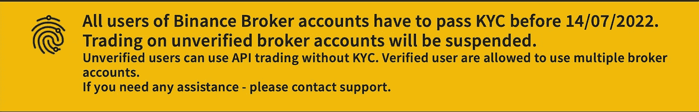
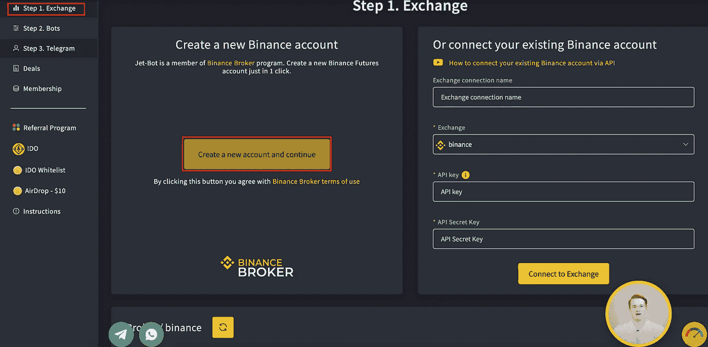
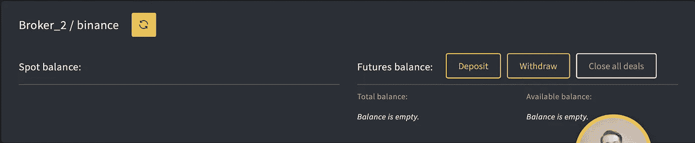
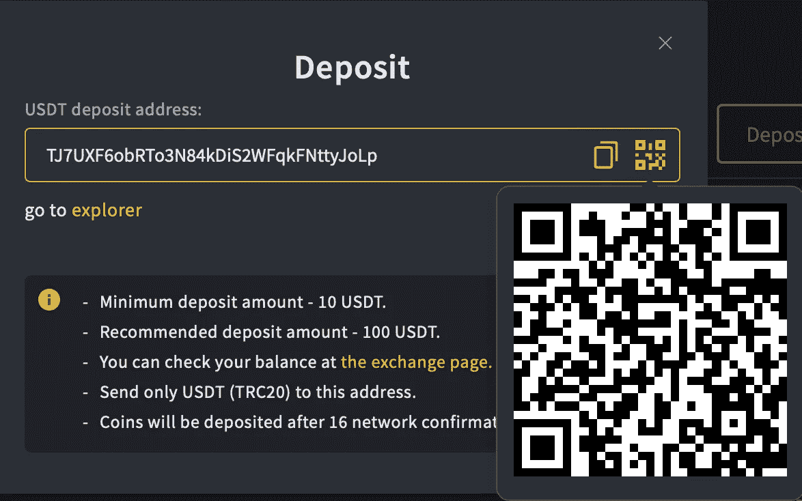
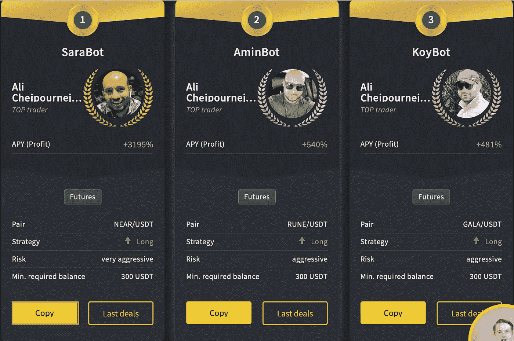
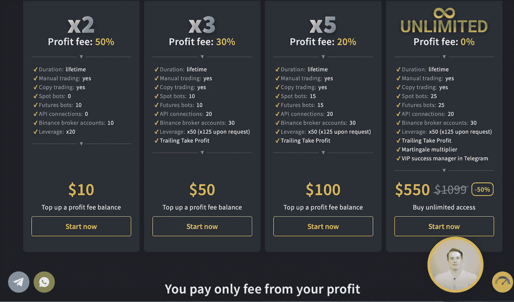
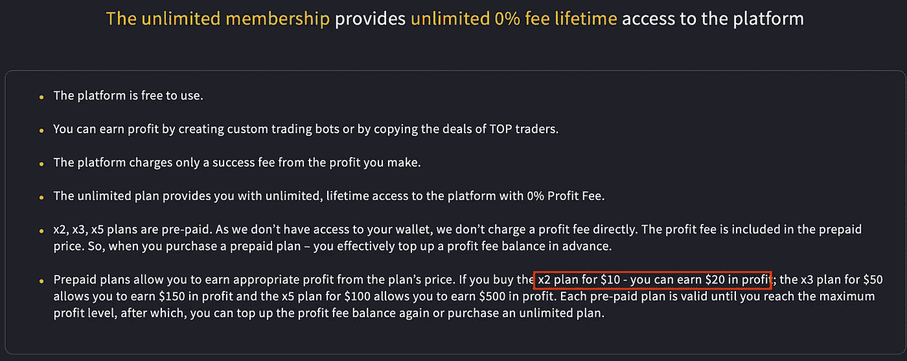
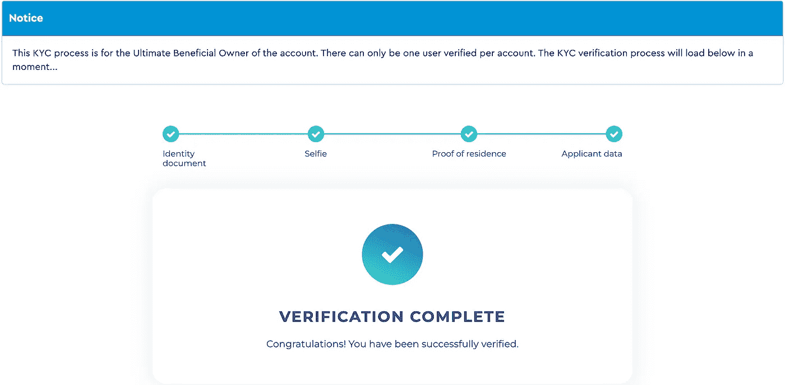

# 我如何在复制交易时一天赚了 36.79 美元。

> 原文：<https://medium.com/coinmonks/how-i-made-36-79-in-a-day-while-copy-trading-eb983347b25b?source=collection_archive---------5----------------------->

## 3195% APY？！？！看我怎么赚被动收入！

Photo by [Caroline Veronez](https://unsplash.com/@carolineveronez?utm_source=medium&utm_medium=referral) on [Unsplash](https://unsplash.com?utm_source=medium&utm_medium=referral)

这是一篇特别的文章，因为我正在走出我的加密矿工的舒适区，来回顾一下我从几个人那里听到的这个交易平台。看起来是合法的，因为它是**的官方经纪人。我绝对不会错过一个潜在的被动收入流。是吗？**

****那么，我们就进入吧！****

**[**Jet-Bot**](https://account.jet-bot.com/?fpr=zutmc#register) 是一个复制交易平台。交易利润将取决于我们决定模仿哪个交易者。目前，SarahBot 提供最高 3195%的 APY 回报率——*8.75%的日回报率。请记住，由于这是基于**真实的**交易规则和措施，有时可能会有不可避免的损失。这些复制交易的成功也将取决于当前的市场状况。***

> ***交易新手？尝试[加密交易机器人](/coinmonks/crypto-trading-bot-c2ffce8acb2a)或[复制交易](/coinmonks/top-10-crypto-copy-trading-platforms-for-beginners-d0c37c7d698c)***

***我知道高回报总是伴随着高风险。然而，与加密矿工不同，我可以在任何我想要的时候从我的钱中提取。***

# ***什么是喷气机器人？***

*****Jet-Bot** 自 2019 年开始运营，是最大的加密集中交易所**币安**的官方经纪人。Jet-Bot 是一个复制交易平台，投资者可以在这里复制专业交易者的交易。也就是说，要完全照搬*交易员正在做的事情！这意味着什么？在睡梦中赚钱——被动收入，这是我们喜欢的，记得吗？****

***或者，我们也可以创建一个简单版本的交易机器人。***

# ***入门指南***

***我将通过 7 个步骤让你开始。***

1.  *****使用此 [**链接**](https://account.jet-bot.com/?fpr=zutmc#register) 注册**。***
2.  ***让自己**KYC ed*****

*   ***我们必须获得 KYC 认证，否则我们的账户将被暂停。***

******

*****3。创建**一个币安经纪人账户***

*   ***转到“第一步:交易”，只需 ***点击*** 即可创建一个币安经纪人账户。或者，你可以选择将你的*现有的*币安账户与一个更复杂的 API 密匙关联起来(*我不推荐！*)。***

****

**完成后，向下滚动到下面，在这里查看您的币安经纪人 ***钱包*** 。**

****

****4。存款****

*   **只存 Tron 网上的*(***TRC-20***)到这个地址。他们现在只接受通过创的存款。处理存款应该需要 15 分钟—不要惊慌！***

****

****5。选择我们的交易机器人****

*   **我们快到了！前往“顶级机器人”并选择我们的交易机器人。在这里，我们可以看到每个机器人的历史 APY。由于我们的账户是新创建的，我们将有 3 天的免费试用期。**
*   **之后，前往“第二步:机器人”,然后**启动**我们的机器人。如果我们不推出它，这个机器人就会闲置——没有利润。**

****

**在试用期间，我们可以使用“无限计划”(如下)，但利润上限为 5 美元。所以，不要想着创建多个账号！**

****6。选择订阅计划****

**您的试用已经结束，但您喜欢它。现在，让我们真正开始吧。**

*   **Jet-Bot 将其订阅模式从每月一次改为**预付费计划**。你可以把这些看作是现收现付的会员费。购买 10 美元预付计划一次，我们将有机会复制 10 个不同的未来交易机器人。**
*   **这有两个问题。首先，根据计划，我们的**利润分享协议**可能会有所不同。例如，计划 1 有 50%的利润费，这意味着如果一笔交易产生 53 美元的利润，我们只能得到 26.50 美元。第二，是**利润上限**。例如，计划 1 的利润上限为 10 美元。**

**因此，我强烈建议我们像我一样选择 ***无限计划*** 。**

********

*****例子*** *:我们将 300 美元存入我们的币安经纪人钱包。我们购买了计划 1(10 美元)。一旦我们的投资达到 320 美元，交易将停止，我们需要购买另一个预付计划。在这种情况下，我们的利润是 300 美元投资中的 10 美元。本质上，购买一个 10 美元的计划，拿回 20 美元。***

****7。使用 Coinpayments 进行注册****

*   **为了能够购买计划，**必须**向 Coinpayments 注册。在这之后，我向你保证麻烦结束了！或者，我们可以联系电报支持并进行手动存款，但*我不推荐*。**

****

*****查看我的加密作品集*** [***这里***](/@Crypto_Auto/read-my-crypto-mining-portfolio-for-free-ef6b3d31ac5c) ***！*****

***如果你觉得这篇文章有帮助，*👉 ***跟着*******拍手👏*** *和* ***共用*** 👐*和你的朋友一起吧！****

***如果你决定在这里使用* ***我的推荐链接*** *，我也将不胜感激(无压力)！***

****链接**:[https://account.jet-bot.com/?fpr=zutmc#register](https://account.jet-bot.com/?fpr=zutmc#register)**

**请随时打电报给我(@The_Crypto_Auto)。**

*****免责声明！！！我写的文章只是我投资的日志，绝不是财务建议。在我的* [*第一篇文章里，*](/@Crypto_Auto/earn-30-day-1000-investment-the-truth-lets-go-a97ff2401510) *我开诚布公地谈一谈这类项目的真相。只投资你能承受的损失，不要把所有的鸡蛋放在一个篮子里。*****