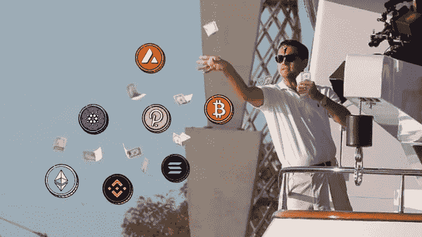
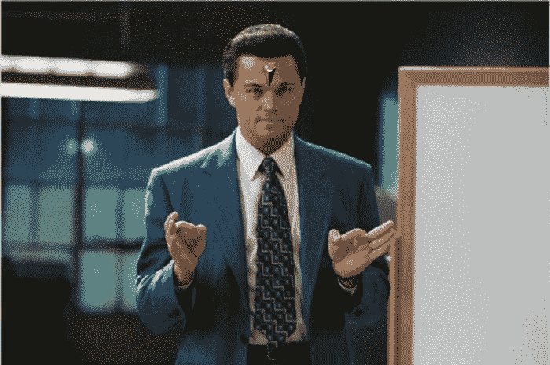
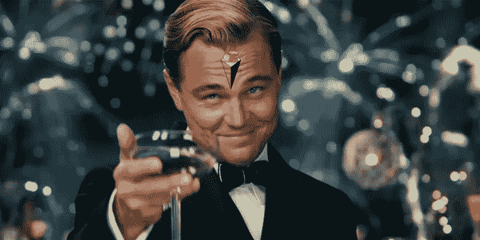

# 追逐登月:我计划如何在 2022-23 年的密码市场上赚钱

> 原文：<https://medium.com/coinmonks/how-i-plan-to-make-bank-in-the-crypto-markets-in-2022-c14a2cb9929a?source=collection_archive---------3----------------------->

大家好，

因为这是我第一次在 Medium 上发帖，我可能应该介绍一下我自己，告诉一些关于我是谁和我做什么的事情，但是我真的不喜欢这样。相反，我会尽量保持简单:这将是一个关于加密的帐户。更具体地说，我将使用这个平台(以及其他平台)来分享我在西部加密市场的旅程。

我已经跟踪加密市场将近两年了，我不得不承认我已经迷上了。你怎么能不被吸引呢？它们很迷人。没有任何一个金融市场能让你在做好投资的一年里持续获得 10 倍的回报，而在做坏投资的一年里获得 90%的回报。

这种极端的风险和极端的回报平衡使加密成为最令人兴奋的金钱游戏，你可以承受失去。如果你想慢慢变富，这不是最好的选择，但如果你想快速变富(或变穷)，这肯定是最好的选择。

所以我决定接受挑战。我将尝试在一年内通过 crypto 将 1k 变成 10k，并将整个过程记录在社交媒体上。我会分享我正在做的所有动作和它们背后的思考过程，我会每周更新。

我不是一个专业的交易者或有经验的投资者，我只是真的喜欢加密，想挑战自己，证明获得异常回报不是纯粹的运气。我希望这是一个学习的过程，一个迷人的旅程，无论最终结果如何。

# 挑战

我将以 1000 美元的初始资本开始，并试图在明年将它变成 10000 美元或更多。这相当于 10 倍的年回报率。对于传统市场来说，这是一种极不自然的表现，但对于 crypto 来说，这并不那么不自然。挑战从 2022 年 9 月 1 日开始，到 2023 年 9 月 1 日结束。

# 投资过程

我不会利用技术分析或任何类型的交易机器人。我的行动将完全基于基本面、策略和市场状况。这不是反对技术分析的诀窍，我只是不喜欢用它(而且我也不太擅长)。另外，仅仅看图表不会产生如此有趣的内容。

# 战略

由于我们处于熊市，我的策略有三个特点:

*   一部分初始资本将以现金形式持有，以备部署(用于 dip、美元平均成本和特殊机会)
*   一部分资本将被配置为市值较高的蓝筹股。这些硬币已经证明了它们的价值和实用性，预计至少会再次达到历史最高水平。这些是我愿意长期持有的硬币，我不介意押注/赚取收益，除非机会成本太高
*   剩余的资本将被配置到我认为是下一轮牛市的热门行业中的小型股。这些是更具投机性的赌注，风险更大，但收益更高

我也会寻找空投或 DeFi 的机会，可以最大限度地提高回报。我通常会远离非功能性测试，因为我对自己在该领域的知识感到不舒服。

# 当前市场状况

现在，加密市场就像所有的资产市场一样，主要受宏观经济因素的影响。通货膨胀形势是当前最重要的事情。对衰退的担忧仍然存在，但几个月来，CPI 数据首次显示出通胀见顶的迹象。然而，美联储非常明确地表示，加息不会很快停止，市场对此反应强烈。下一份消费者物价指数报告将至关重要。如果通货膨胀再次上升，我预计价格会暴跌。

对于 crypto 来说，9 月一直是一个糟糕的月份，所以我总体上并不乐观，但这一次我们有以太坊合并的事情发生。至少在 9 月 13 日 CPI 报告出来之前，我不认为会有明显的下降。从长期来看，这可能会是一个艰难的冬天，原因很多，但主要是因为能源成本的增加(由于乌克兰-俄罗斯战争)。

因为我不想在开始之前就被破坏，因为我们处于不确定状态，我将从下面的分布开始:

*   35%现金
*   40%高上限
*   25%的低上限赌注

在整个挑战过程中，主要策略通常保持不变，但百分比将根据市场条件(以及已经取得的进展)而变化，以将风险保持在相当相同的水平。

当然，这是不言而喻的，但是这篇文章，或者这个系列中的任何一篇文章，都不是金融建议。内容纯粹用于信息和娱乐目的。我不是财务顾问。我甚至对金融都不感兴趣。我就是喜欢加密，并且相信如果你打对了牌，加密市场充满了诱人的机会。

在下一篇[帖子](/@thewolfofwalletstreet/the-apples-and-amazons-of-the-crypto-markets-9-blue-chip-coins-to-keep-an-eye-on-in-this-bear-fe33fbb13c81)中，我将分析这次挑战中我一直关注的“蓝筹”密码，并给你我对每一种密码的看法。在那之后，我会写一份下一轮牛市潜在热点板块的[细分](/@thewolfofwalletstreet/playing-low-caps-how-i-plan-to-gamble-responsibly-e45d79fef0c6)(低市值押注)。我预计这两个今天晚些时候会出来。感谢阅读，敬请关注。

*如果你对此感兴趣，请关注我的* [*推特*](https://twitter.com/WolfOfWalletSt) *以了解更多挑战的加密内容和更新。我昨天刚刚创建了帐户，所以我可能会跟进回来(除非你看起来像一个机器人)。另外，我知道最后一张图片不是来自华尔街之狼。它只是看起来很酷。*

> 交易新手？尝试[加密交易机器人](/coinmonks/crypto-trading-bot-c2ffce8acb2a)或[复制交易](/coinmonks/top-10-crypto-copy-trading-platforms-for-beginners-d0c37c7d698c)