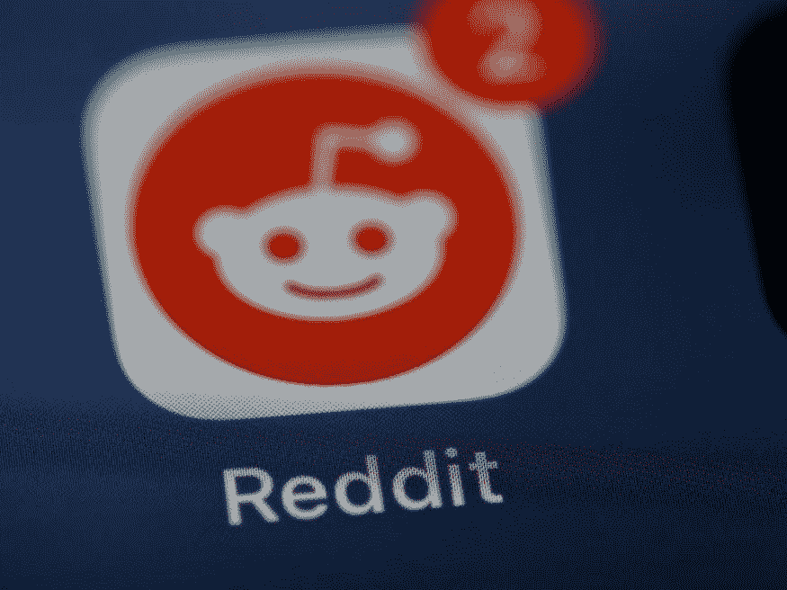
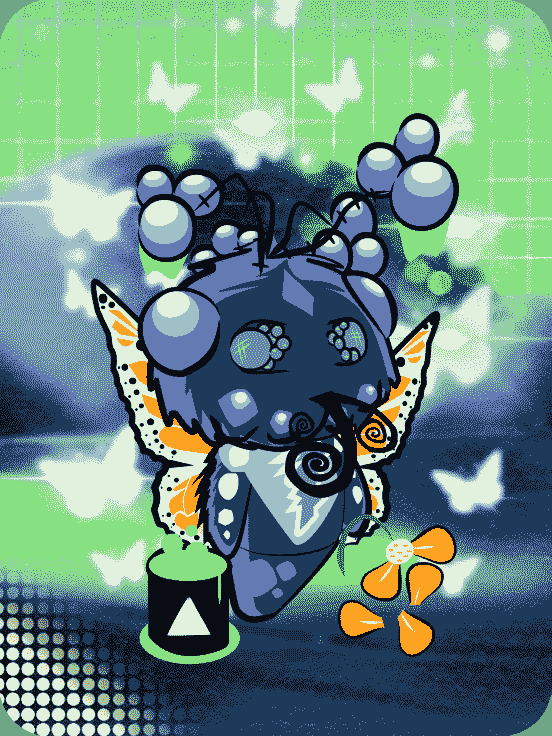
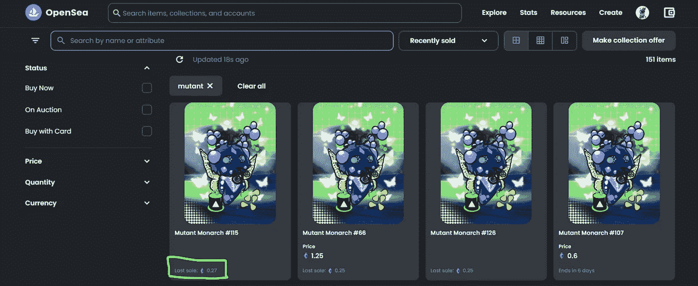

# 我如何使用 Reddit 收藏头像将我的 50 美元变成 350 美元

> 原文：<https://medium.com/coinmonks/how-i-turned-my-50-to-350-using-reddit-collectible-avatars-5f3c90b151ed?source=collection_archive---------36----------------------->

Photo by [Brett Jordan](https://unsplash.com/@brett_jordan?utm_source=unsplash&utm_medium=referral&utm_content=creditCopyText) on [Unsplash](https://unsplash.com/s/photos/reddit?utm_source=unsplash&utm_medium=referral&utm_content=creditCopyText)

几周前，我写了一篇关于可收藏的 Reddit 头像以及它们如何迅速售罄的故事。

所以，在写完这个故事后，我立即为自己买了一些 NFT，我很高兴地说，我买的所有头像的价值都飙升了。

这个博客是关于我买的第一个可收藏的头像，以及它如何把我的 50 美元变成 350 美元。

Mutant Monarch from The Butterfly Garden x Reddit Collectible Avatars

这个 NFT 是变异君主，是第一代 NFT 收藏头像的一部分。当我写我的前一篇描述 Reddit NFTs 的文章时，它值 50 美元。看到有机会拥有一件稀有的东西(这个头像只有 151 份)就立马买了。

在我买下头像几个小时后，它就卖光了，以 0.33 eth 的价格出售(当时大约 50 美元)，但我并不介意，因为我打算持有 NFT 大约一个月。

快进到昨天，当我偶然浏览 Reddit 时，我看到一个帖子说，Reddit 最初卖 50 美元的“手”头像以 4 eth(～5000 美元)的价格出售。

很自然地，我很好奇，并检查了我的第一个 NFT 是如何做的，这是我看到的:

Screenshot from Opensea showing how much the Mutant Monarch was recently sold for.

最后以 0.27 eth(~ 350 美元)成交！

诚然，它不如 4 eths。700%的增值一点也不差！

在任何人问我之前，我没有卖掉我的，我甚至没有列出它，因为我预测这个头像的价值仍然有很大的增长空间。我认为这些头像的价值会随着年龄的增长而不断增长。

这就是我如何把我的 50 美元变成 350 美元的故事(可能更多！).如果你喜欢这个故事，并想保持更新，请跟我来。我偶尔会写一些关于 crypto 和 NFTs 的故事，有时也会写一些我的投资。

> 交易新手？试试[密码交易机器人](/coinmonks/crypto-trading-bot-c2ffce8acb2a)或者[复制交易](/coinmonks/top-10-crypto-copy-trading-platforms-for-beginners-d0c37c7d698c)