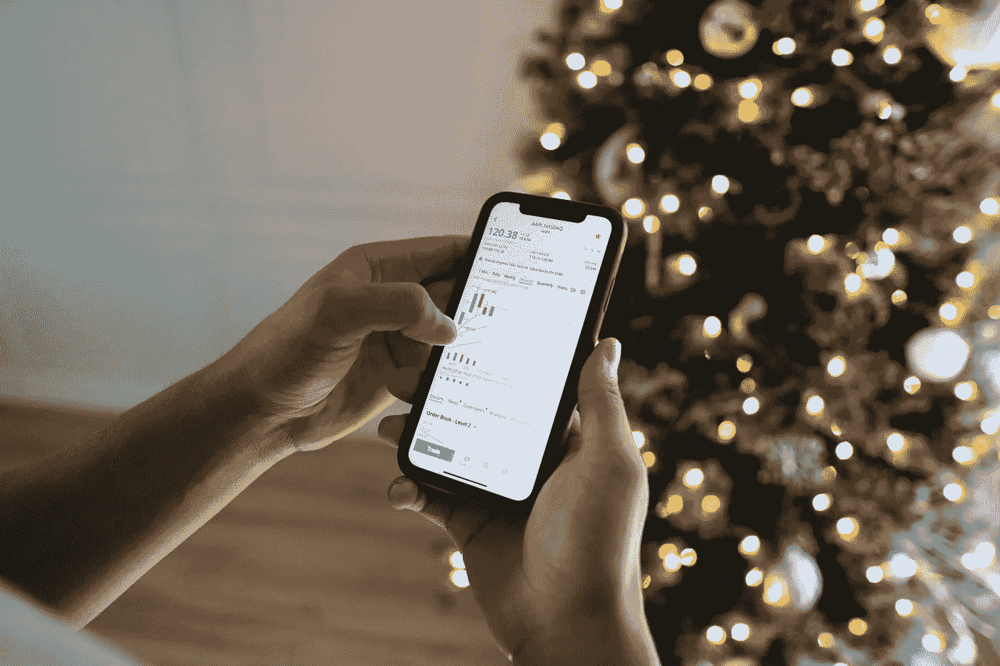

# 我想在 2022 年的最后一天投资 500 美元

> 原文：<https://medium.com/coinmonks/how-i-want-to-invest-500-in-the-last-day-of-2022-34963de1eb55?source=collection_archive---------28----------------------->

Source photo [person holding black iphone 5 photo — Free Forex Image on Unsplash](https://unsplash.com/photos/f8xzTx4Vd2c)

# 比特币(BTC)-200 美元

比特币(BTC 兑美元)本月显示出一些活力，但目前交易价格低于 17，000 美元。由于 BTC 一直在逐渐跌破关键心理水平，这种情况给投资者情绪带来了困难。

今年年初，比特币很难突破 50，000 美元大关。当四月…