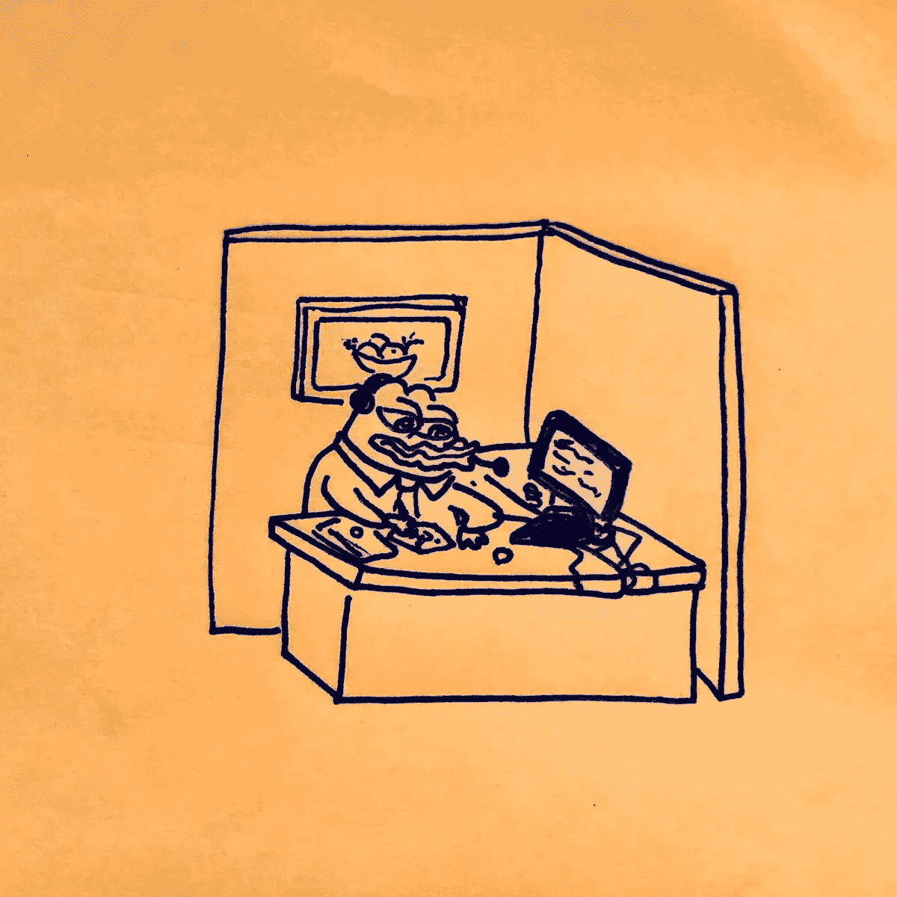

# 我如何在下一个加密周期中做到这一点

> 原文：<https://medium.com/coinmonks/how-im-going-to-make-it-in-the-next-crypto-cycle-62f70cf72f33?source=collection_archive---------13----------------------->

*寒冷的冬天里的小目标*

对 Web3 和区块链行业如此深入，我不得不说这不是我预期的熊市。当然，价格下降了，但是 Web3 的能量和应用仍然存在(如果不是更好的话)。在与一些基金和创业公司交谈后，我注意到他们都在尝试或寻求以某种方式将 Web3 集成到他们的产品中。我越来越难相信这个行业会因为几个烂演员就神奇的消失。

作为一名仍在规划自己职业道路的大学生，我认为自己处于一个独特的位置，可以在这个行业做得很好。在判断区块链的长寿和实用性时，我可能有点偏见，但如果区块链设法克服其挑战并接触到大众，我并不感到惊讶。不管它是什么，我认为我最大的痛苦场景是如果区块链真的获得大规模采用，并成熟为一个数万亿美元的产业，但我没有什么可以展示的，因为我浪费了时间和金钱交易 shitcoins 和变得坚固。

在经历了 2020/2021 年的大部分牛市(以及熊市)后，我意识到，赢家不是那些买入 Apes 或做空 Luna 的人。真正的赢家是建筑商和开发商。作为一个散户，交易的收益来来去去，有时我很幸运，但更多的时候我发现自己犯了错误，使我的利润来回波动。但是那些制造好产品和创收公司的人是在这个领域获益最多的人。回想我在 Web3 中学到的东西，我认为我进步得不够快。幸运的是，在如此年轻的时候就接触到这个领域，如果我没有成功，那绝对是浪费机会。

> 喜欢你目前所读的吗？考虑给我一个每周加密文章的关注！

# 那么下一个周期我想做什么？

Ignore the typo lol

作为一个自称为全才的人，很难在 Crypto 中只选择一个利基并坚持下去。现在，我想通过两种主要方式来创造价值:

1.  磨练我的开发技能(Web2 和 Web3)
2.  创建内容(研究和分析)

# 做一个建设者和开发者

我的主要目标之一是建立一个应用程序或软件，在 defi 领域带来价值/解决问题。作为一个加密本地人，我记得当跨链桥不存在的时候，或者你必须签署多个交易来交换令牌。defi(和 Web3 空间)中的 UX 和工具仍然处于早期阶段，所以我希望能够作为一名开发者为这个空间做点贡献。

# 创建内容并获得关注

当我第一次开始这个媒体页面时，我希望它是一种日志。一个存储和分享我与加密相关的想法的地方，因为我的大多数社交圈对加密并不感兴趣。我很快意识到在 Web3 领域对教育/研究内容有巨大的需求。我想维护和创建内容的短和长的形式。这不仅迫使我不断寻找新产品和创新，也迫使我评估我的思维，提高我的研究技能

总而言之，我在这个空间呆得越久，我就越兴奋。无论是作为一名交易者、作家还是开发者，Web3 确实给我一种感觉，那就是成为比我自己更大的事物的一部分。如果我想有任何成功的机会，我需要埋头苦干，不管是不是牛市。祝我好运。

希望这篇文章对你有用。今天有点短，但如果你喜欢的内容，请考虑跟随我的旅程，并分享这些:)你在这个熊市的一些目标是什么？

推特:[https://twitter.com/neavra_](https://twitter.com/neavra_)

> 交易新手？试试[密码交易机器人](/coinmonks/crypto-trading-bot-c2ffce8acb2a)或者[复制交易](/coinmonks/top-10-crypto-copy-trading-platforms-for-beginners-d0c37c7d698c)