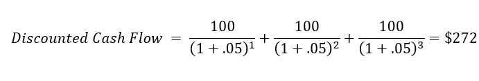

# 利率如何影响加密——为什么高利率会对加密市场产生负面影响的初级读本

> 原文：<https://medium.com/coinmonks/how-interest-rates-affect-crypto-markets-56487f33e7a5?source=collection_archive---------12----------------------->

[Image credit](https://unsplash.com/photos/fiXLQXAhCfk)

加密熊市正如火如荼，加密市场总市值从 2021 年 11 月的峰值[~ 3 万亿美元下降到 1 万亿美元以下。](https://www.statista.com/statistics/730876/cryptocurrency-maket-value/)

虽然这一下跌背后有多种因素，但一个主要驱动因素是世界各国央行为应对不断上升的通胀而迅速提高利率。

但是更高的利率到底是如何影响加密市场的呢？

**TL；博士**

高利率从两个方面对加密市场产生负面影响:

1.  **流入市场的投资减少:**随着利率上升，现金(存在储蓄账户中)的回报增加。投资者的反应是持有更多现金(一种流动性和低风险资产)和更少的加密/其他风险资产。这减少了流入加密市场的投资，增加了流出，给价格带来了下行压力
2.  **降低加密项目的隐含估值:**更高的利率增加了应用于加密项目现金流的贴现率，降低了项目的估值和市场的支付意愿

## 影响 1:更高的利率降低了投资流入，增加了加密市场的流出(给价格带来下行压力)，刺激了从加密/其他风险资产向现金的转移

投资者(无论是散户还是机构投资者)都面临着一个始终存在的资产配置问题:在我可用的资本有限的情况下，什么样的资产配置会给我带来最佳的整体风险/回报权衡？

虽然每个投资者都有自己的风险承受能力，这会影响资产配置，但利率对这个决定有很大的影响。

在超低利率时代，没有什么动机让你的资产保持现金。为什么要把钱存在几乎没有收益的银行账户里？此外，在考虑通货膨胀后，这通常意味着投资者的实际回报是负的(即赚取的利息不足以跟上通货膨胀，这意味着你在实际/购买力方面亏损)。这种态度最著名的例子可能是 Bridgewater Associates 的创始人雷伊·达里奥所说的“现金是垃圾”。

超低利率环境自然导致投资者开始寻找其他资产类别进行投资，以获得高于通胀的回报。因此，随着投资者抽走现金，投资于风险更高的资产，导致从房地产到密码的资产价格上涨，他们预计到了“万物繁荣”。

然而，利率的快速上升(由通货膨胀驱动)结束了这种繁荣。投资者现在可以把钱存入银行账户，这些账户提供低风险、高流动性的诱人回报。随着利率继续上升，现金将继续成为更具吸引力的资产类别——这意味着流入加密市场的资金减少，价格面临下行压力(特别是当投资者出售加密以持有现金时)。

## 影响 2:更高的利率降低了加密资产的估值

虽然新生的加密市场还没有一个普遍接受的估值方法，但其他金融市场中的关键估值方法可以为我们提供一个强有力的指导，说明加密估值是如何受利率影响的。

股票市场的一个关键估值方法是贴现现金流(DCF)分析。DCF 分析依赖于一个基本假设，即股票的价值是其产生的现金的函数。直觉上，这是有道理的——如果让你选择以同样的价格投资两只股票，一只每年产生 1 亿美元现金，另一只每年产生 1000 万美元现金，你显然会更喜欢产生 1 亿美元现金的公司(假设这种现金流在未来会持续)。

DCF 通过合计公司的预计贴现现金流得出股票的估计价值(例如，1B 美元)(见下图中的等式)。

Basic discounted cash flow formula

为了理解利率如何影响 DCF 分析中的估值，让我们将“贴现现金流”分析分解为其组成部分:

**“现金流”:**对于给定的股票，在一段时间内(通常在 10 年的范围内)对预期的现金产生(使用财务模型)进行预测。然而，要找到一家公司的真正“价值”，仅仅将模型中的所有现金流相加是不够的。这就是“打折”部分的由来。

**贴现:贴现的核心概念是“货币的时间价值”。这个问题可以很好地说明这一点:你愿意今天得到 1 美元还是 5 年后得到 1 美元？很明显，人们会认为今天的 1 美元是 1)你现在可以投资来赚取回报，2)随着时间的推移，你会预期通货膨胀会侵蚀 1 美元的购买力。实际上，我们可以通过“贴现率”从数学上量化今天的 1 美元与 5 年后的 1 美元之间的差异。贴现率就是一个百分比，我们可以用它来比较一段时间内的现金流。贴现率由无风险利率(政府债务的利率)加上风险溢价(考虑资产风险状况的差异)组成。**

让我们做一个简单的例子来说明。假设有一家公司在接下来的 3 年里每年产生 100 美元的现金流，然后关闭运营(因此在那之后它不再产生任何现金流)。假设贴现率为 5%，这将意味着 272 美元的估值。

Example calculations for a company generating $100 per year for 3 years

现在让我们假设中央银行将利率提高了 3%，将贴现率从 5%提高到 8%。在这种情况下，估值现已跌至 257 美元(下跌约 5.5%)。

Example calculations when the discount rate increases from 5% to 8%

有趣的是，该公司的现金流没有变化(仍然保持在 100 美元)，但估值(即一个人愿意支付多少钱)已经下降。

很好，但这和加密有什么关系呢？

另一种思考加密项目的方式类似于传统公司。加密项目通常是为预期在未来产生现金流的用例而设计的。假设设计充分，这些现金流预计会流回持有者(例如，通过赌注回报、供应减少、项目再投资等。).

作为代币的购买者，你实际上是在赌一个项目的现金流产生。抛开猜测不谈，这就是为什么当宣布潜在的现金流积极事件(例如，产品/功能发布、合作伙伴关系等)时，我们会看到代币的价值增加。).

从这个角度来看，DCF 分析为我们提供了一个心理框架，以理解为什么加密市值随着利率的上升而下降——随着贴现率的上升，估值下降。

> 交易新手？试试[密码交易机器人](/coinmonks/crypto-trading-bot-c2ffce8acb2a)或者[复制交易](/coinmonks/top-10-crypto-copy-trading-platforms-for-beginners-d0c37c7d698c)