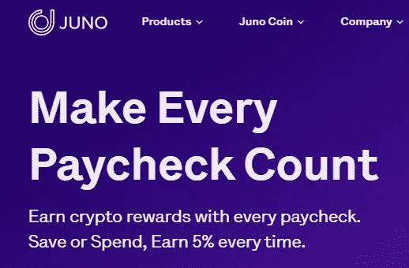
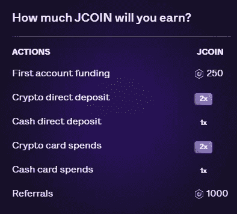
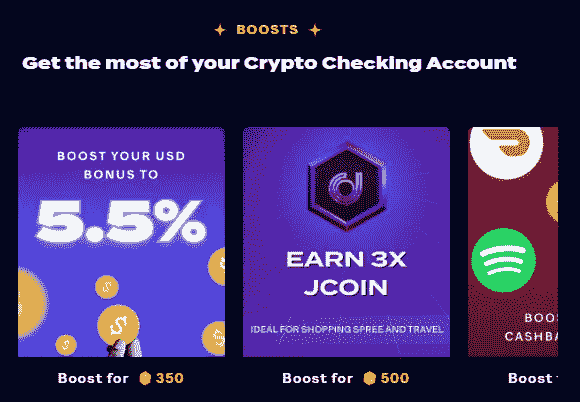
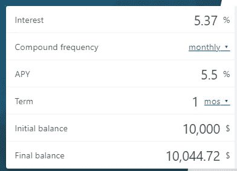
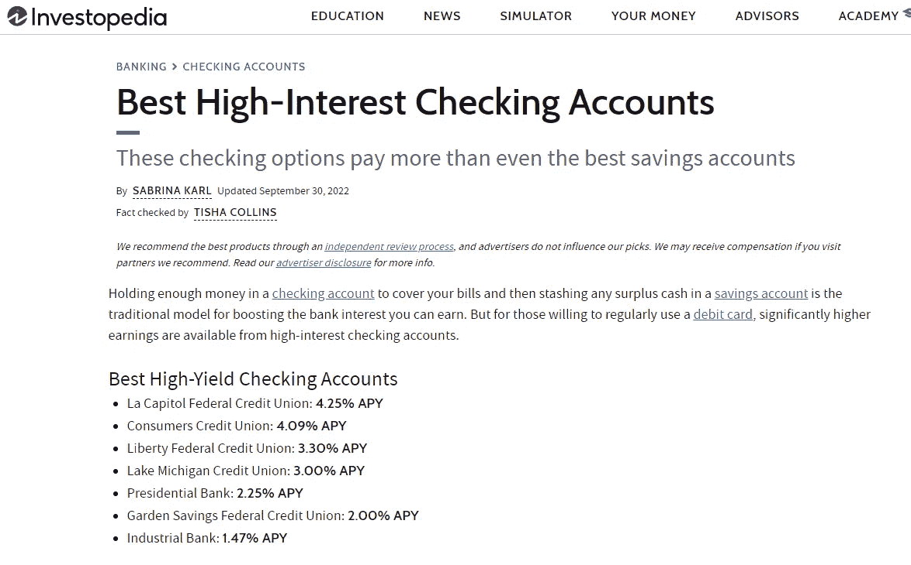

# Juno 如何使用 crypto 击败 TradFi，同时提供 FDIC 保险

> 原文：<https://medium.com/coinmonks/how-juno-is-using-crypto-to-beat-tradfi-while-at-the-same-time-offering-fdic-insurance-2327210f6321?source=collection_archive---------9----------------------->

嘿，伙计们，如果你一直在关注我关于朱诺的最新文章，你会知道,[朱诺金融](https://onjuno.onelink.me/TkoI/referral?code=JAME4XIL)最近推出并空投了他们新的$JCOIN。尽管他们在 8 月份取消了赚取的加密利率，但 Juno 继续推出积极的功能，我相信这些功能将帮助他们继续为他们的生态系统增加流量，并鼓励人们(像我一样)更多地依赖 Juno，而不是常规的 100% TradFi 帐户。

# 朱诺是什么？简短回顾

2020 年在 Juno 上推出的[(或在](https://onjuno.onelink.me/TkoI/referral?code=JAME4XIL) [2022](https://juno.finance/blog/the-journey-from-OnJuno-to-Juno) 年正式重新推出为 Juno)被许多人认为是一家新银行，但事实上，它实际上并不是一家银行。也许最容易想到的是 Juno 分成两个不同的部门——TradFi 和 Crypto。TradFi 部门充当银行的角色，因为他们的银行服务由 FDIC 成员[Evolve Bank and Trust](https://www.getevolved.com/)提供。换句话说，就像任何其他官方银行一样，你的资金由联邦保险公司(FDIC)承保，最高可达 25 万美元。

另一方面，加密部门没有得到联邦存款保险公司的保险(据我所知，没有一个加密部门得到或可能得到保险)，而是“由信托和持照保管人保管，他们将大部分加密数据存放在冷库中，并购买了必要的保险。”从我[读到的](https://www.thewaystowealth.com/reviews/onjuno-review/)来看，BitGo 提供的冷存储，如果你之前没听说过的话，BitGo 是一个主要的行业加密货币托管人，他参与了 [2016 BitFinex 黑客攻击](https://www.ccn.com/bitgo-claims-software-not-fault-bitfinex-hack/)。

# $JCOIN Tokenomics

上个月刚刚空投的$JCOIN 是一个 ERC20 ( [令牌合同地址](https://etherscan.io/token/0x7C72f41342d485D59A890528880a210ee7BFBb73))，它不仅可以作为 Juno 的忠诚度奖励积分，还可以作为公用事业令牌提供多种途径。许多 tradfi 信用卡提供现金返还、积分和/或里程等优惠，但$JCOIN 有可能更加有利可图，因为$JCOIN 不仅可以提供与信用卡相同的优惠，而且它们就像任何加密令牌一样，能够在流动性池中挖掘、下注和交易。就像大多数替代硬币一样，$JCOIN t [okenomics](https://help.juno.finance/en/articles/6595618-token-economics-of-juno-coin) 有一系列不同的属性，包括:

**铸造**:最初铸造了 10 亿枚代币，一旦最初的供应耗尽，将会再次铸造。每铸造 10 亿枚硬币，总收入将减半，或者换句话说，不是每花 1 美元赚 1 美元，而是只能赚 0.5 美元，然后是 0.25 美元，以此类推。此外，JCOIN 只分发给 Juno 帐户持有人，不发给 VC 或员工。

**赢取:**赢取$JCOIN 代币的主要方式是在您的 Juno 借记卡上消费，但您也可以通过使用其他账户功能获得多项奖励，包括:

除了常规帐户功能，您还可以(在有限时间内)通过[Juno quest](https://juno.finance/quests/)申请与 Juno 无关的空投，包括:

即使你目前还没有开设 Juno 帐户，我也建议你查看一下 Juno Quests 页面，看看你是否有资格，因为稍后我会用$JCOIN 代币进行计算，Juno 可能是持有你的菲亚特的最佳场所。

**烧钱**:所有兑换的代币将被发送到烧钱钱包(0x 000000000000000000000000000000000)，这抵消了代币潜在的通货膨胀铸造。

**严格忠诚:**也许使它与 tradfi 卡最相似的特征是因为如前所述，Juno:

> “不会促进忠诚令牌的二级交易，也不会采取任何其他行动来上市或做市忠诚令牌的二级交易。”

换句话说，没有其他方法可以购买、出售或交易$JCOIN，相反，您可以获得它们的唯一方法是成为一名经过验证的 Juno 用户，并直接与 Juno 互动。

# $JCOIN 的效用是什么，它们值多少钱？

正如我之前提到的，目前没有$JCOIN 的公开市场价格，因为目前，它还没有在任何地方列出。为了辨别货币价值，我们必须对用户可以兑换的价值做一些计算。我想这在未来可能会有所改变，但迄今为止，目前广告中的选项要么是将$JCOIN 兑换成账本、礼品卡，要么是将它们用于“促销”

目前，唯一可以定价的选项是每月 5.5%的 boost(相对于正常的 5.0%收益率)，可以用 350 美元 JCOIN 购买，或者用 5000 美元 JCOIN 兑换一个分类帐。礼品卡的兑换细节尚未发布，在获得更多信息之前，实际上不可能计算其他提升选项的价值(例如，3 倍收入和提升的返现)。

**账本**:Nano S 账本的标准零售价目前是 79 美元，也就是说以 5000 美元 JCOIN 的兑换比率，你可以用 1 美元 JCOIN 兑换大约 0 美元 **0.0158** 。

**5.5%的年利率提升:**在菲亚特，1 个月的年利率(与 APY 相反，因为据我所知，你的利息是按月支付的)被限制在 10，000 美元以内，这意味着如果你最大限度地提高年利率，你每月可能会赚到 44.72 美元:

350 美元的 JCOIN 是 44.72 美元，这意味着每 1 美元的 JCOIN 相当于大约 0.12 美元美分。与分类帐相比，这是一个更好的选择，但记住这一点也很重要，这种提升是不可扩展的，这意味着您每个月只能使用一次提升。

# 结论

不考虑所有的华而不实，对我来说，Juno 的标准 FDIC 保险 5%的利息是值得的，从我的发现来看，它目前是全国最高的利率之一:

然而，就像大多数利率一样，我不指望 5%会永远持续下去，在那之前我会一直关注它。此外，你可以继续用他们的借记卡在精选品牌上赚取 5%的利润，而不需要像其他产品[Crypto.com](/coinmonks/why-crypto-com-visa-cards-are-getting-worse-4407f0dba9b6)那样荒谬的 40 万美元的股份。

现在，在 genesis 上，赚$JCOIN 真的很容易，因为你只需开立一个账户并设置你的第一笔法定和加密直接存款，就可以赚 1000 $JCOIN。如果您有兴趣注册，请考虑使用[我的推荐链接](https://onjuno.onelink.me/TkoI/referral?code=JAME4XIL)在您的 Juno 钱包中存入 50 美元或更多时，额外赚取 10 美元。

感谢阅读，请一如既往地在 twitter 上关注我，阅读我的最新发现和更新:[https://twitter.com/CryptosWith](https://twitter.com/CryptosWith)

声明:这些信息都不是财务建议，只是我在网上随便找的一个人的推测。请考虑这纯粹是教育和娱乐的目的。像往常一样，请做你自己的研究或联系财务顾问，找到什么投资可能最适合你。

> 交易新手？试试[密码交易机器人](/coinmonks/crypto-trading-bot-c2ffce8acb2a)或者[复制交易](/coinmonks/top-10-crypto-copy-trading-platforms-for-beginners-d0c37c7d698c)