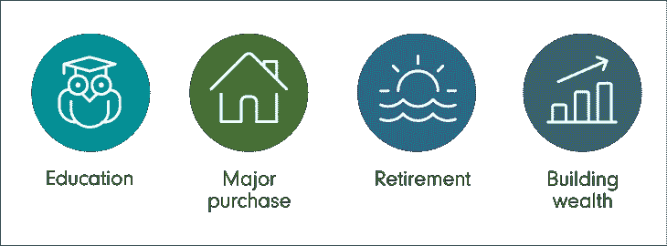
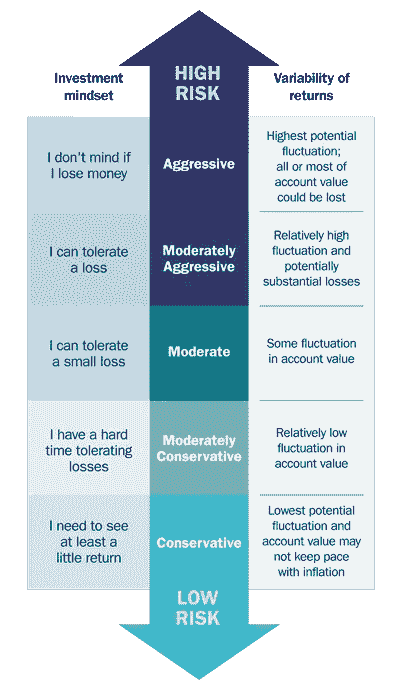
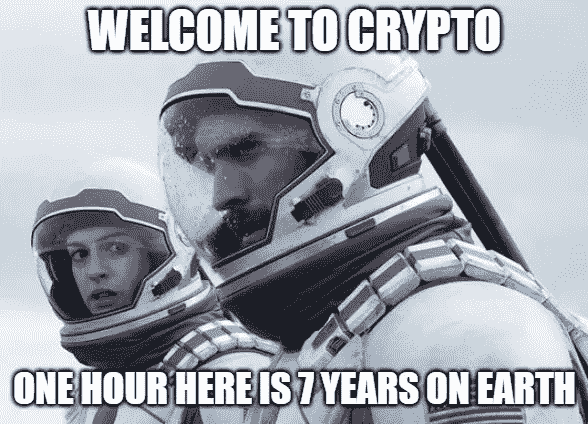

# 您应该将您的数字资产 HODL 多久？

> 原文：<https://medium.com/coinmonks/how-long-should-you-hodl-your-digital-assets-fb3cccfff0ef?source=collection_archive---------20----------------------->

根据个人的投资目标和风险承受能力，持有加密货币等数字资产的时间范围可能会有很大的不同。

对于许多加密投资者来说，加密是他们第一次投资任何资产。虽然因为你在新闻周期中看到的东西，你可能很容易按下购买按钮，但这实际上是大多数人在投资中赔钱的方式。

在购买之前，确定你打算持有多长时间是有帮助的。有些购买只在短期内有吸引力，比如几个月、几周甚至几天。而另一些买入是几个月、一年甚至几年的长期持有。

因此，为了让你决定你应该 HODL 多久，你必须先问自己几个基本问题

# 你的投资目标是什么？

一些常见的投资目标包括通过股票、债券、房地产和密码等产生收益的金融产品来积累长期财富。另一个目标可能是为退休储蓄或创收。保存资本是另一个问题。你可能想为房子的首付存钱。支付你孩子的教育费用。

# 你的风险承受能力是多少？

在投资 crypto 之前，了解自己的风险承受能力是关键。你的风险承受能力描述了你处理市场波动和损失的能力，相对于你的年龄，你作为一个投资者愿意接受这种能力。

年轻投资者可能更愿意承担风险，因为他们有更多的时间安然度过市场波动，并可能受益于高风险资产的长期增长潜力。

另一方面，年龄较大的投资者可能更专注于保护他们的财富，可能更厌恶风险。

投资者的财务状况也会影响他们的风险承受能力。拥有更大资金缓冲的投资者可能更愿意承担风险，因为他们有更多的资源在市场低迷时可以依靠。财务状况更脆弱的投资者为了保护自己的资产，可能会更加厌恶风险。

最后，投资者个人对风险的舒适程度也会影响他们的风险承受能力。一些投资者可能天生更厌恶风险，而另一些投资者可能更愿意冒险追求潜在的更高回报。

# 我的 HODL 是短期还是长期的？

一旦你确立了自己的风险承受能力和投资目标，短期还是长期持有数字资产的决定就一目了然了。仅仅因为你的时间跨度长，风险容忍度高，并不意味着这对你的奶奶、邻居或朋友都是正确的。每个人的财务状况都不一样。

现在是重新问自己的时候了，你还想按下“购买”按钮吗？感谢阅读！

*   免责声明——我写的任何东西都不应被视为财务建议。这仅用于教育和娱乐目的。我只是一只网络狼。我有偏见，因为我的投资组合中持有数字资产，因此高度评价我投资的项目对我有利。我投资组合中持有的密码并不反映你应该持有的。我不是财务顾问

> 交易新手？试试[密码交易机器人](/coinmonks/crypto-trading-bot-c2ffce8acb2a)或者[复制交易](/coinmonks/top-10-crypto-copy-trading-platforms-for-beginners-d0c37c7d698c)