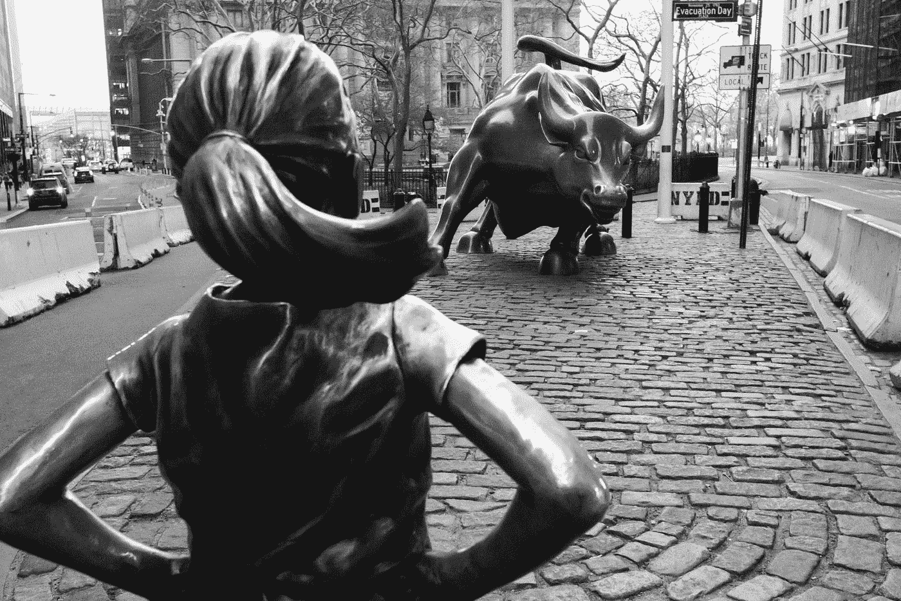

# 这场衰退会持续多久？2022 年的崩盘

> 原文：<https://medium.com/coinmonks/how-long-will-this-recession-last-the-crash-of-2022-8e4d009556f?source=collection_archive---------10----------------------->

所以看起来我们现在正处于衰退之中。发生了这么多事，我不知道如何跟上新闻。似乎总有不好的事情即将发生。

[这篇文章最初来自我的网站组合中心](http://www.portfolio-hub.co.uk/)

Photo by [Daniel Lloyd Blunk-Fernández](https://unsplash.com/@blunkorama?utm_source=medium&utm_medium=referral) on [Unsplash](https://unsplash.com?utm_source=medium&utm_medium=referral)

在今天的帖子中，我将探讨什么是衰退，衰退通常会持续多久，以及为什么我认为这是一个伟大的…