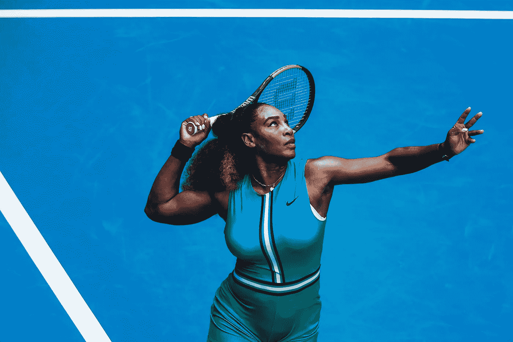
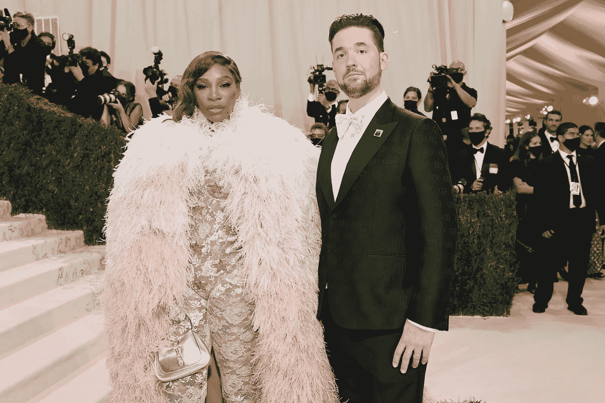
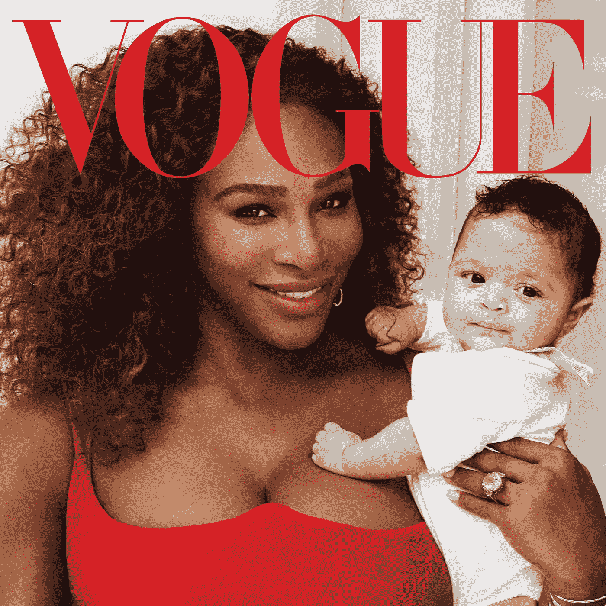

# 有多少母亲身家 2.6 亿美元，还能以 206 公里/小时的速度打网球？

> 原文：<https://medium.com/coinmonks/how-many-mums-out-there-are-worth-260m-and-can-hit-a-tennis-ball-at-206-km-h-b4038dc8140e?source=collection_archive---------47----------------------->

Female Tennis Superstar, $260M net worth, $111M Venture Capital firm, 73 Career Titles, 40 years old, 23 Grand Slams, 16 Unicorns, 4 Olympic Golds, and 1 baby girl Olympia.

女士们先生们，我向你们介绍，瑟琳娜·威廉姆斯。

她已经 40 岁了，仍然在打国际级别的网球。

她已经获得了 23 个大满贯。

她可能是世界上最著名的女运动员之一，与西蒙·比尔斯和比莉·琼·金等明星一起。

是的，她是历史上最好最快的女子网球发球手之一。

十年前，她开始了天使投资，至今已经开了超过 16 张支票。

你听说过她向赛琳娜·戈麦斯的新精神健康创业公司投资 500 万美元，并对其估值为 1 亿美元吗？

没错。

看起来高得离谱的估价又回到菜单上了，伙计们！

Serena and Alexis married in 2017.

她的丈夫，Reddit 的创始人之一，Alexis Ohanian，可能也影响了她。

亚历克西斯是初创企业领域的知名投资者，也是 web3 的大力支持者。

因此，现在 Serena Ventures 的投资组合中有 16 只独角兽，还有 1.11 亿美元可以挥霍。

这就是我所说的投资界蓬勃发展的大首次发球。

在初恋取得如此巨大的成功后，能够找到第二次恋爱真的很有趣。

大多数人活了一辈子，连初恋都找不到。

我是说专业上。

=)

所有的超级明星、世界冠军、体育传奇和顶级运动员都应该认真考虑一下小威刚刚写的剧本。

在你的运动领域成名并出类拔萃。

一路走好。

努力工作，投入热情，成为世界级的高手。

Serena the legend WON the Australian Open in 2017 while pregnant!

但是运动员的职业生涯是短暂的(至少比医生或教师等其他职业要短)。

伤病会比纽约地铁里吃披萨的老鼠更快地破坏运动员的职业道路。

所以聪明点，开始投资其他领域，增加你在其他地方成功的机会。

代言和赞助很酷，但它们很少能持续一生。

天使投资创业公司，启动风险投资工具和撤资是可持续增长财富的好方法。

你开始时很小，但随着时间的推移它会增长。

此外，你还可以回馈社区，投资你认为值得投资的创业公司，这些公司将会继续发展，并在未来影响更多人的生活。

哪个创业公司的创始人不喜欢职业运动员出现在他们的球帽桌或董事会上？

-

应该让更多女性进入投资/风险投资行业吗？

-

# startups # business # startupx # growth # success # social media # culture # web 3 # strategy # eth # BTC # crypto # Serena Williams # king Richard # serenaventures # investment # femalevc # tennis # grandslams

> 交易新手？试试[加密交易机器人](/coinmonks/crypto-trading-bot-c2ffce8acb2a)或者[复制交易](/coinmonks/top-10-crypto-copy-trading-platforms-for-beginners-d0c37c7d698c)